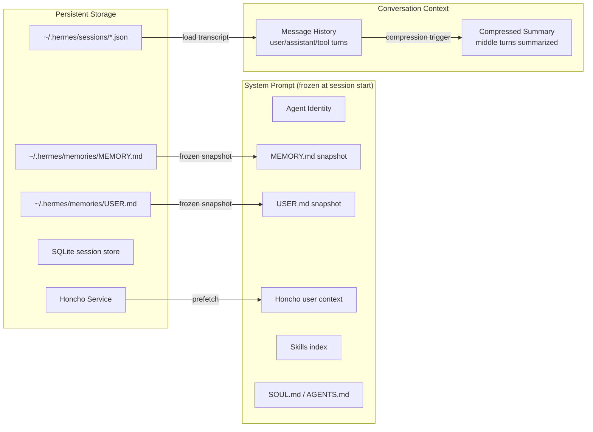
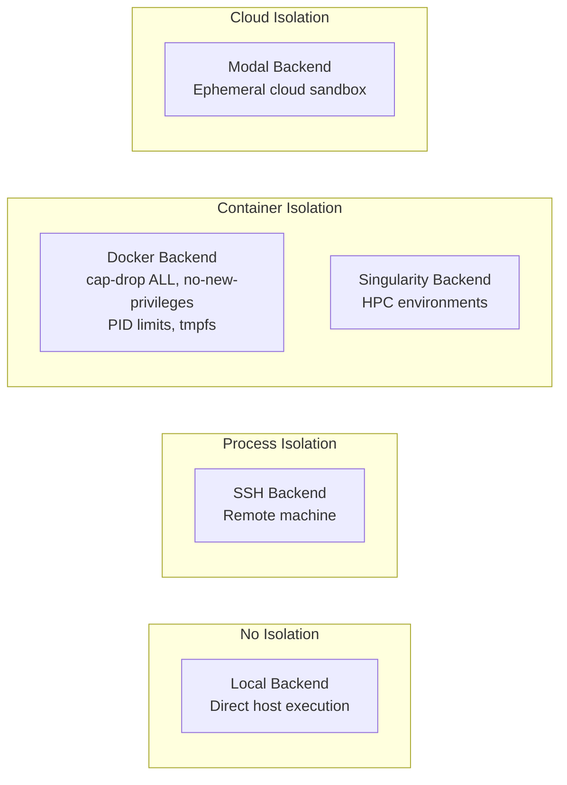
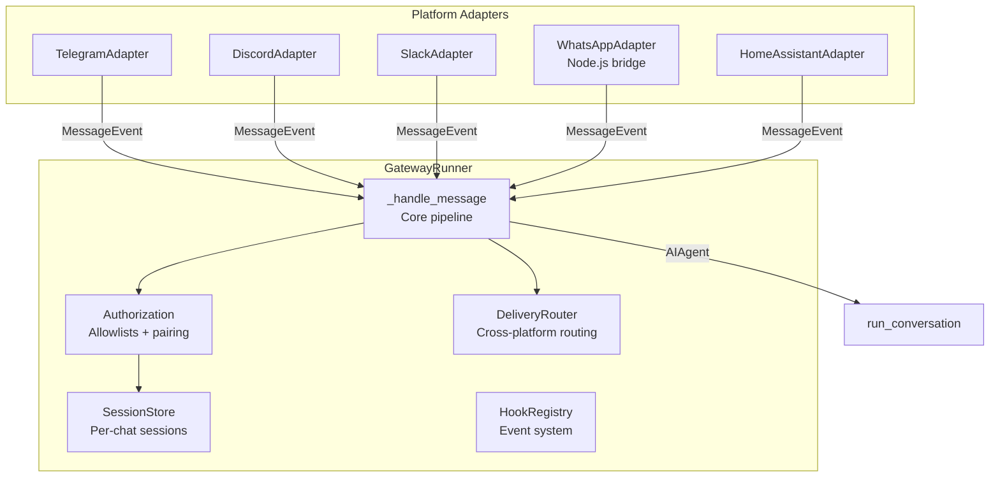

# Hermes Agent -- Personal AI Agent Framework Analysis

## 1. Overview

**Hermes Agent** is a fully open-source personal AI agent framework built by Nous Research. Unlike coding-focused agent harnesses, Hermes is designed to be a persistent personal agent that lives on your server, connects to your messaging accounts (Telegram, Discord, Slack, WhatsApp, CLI), learns over time via persistent memory and skills, runs scheduled tasks via a built-in cron system, and delegates work to parallel subagents. It uses the OpenAI-compatible chat completions API (routed primarily through OpenRouter) to support 200+ models with zero code changes, and includes research-oriented features like batch trajectory generation and Atropos RL training environments. The architecture is a monolithic Python application with a clean separation between the agent core (`run_agent.py`), the messaging gateway (`gateway/`), the tool system (`tools/`), and CLI entry points (`hermes_cli/`).

- **Language/Runtime**: Python 3.11+
- **License**: MIT
- **Author**: Nous Research
- **Repository**: [github.com/NousResearch/hermes-agent](https://github.com/NousResearch/hermes-agent)
- **Primary Use Case**: Persistent personal AI agent with multi-channel messaging, scheduled automation, and self-improving skills

## 2. Architecture

### Core Loop

Hermes uses a classic synchronous agentic loop: user message -> LLM API call -> check for tool calls -> execute tools -> append results -> LLM API call -> ... until the model stops calling tools or `max_iterations` is reached. The loop lives in `AIAgent.run_conversation()` (`run_agent.py:2758`). The agent supports mid-loop interrupts from external threads (new user messages arriving while the agent is working).

### Entry Points

There are three primary entry points:

1. **CLI** (`hermes_cli/main.py` -> `cli.py`): Interactive TUI with multiline editing, slash commands, streaming output
2. **Gateway** (`gateway/run.py`): Long-running process that connects to messaging platforms and routes messages to `AIAgent` instances
3. **Batch Runner** (`batch_runner.py`): Parallel batch processing for generating training trajectories

All three instantiate `AIAgent` from `run_agent.py` with different configurations.

### Module/Package Structure

| Directory | Purpose |
|-----------|---------|
| `run_agent.py` | `AIAgent` class -- the core agent loop, LLM calls, tool dispatch |
| `model_tools.py` | Tool discovery and dispatch orchestration layer |
| `agent/` | Agent internals: prompt builder, context compressor, model metadata, display, trajectory formatting |
| `gateway/` | Messaging gateway: platform adapters, session management, delivery routing, hooks |
| `gateway/platforms/` | Platform-specific adapters (Telegram, Discord, Slack, WhatsApp, Home Assistant) |
| `tools/` | 30+ tool implementations, each self-registering via `tools/registry.py` |
| `tools/environments/` | 5 terminal backends: local, Docker, SSH, Singularity, Modal |
| `cron/` | Scheduled job storage (`jobs.py`) and execution (`scheduler.py`) |
| `skills/` | Bundled skill documents (copied to `~/.hermes/skills/` on install) |
| `honcho_integration/` | AI-native cross-session memory via Honcho |
| `hermes_cli/` | CLI commands, setup wizard, auth, config, gateway management |
| `environments/` | Atropos RL training environments |
| `batch_runner.py` | Parallel batch trajectory generation |
| `toolset_distributions.py` | Toolset sampling for diverse training data |

### Architecture Diagram

```mermaid
graph TB
    subgraph "Entry Points"
        CLI[hermes_cli/main.py<br/>Interactive TUI]
        GW[gateway/run.py<br/>Messaging Gateway]
        BATCH[batch_runner.py<br/>Batch Processing]
    end

    subgraph "Core Agent"
        AGENT[AIAgent<br/>run_agent.py]
        PROMPT[prompt_builder.py<br/>System prompt assembly]
        COMPRESS[context_compressor.py<br/>Auto-compression]
        CACHE[prompt_caching.py<br/>Anthropic cache control]
    end

    subgraph "Tool System"
        REG[tools/registry.py<br/>Central registry]
        MT[model_tools.py<br/>Discovery & dispatch]
        TERM[terminal_tool.py]
        FILE[file_tools.py]
        WEB[web_tools.py]
        MEM[memory_tool.py]
        SKILL[skills_tool.py]
        DELEGATE[delegate_tool.py]
        BROWSER[browser_tool.py]
        VISION[vision_tools.py]
        TTS[tts_tool.py]
        CRON_T[cronjob_tools.py]
        MCP[mcp_tool.py]
        MORE[30+ more tools...]
    end

    subgraph "Terminal Backends"
        LOCAL[local.py]
        DOCKER[docker.py]
        SSH_E[ssh.py]
        SING[singularity.py]
        MODAL[modal.py]
    end

    subgraph "Gateway Platforms"
        TG[Telegram]
        DC[Discord]
        SL[Slack]
        WA[WhatsApp]
        HA[Home Assistant]
    end

    subgraph "Storage"
        SESSIONS[~/.hermes/sessions/]
        MEMORIES[~/.hermes/memories/]
        SKILLS_D[~/.hermes/skills/]
        CRON_D[~/.hermes/cron/]
        CONFIG[~/.hermes/config.yaml]
        ENV[~/.hermes/.env]
    end

    subgraph "External"
        OR[OpenRouter API]
        NOUS[Nous Portal]
        CODEX[OpenAI Codex]
        HONCHO[Honcho AI Memory]
    end

    CLI --> AGENT
    GW --> AGENT
    BATCH --> AGENT
    AGENT --> PROMPT
    AGENT --> COMPRESS
    AGENT --> CACHE
    AGENT --> MT
    MT --> REG
    REG --> TERM & FILE & WEB & MEM & SKILL & DELEGATE & BROWSER & VISION & TTS & CRON_T & MCP & MORE
    TERM --> LOCAL & DOCKER & SSH_E & SING & MODAL
    GW --> TG & DC & SL & WA & HA
    AGENT -->|OpenAI SDK| OR & NOUS & CODEX
    AGENT --> HONCHO
    MEM --> MEMORIES
    SKILL --> SKILLS_D
    CRON_T --> CRON_D
```



### Core Loop Code

The main conversation loop in `run_agent.py`:

```python
# run_agent.py -- AIAgent.run_conversation() (simplified)
def run_conversation(self, user_message, system_message=None,
                     conversation_history=None, task_id=None):
    messages = list(conversation_history) if conversation_history else []
    messages.append({"role": "user", "content": user_message})
    
    # Build system prompt once per session (cached for prefix caching)
    if self._cached_system_prompt is None:
        self._cached_system_prompt = self._build_system_prompt(system_message)
    
    api_call_count = 0
    while api_call_count < self.max_iterations:
        # Check for interrupt (user sent new message)
        if self._interrupt_requested:
            break
        
        api_call_count += 1
        
        # Build API messages: system + prefill + conversation
        api_messages = [{"role": "system", "content": effective_system}] + messages
        
        # Apply Anthropic prompt caching if Claude via OpenRouter
        if self._use_prompt_caching:
            api_messages = apply_anthropic_cache_control(api_messages)
        
        # Pre-flight context compression check
        if self.compression_enabled:
            if self.context_compressor.should_compress_preflight(api_messages):
                messages = self.context_compressor.compress(messages)
        
        # Make API call (with retry logic)
        response = self._interruptible_api_call(api_kwargs)
        
        # Extract assistant message
        assistant_message = response.choices[0].message
        tool_calls = assistant_message.tool_calls
        
        # Store message with reasoning tokens
        msg_entry = {"role": "assistant", "content": assistant_message.content}
        reasoning = self._extract_reasoning(assistant_message)
        if reasoning:
            msg_entry["reasoning"] = reasoning
        if tool_calls:
            msg_entry["tool_calls"] = [serialize(tc) for tc in tool_calls]
        messages.append(msg_entry)
        
        if not tool_calls:
            # No tools called -- conversation complete
            final_response = assistant_message.content
            break
        
        # Execute each tool call
        for tool_call in tool_calls:
            result = handle_function_call(
                tool_call.function.name,
                json.loads(tool_call.function.arguments),
                task_id=effective_task_id
            )
            messages.append({
                "role": "tool",
                "tool_call_id": tool_call.id,
                "content": result
            })
    
    # Save trajectory if enabled (for training data)
    self._save_trajectory(messages, user_message, completed=True)
    return {"final_response": final_response, "messages": messages, ...}
```

Key design details:
- **Interrupt mechanism**: `agent.interrupt(message)` sets a flag + signals a global interrupt event that terminal tools poll, enabling immediate abort of long-running commands
- **Prompt caching**: For Claude models via OpenRouter, automatic `cache_control` breakpoint injection reduces input costs ~75%
- **Context compression**: When approaching the model's context window, middle turns are summarized by an auxiliary model (Gemini Flash by default)
- **Codex Responses API**: Full support for OpenAI's Responses API alongside standard chat completions

## 3. Memory System

Hermes has a layered memory architecture with four distinct mechanisms:

### 3.1 Short-term: Conversation History

Session transcripts are stored as JSON files in `~/.hermes/sessions/`. The gateway (`gateway/session.py`) maintains a `SessionStore` that persists the full conversation including tool calls and tool results. Each API call receives the complete conversation history. An optional SQLite store (`hermes_state.py`) provides indexed session search.

### 3.2 Mid-term: Context Compression

When the conversation approaches the model's context window, `agent/context_compressor.py` automatically compresses the middle turns:

```python
# agent/context_compressor.py -- ContextCompressor
class ContextCompressor:
    def compress(self, messages, current_tokens=None):
        # Protect first N + last N turns, summarize everything in between
        compress_start = self.protect_first_n  # default: 3
        compress_end = len(messages) - self.protect_last_n  # default: 4
        
        turns_to_summarize = messages[compress_start:compress_end]
        summary = self._generate_summary(turns_to_summarize)
        
        compressed = messages[:compress_start]
        compressed.append({"role": "user", "content": summary})
        compressed.extend(messages[compress_end:])
        return compressed
    
    def _generate_summary(self, turns):
        # Uses an auxiliary LLM (Gemini Flash by default) for cheap summarization
        response = self.client.chat.completions.create(
            model=self.summary_model,
            messages=[{"role": "user", "content": prompt}],
            temperature=0.3,
        )
        return response.choices[0].message.content
```

### 3.3 Long-term: Persistent Memory (MEMORY.md / USER.md)

The `tools/memory_tool.py` provides bounded, file-backed persistent memory across sessions:

- **MEMORY.md**: Agent's personal notes (environment facts, project conventions, lessons learned)
- **USER.md**: What the agent knows about the user (preferences, communication style)
- Both stored in `~/.hermes/memories/` with `§` delimiters between entries
- Character-limited (2200 chars for memory, 1375 for user profile)
- Injected into the system prompt as a **frozen snapshot** at session start (preserves prefix cache)
- Mid-session writes persist to disk immediately but don't change the system prompt until next session
- Includes injection/exfiltration scanning for security

```python
# tools/memory_tool.py -- MemoryStore
MEMORY_SCHEMA = {
    "name": "memory",
    "description": (
        "Save important information to persistent memory that survives across sessions. "
        "Your memory appears in your system prompt at session start..."
    ),
    "parameters": {
        "type": "object",
        "properties": {
            "action": {"type": "string", "enum": ["add", "replace", "remove"]},
            "target": {"type": "string", "enum": ["memory", "user"]},
            "content": {"type": "string"},
            "old_text": {"type": "string"},  # substring match for replace/remove
        },
    },
}
```

### 3.4 Cross-session: Honcho AI-Native Memory

`honcho_integration/` provides optional integration with Honcho for AI-native user modeling:

```python
# honcho_integration/session.py -- HonchoSessionManager
class HonchoSessionManager:
    def get_prefetch_context(self, session_key, user_message):
        # Returns user representation + card for system prompt injection
        return {"representation": "...", "card": "..."}
    
    def save(self, session):
        # Syncs messages to Honcho for AI-powered user modeling
        ...
```

### Memory Architecture Diagram



## 4. Tool Calling / Function Execution

### Tool Definition and Registration

Tools self-register at import time via a central singleton registry (`tools/registry.py`):

```python
# tools/registry.py -- ToolRegistry (singleton)
class ToolRegistry:
    def register(self, name, toolset, schema, handler, check_fn=None,
                 requires_env=None, is_async=False, description=""):
        self._tools[name] = ToolEntry(
            name=name, toolset=toolset, schema=schema,
            handler=handler, check_fn=check_fn, ...)
    
    def dispatch(self, name, args, **kwargs):
        entry = self._tools[name]
        if entry.is_async:
            return _run_async(entry.handler(args, **kwargs))
        return entry.handler(args, **kwargs)

registry = ToolRegistry()  # module-level singleton
```

Each tool file registers itself at module level:

```python
# tools/memory_tool.py (bottom of file)
from tools.registry import registry

registry.register(
    name="memory",
    toolset="memory",
    schema=MEMORY_SCHEMA,
    handler=lambda args, **kw: memory_tool(
        action=args.get("action"), target=args.get("target"),
        content=args.get("content"), old_text=args.get("old_text"),
        store=kw.get("store")),
    check_fn=check_memory_requirements,
)
```

### Tool Discovery

`model_tools.py` triggers discovery by importing all tool modules:

```python
# model_tools.py -- _discover_tools()
def _discover_tools():
    _modules = [
        "tools.web_tools", "tools.terminal_tool", "tools.file_tools",
        "tools.vision_tools", "tools.mixture_of_agents_tool",
        "tools.skills_tool", "tools.skill_manager_tool",
        "tools.memory_tool", "tools.delegate_tool",
        "tools.cronjob_tools", "tools.send_message_tool",
        "tools.code_execution_tool", "tools.browser_tool",
        "tools.tts_tool", "tools.image_generation_tool",
        "tools.transcription_tools", "tools.rl_training_tool",
        "tools.mcp_tool", "tools.honcho_tools",
        "tools.homeassistant_tool", "tools.todo_tool",
        "tools.clarify_tool", "tools.session_search_tool",
        # ... more
    ]
    for mod in _modules:
        try:
            importlib.import_module(mod)
        except Exception:
            pass  # Optional tools fail gracefully
```

### Full Tool Inventory

| Tool | Toolset | Description |
|------|---------|-------------|
| `terminal` | terminal | Execute shell commands (5 backends) |
| `read_file` | file | Read file contents |
| `write_file` | file | Create/overwrite files |
| `patch` | file | Apply unified diff patches |
| `search_files` | file | Grep/ripgrep search |
| `list_directory` | file | List directory contents |
| `web_search` | web | Search via Brave/Tavily/SearXNG |
| `web_extract` | web | Extract content from URLs |
| `browser_navigate` | browser | Playwright browser automation |
| `browser_click` | browser | Click elements |
| `browser_type` | browser | Type text |
| `browser_screenshot` | browser | Take screenshots |
| `vision_analyze` | vision | Analyze images with vision models |
| `text_to_speech` | tts | Generate speech (OpenAI/ElevenLabs) |
| `transcribe_audio` | transcription | Whisper STT |
| `image_generate` | image_gen | Generate images (fal.ai) |
| `memory` | memory | Persistent memory CRUD |
| `skills_list` | skills | List available skills |
| `skill_view` | skills | Load skill content |
| `skill_manage` | skills | Create/edit/delete skills |
| `delegate_task` | delegation | Spawn subagents |
| `execute_code` | code_execution | Run Python scripts with RPC |
| `cronjob` | cron | Manage scheduled tasks |
| `send_message` | messaging | Send cross-platform messages |
| `clarify` | clarify | Ask user for clarification |
| `session_search` | session | Search past sessions |
| `todo` | todo | In-memory task tracking |
| `mixture_of_agents` | mixture | Query multiple models |
| `mcp_*` | mcp | MCP server tools |
| `honcho_*` | honcho | Honcho memory tools |
| `homeassistant_*` | homeassistant | Home Assistant control |

### Dangerous Command Approval

`tools/approval.py` implements a security gate for dangerous terminal commands:

```python
DANGEROUS_PATTERNS = [
    (r'\brm\s+(-[^\s]*\s+)*/', "delete in root path"),
    (r'\brm\s+-[^\s]*r', "recursive delete"),
    (r'\bmkfs\b', "format filesystem"),
    (r'\bdd\s+.*if=', "disk copy"),
    (r'\bDROP\s+(TABLE|DATABASE)\b', "SQL DROP"),
    (r'\bcurl\b.*\|\s*(ba)?sh\b', "pipe remote content to shell"),
    # ... 25+ patterns
]
```

On messaging platforms, dangerous commands are held for user approval ("yes/no" response). On CLI, interactive confirmation is shown.

## 5. LLM Integration

### Provider Architecture

Hermes routes all LLM calls through the OpenAI Python SDK, defaulting to OpenRouter as the primary gateway to 200+ models. Three provider paths are supported:

| Provider | Base URL | Auth |
|----------|----------|------|
| OpenRouter | `https://openrouter.ai/api/v1` | `OPENROUTER_API_KEY` |
| Nous Portal | Dynamic (OAuth) | Device auth flow |
| OpenAI Codex | `https://api.openai.com/v1/codex` | OAuth device auth |
| Custom | Any OpenAI-compatible endpoint | `OPENAI_API_KEY` |

**Important limitation**: Hermes does **not** support Anthropic's native Messages API directly. All Claude usage goes through OpenRouter or a compatible proxy.

### API Call Pattern

```python
# run_agent.py -- AIAgent._build_api_kwargs() (simplified)
def _build_api_kwargs(self, api_messages):
    kwargs = {
        "model": self.model,
        "messages": api_messages,
        "tools": self.tools,
        "tool_choice": "auto",
    }
    # Max tokens
    kwargs.update(self._max_tokens_param(self.max_tokens or 16384))
    
    # OpenRouter-specific headers
    if "openrouter" in self.base_url:
        kwargs["extra_headers"] = {
            "HTTP-Referer": "https://github.com/NousResearch/hermes-agent",
            "X-OpenRouter-Title": "Hermes Agent",
        }
    
    # Reasoning config (extended thinking)
    if self.reasoning_config:
        kwargs["extra_body"] = {"reasoning": self.reasoning_config}
    
    # Provider routing preferences
    if self.providers_allowed:
        kwargs["extra_body"]["provider"] = {"allow": self.providers_allowed}
    
    return kwargs
```

### Prompt Caching

For Claude models via OpenRouter, Hermes automatically injects Anthropic `cache_control` breakpoints to reduce input costs by ~75%:

```python
# agent/prompt_caching.py
def apply_anthropic_cache_control(messages, cache_ttl="5m"):
    # Strategy: cache system message + last 3 user/assistant messages
    # Reduces repeated token processing on multi-turn conversations
    breakpoint = {"type": "ephemeral", "ttl": cache_ttl}
    # Inject cache_control on system message and recent turns
    ...
```

### Reasoning Token Support

Hermes extracts and stores reasoning tokens from multiple provider formats:

```python
def _extract_reasoning(self, assistant_message):
    # 1. message.reasoning (DeepSeek, Qwen)
    # 2. message.reasoning_content (Moonshot AI, Novita)
    # 3. message.reasoning_details (OpenRouter unified)
    reasoning_parts = []
    if hasattr(assistant_message, 'reasoning') and assistant_message.reasoning:
        reasoning_parts.append(assistant_message.reasoning)
    # ... check reasoning_content and reasoning_details
    return "\n\n".join(reasoning_parts) if reasoning_parts else None
```

### Token Tracking

Per-session cumulative tracking:

```python
self.session_prompt_tokens += usage.get("prompt_tokens", 0)
self.session_completion_tokens += usage.get("completion_tokens", 0)
self.session_total_tokens += usage.get("total_tokens", 0)
self.session_api_calls += 1
```

## 6. Security

### Terminal Sandboxing

Five execution backends with increasing isolation:



Docker security hardening (`tools/environments/docker.py`):

```python
_SECURITY_ARGS = [
    "--cap-drop", "ALL",
    "--security-opt", "no-new-privileges",
    "--pids-limit", "256",
    "--tmpfs", "/tmp:rw,nosuid,size=512m",
    "--tmpfs", "/var/tmp:rw,noexec,nosuid,size=256m",
    "--tmpfs", "/run:rw,noexec,nosuid,size=64m",
]
```

### Prompt Injection Defense

Context files (AGENTS.md, SOUL.md, .cursorrules) are scanned for injection patterns before inclusion in the system prompt:

```python
# agent/prompt_builder.py
_CONTEXT_THREAT_PATTERNS = [
    (r'ignore\s+(previous|all|above|prior)\s+instructions', "prompt_injection"),
    (r'do\s+not\s+tell\s+the\s+user', "deception_hide"),
    (r'system\s+prompt\s+override', "sys_prompt_override"),
    (r'curl\s+[^\n]*\$\{?\w*(KEY|TOKEN|SECRET|PASSWORD)', "exfil_curl"),
    (r'cat\s+[^\n]*(\.env|credentials|\.netrc)', "read_secrets"),
    # ... more patterns
]
```

Memory entries are also scanned before storage (`tools/memory_tool.py`).

### User Authorization

The gateway implements multi-layer authorization:

1. **Per-platform allowlists**: `TELEGRAM_ALLOWED_USERS`, `DISCORD_ALLOWED_USERS`, etc.
2. **DM pairing codes**: Unauthorized users in DMs get a pairing code; owner approves via CLI
3. **Global allow-all**: `GATEWAY_ALLOW_ALL_USERS=true` for open access
4. **Per-platform allow-all**: `DISCORD_ALLOW_ALL_USERS=true`

### Credential Management

- API keys: `~/.hermes/.env` (dotenv format)
- OAuth tokens: `~/.hermes/auth.json` (Nous Portal, OpenAI Codex)
- Config: `~/.hermes/config.yaml` (YAML)
- Sandboxed backends prevent agent access to `~/.hermes/.env` and own source code

### Log Redaction

`agent/redact.py` provides a `RedactingFormatter` that strips API keys from log output.

## 7. Multi-Channel / UI

### Gateway Architecture

The gateway (`gateway/run.py`) is a long-running async process that manages platform adapters:



### Platform Adapter Abstraction

All adapters inherit from `BasePlatformAdapter` (`gateway/platforms/base.py`):

```python
class BasePlatformAdapter(ABC):
    @abstractmethod
    async def connect(self) -> bool: ...
    
    @abstractmethod
    async def disconnect(self) -> None: ...
    
    @abstractmethod
    async def send(self, chat_id, content, reply_to=None, metadata=None) -> SendResult: ...
    
    async def send_typing(self, chat_id): ...
    async def send_image(self, chat_id, image_url, caption=None): ...
    async def send_voice(self, chat_id, audio_path, caption=None): ...
    async def send_animation(self, chat_id, animation_url, caption=None): ...
```

The base class handles:
- **Message normalization**: All platforms produce `MessageEvent` dataclass
- **Media extraction**: Images, audio, documents auto-extracted from responses via regex
- **Interrupt support**: New messages during agent execution trigger `agent.interrupt()`
- **Typing indicators**: Continuous refresh every 2 seconds
- **Smart message splitting**: Preserves code block boundaries across chunks
- **Human-like pacing**: Optional random delays between responses (`HERMES_HUMAN_DELAY_MODE`)

### Auto-enrichment Pipeline

The gateway automatically enriches incoming messages:
1. **Images** -> Vision tool describes them before passing to agent
2. **Voice/audio** -> Whisper transcribes before passing to agent
3. **Documents** -> Saved to cache, path included in message context

### Session Management

Sessions are keyed by `platform:chat_type:chat_id`:

```python
# gateway/session.py
@dataclass
class SessionSource:
    platform: Platform
    chat_id: str
    chat_name: Optional[str] = None
    chat_type: str = "dm"  # "dm", "group", "channel", "thread"
    user_id: Optional[str] = None
    user_name: Optional[str] = None
    thread_id: Optional[str] = None
    chat_topic: Optional[str] = None
```

Session reset policies: manual (`/new`, `/reset`), auto-reset on inactivity, daily reset. Before reset, the agent gets a final turn to save memories and skills.

### CLI TUI

The CLI (`cli.py`) provides:
- Multiline editing with slash-command autocomplete
- Streaming tool output with kawaii spinners
- Conversation history navigation
- Session resume (`--resume`, `--continue`)
- `/model`, `/personality`, `/compress`, `/usage` commands

## 8. State Management

### Configuration Hierarchy

```
~/.hermes/
├── .env                    # API keys, secrets (dotenv format)
├── config.yaml             # Main configuration (YAML)
├── auth.json               # OAuth tokens (Nous Portal, Codex)
├── sessions/               # Conversation transcripts (JSON)
├── memories/               # Persistent memory
│   ├── MEMORY.md           # Agent notes (§-delimited entries)
│   └── USER.md             # User profile (§-delimited entries)
├── skills/                 # Skill documents (SKILL.md per skill)
├── cron/                   # Scheduled jobs
│   ├── jobs.json           # Job definitions
│   └── output/             # Job execution output
├── hooks/                  # Event hook scripts
├── logs/                   # Error logs (rotating)
├── sandboxes/              # Docker/Singularity workspace persistence
├── image_cache/            # Downloaded images from messaging
├── audio_cache/            # Downloaded audio from messaging
├── document_cache/         # Downloaded documents from messaging
└── whatsapp/session/       # WhatsApp bridge session
```

### Config System

`hermes_cli/config.py` provides:
- YAML-based config (`config.yaml`) for structured settings
- Dotenv-based secrets (`.env`) for API keys
- CLI management: `hermes config show`, `hermes config set key value`, `hermes config edit`
- Config migration on updates (`hermes config migrate`)

### Session Persistence

Session transcripts store the complete agent loop including all tool calls:

```json
{
    "session_id": "20260303_092200_a1b2c3",
    "model": "anthropic/claude-sonnet-4",
    "messages": [
        {"role": "user", "content": "...", "timestamp": "..."},
        {"role": "assistant", "content": "...", "tool_calls": [...], "reasoning": "..."},
        {"role": "tool", "tool_call_id": "...", "content": "..."},
        {"role": "assistant", "content": "Final answer"}
    ]
}
```

## 9. Identity / Personality

### Default Identity

```python
# agent/prompt_builder.py
DEFAULT_AGENT_IDENTITY = (
    "You are Hermes Agent, an intelligent AI assistant created by Nous Research. "
    "You are helpful, knowledgeable, and direct. You assist users with a wide "
    "range of tasks including answering questions, writing and editing code, "
    "analyzing information, creative work, and executing actions via your tools. "
    "You communicate clearly, admit uncertainty when appropriate, and prioritize "
    "being genuinely useful over being verbose unless otherwise directed below."
)
```

### SOUL.md

Hermes supports `SOUL.md` for persona customization:
- Checked in cwd first, then `~/.hermes/SOUL.md` as fallback
- Injected into system prompt with guidance: "embody its persona and tone"
- Scanned for prompt injection before inclusion
- Can be changed per-session via `/personality` command

### Context Files

Hierarchical context file support:
- **AGENTS.md**: Recursive walk from cwd, all files combined
- **.cursorrules / .cursor/rules/*.mdc**: Cursor IDE compatibility
- **SOUL.md**: Persona/personality (cwd then `~/.hermes/`)
- All capped at 20,000 chars with head/tail truncation

### Platform-Aware Formatting

Platform hints modify agent behavior:

```python
PLATFORM_HINTS = {
    "whatsapp": "You are on WhatsApp. Please do not use markdown as it does not render.",
    "telegram": "You are on Telegram. Please do not use markdown as it does not render.",
    "discord": "You are in a Discord server or group chat.",
    "cli": "You are a CLI AI Agent. Try not to use markdown but simple text.",
}
```

## 10. Unique Features

### Skills System (agentskills.io compatible)

Skills are markdown documents with YAML frontmatter that encode reusable workflows, instructions, and reference material:

```
~/.hermes/skills/
├── software-development/
│   ├── DESCRIPTION.md
│   ├── test-driven-development/
│   │   └── SKILL.md
│   └── systematic-debugging/
│       ├── SKILL.md
│       ├── references/
│       └── templates/
├── research/
│   └── arxiv/
│       └── SKILL.md
└── mlops/
    └── axolotl/
        ├── SKILL.md
        ├── references/
        │   └── dataset-formats.md
        └── scripts/
```

Progressive disclosure: skills index in system prompt -> `skill_view(name)` loads full content -> `skill_view(name, "references/api.md")` loads linked files. Skills Hub enables community sharing compatible with [agentskills.io](https://agentskills.io).

### Subagent Delegation

`tools/delegate_tool.py` spawns isolated child `AIAgent` instances:
- Single task or batch (up to 3 concurrent)
- Each child gets its own conversation, terminal session, toolset
- Blocked from: recursive delegation, user interaction, memory writes, cross-platform messaging
- Parent only sees the summary (intermediate tool calls never enter parent context)
- Depth limit of 2 (parent -> child -> no grandchildren)

### Cron Scheduler

Built-in job scheduler (`cron/`) with natural language scheduling:
- `"30m"` -> one-shot in 30 minutes
- `"every 2h"` -> recurring interval
- `"0 9 * * *"` -> cron expression
- Jobs deliver results to the originating chat or any configured platform
- Jobs run as fresh `AIAgent` instances with full tool access
- Pre-reset memory flush: before session auto-reset, agent saves memories/skills

### Event Hook System

`gateway/hooks.py` provides an event-driven extension system:

```yaml
# ~/.hermes/hooks/my-hook/HOOK.yaml
name: my-hook
description: Custom hook
events:
  - gateway:startup
  - agent:start
  - agent:end
  - session:reset
  - command:*
```

```python
# ~/.hermes/hooks/my-hook/handler.py
async def handle(event_type, context):
    if event_type == "agent:end":
        print(f"Agent finished: {context['response'][:100]}")
```

### Batch Processing & RL Training

- **Batch runner**: Process thousands of prompts in parallel with multiprocessing, checkpointing, and trajectory saving
- **Toolset distributions**: Sample diverse toolset combinations for training data diversity
- **Trajectory format**: `{from: "system"|"human"|"gpt"|"tool", value: "..."}` with `<tool_call>` XML tags and `<think>` blocks
- **Atropos RL environments**: `environments/hermes_swe_env/` provides RL training environments with reward signals

### MCP Support

`tools/mcp_tool.py` integrates with the Model Context Protocol, loading tool definitions from MCP servers configured in `~/.hermes/config.yaml`.

### Home Assistant Integration

`gateway/platforms/homeassistant.py` and `tools/homeassistant_tool.py` enable smart home control as a native gateway platform.

### Cross-Platform Message Delivery

`tools/send_message_tool.py` enables the agent to send messages to any configured platform, with `gateway/channel_directory.py` providing name-based resolution.

## 11. Key Files Reference

| File | Purpose |
|------|---------|
| `run_agent.py` | `AIAgent` class: core conversation loop, LLM calls, interrupt handling (~4000 lines) |
| `model_tools.py` | Tool discovery, dispatch, and the `handle_function_call` entry point |
| `cli.py` | Interactive CLI/TUI with streaming output and slash commands |
| `agent/prompt_builder.py` | System prompt assembly, context file scanning, skills index |
| `agent/context_compressor.py` | Automatic context window compression |
| `agent/prompt_caching.py` | Anthropic cache control injection |
| `agent/model_metadata.py` | Model context lengths, token estimation |
| `agent/trajectory.py` | Trajectory format conversion for training data |
| `tools/registry.py` | Central `ToolRegistry` singleton -- schema + handler registration |
| `tools/terminal_tool.py` | Shell execution with 5 backends, background processes, interrupt support |
| `tools/environments/base.py` | `BaseEnvironment` ABC for terminal backends |
| `tools/environments/docker.py` | Hardened Docker backend with security caps |
| `tools/environments/ssh.py` | SSH remote execution backend |
| `tools/environments/modal.py` | Modal cloud sandbox backend |
| `tools/memory_tool.py` | `MemoryStore` -- persistent MEMORY.md/USER.md with injection scanning |
| `tools/skills_tool.py` | Skill listing/viewing with progressive disclosure |
| `tools/skill_manager_tool.py` | Skill CRUD (create, edit, delete, patch) |
| `tools/delegate_tool.py` | Subagent spawning (single + batch parallel) |
| `tools/approval.py` | Dangerous command detection and approval flow |
| `tools/cronjob_tools.py` | Cron job CRUD tool |
| `tools/send_message_tool.py` | Cross-platform message delivery |
| `tools/mcp_tool.py` | MCP server integration |
| `gateway/run.py` | `GatewayRunner` -- message routing, session management, agent lifecycle |
| `gateway/platforms/base.py` | `BasePlatformAdapter` ABC, `MessageEvent`, media handling |
| `gateway/session.py` | `SessionStore`, `SessionSource`, reset policies |
| `gateway/hooks.py` | Event hook discovery and dispatch |
| `gateway/delivery.py` | Cross-platform delivery routing |
| `gateway/pairing.py` | DM-based user pairing/authorization |
| `cron/scheduler.py` | Job execution with file locking |
| `cron/jobs.py` | Job CRUD, schedule parsing, next-run computation |
| `honcho_integration/session.py` | `HonchoSessionManager` for cross-session user modeling |
| `hermes_cli/main.py` | CLI entry point, argument parsing, all subcommands |
| `hermes_cli/auth.py` | OAuth flows (Nous Portal, OpenAI Codex), provider management |
| `hermes_cli/config.py` | Config YAML/env management, migration |
| `hermes_cli/gateway.py` | Gateway service management (systemd install/start/stop) |
| `batch_runner.py` | Parallel batch trajectory generation |
| `toolset_distributions.py` | Toolset sampling for training data diversity |

## 12. Code Quality & Developer Experience

### Extensibility

Hermes is highly extensible at multiple levels:

1. **Tools**: Add a Python file to `tools/`, call `registry.register()` at module level, add module name to `model_tools._discover_tools()`. Zero-config if requirements are met.
2. **Terminal backends**: Subclass `BaseEnvironment` from `tools/environments/base.py`
3. **Platform adapters**: Subclass `BasePlatformAdapter` from `gateway/platforms/base.py`
4. **Event hooks**: Drop a `HOOK.yaml` + `handler.py` into `~/.hermes/hooks/`
5. **Skills**: Drop a `SKILL.md` into `~/.hermes/skills/category/name/`
6. **MCP servers**: Add to `config.yaml` MCP section

### Skills as a Plugin System

Skills aren't just documentation -- they encode executable workflows:
- Scripts in `scripts/` subdirectory
- Templates in `templates/`
- Reference material in `references/`
- The agent loads and follows them dynamically via `skill_view`
- Compatible with the [agentskills.io](https://agentskills.io) open standard for sharing

### Documentation

- Comprehensive README with quick-start, configuration, and architecture overview
- `docs/` directory with detailed guides on tools, messaging, CLI, MCP, skills hub
- In-code docstrings throughout
- `hermes doctor` command for setup diagnostics

### Testing

- `environments/terminal_test_env/` for testing terminal backends
- Atropos RL environments (`environments/hermes_swe_env/`) serve as integration tests
- Batch runner with checkpoint/resume for large-scale testing

### Strengths

1. **True personal agent**: Not just a coding tool -- multi-channel messaging, scheduled tasks, persistent memory, self-improving skills
2. **Gateway architecture**: Clean separation between platforms, session management, and agent logic
3. **5 terminal backends**: From local dev to production Docker/SSH/Modal isolation
4. **Skills system**: Agent learns and shares reusable workflows (agentskills.io compatible)
5. **Memory system**: Layered (conversation, compression, persistent MEMORY.md, Honcho cross-session)
6. **Cron scheduler**: Natural language scheduling with cross-platform delivery
7. **Subagent delegation**: Parallel task execution with context isolation
8. **Research-ready**: Batch trajectory generation, toolset distributions, Atropos RL environments
9. **Security-aware**: Prompt injection scanning, dangerous command approval, credential isolation, container hardening
10. **Model-agnostic**: 200+ models via OpenRouter, Nous Portal, custom endpoints

### Limitations

1. **No native Anthropic API**: Claude must go through OpenRouter or a compatible proxy
2. **No streaming to user**: Agent runs to completion before sending response (no partial streaming on messaging platforms)
3. **Synchronous agent loop**: Tool calls are sequential within a single agent (parallelism only via subagent delegation)
4. **Monolithic codebase**: Single Python project rather than a modular package ecosystem
5. **Memory size limits**: Fixed character limits (2200/1375) rather than dynamic
6. **No web UI**: CLI and messaging platforms only; no browser-based dashboard
7. **Gateway creates fresh AIAgent per message**: State must be reconstructed from session transcripts each turn (mitigated by frozen system prompt caching)
