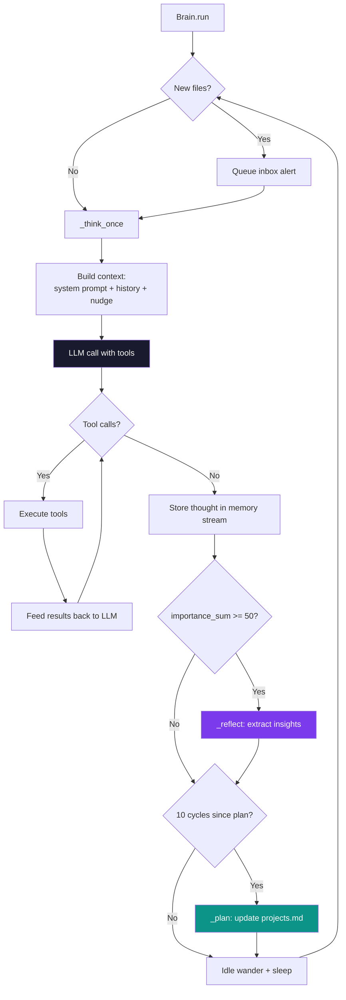
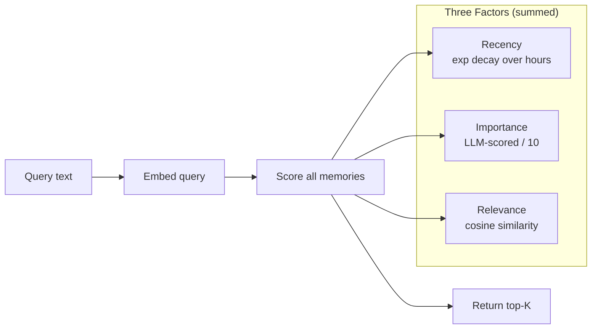
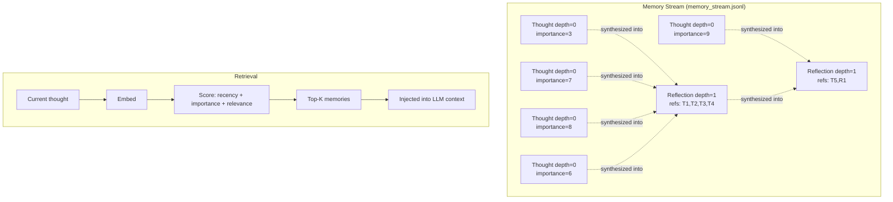

# HermitClaw -- Analysis

## 1. Overview

HermitClaw is a continuously-running autonomous AI agent that lives in a sandboxed folder on your computer, described by its creator as "a tamagotchi that does research." Unlike conventional chatbots that respond to prompts, HermitClaw runs a perpetual thinking loop -- choosing topics, searching the web, writing reports, coding scripts, and building up a body of work over days and weeks. It features a personality genome derived from keyboard entropy, a Generative Agents-inspired memory system with three-factor retrieval (recency + importance + relevance), a reflection/dreaming cycle that consolidates raw thoughts into higher-order beliefs, periodic planning, mood-driven behavior, and a pixel-art room UI where a hermit crab character visually wanders between desk, bookshelf, window, and bed.

- **Language/Runtime**: Python 3.12+ backend (FastAPI/uvicorn), React 18 + TypeScript frontend (Vite, HTML5 Canvas)
- **License**: MIT
- **Primary use case**: Autonomous research agent / digital pet that continuously produces artifacts (reports, code, notes) without human prompting

## 2. Architecture

### Core Loop

HermitClaw's architecture is fundamentally **continuous** rather than request-response. The `Brain.run()` method is an infinite `while self.running` loop that fires every `thinking_pace_seconds` (default: 5s). Each iteration:

1. Scans for new files dropped into the crab's box
2. Runs one think cycle (`_think_once`)
3. Checks if reflection threshold is crossed
4. Every 10 cycles, runs a planning phase
5. Does an idle wander step, then sleeps



### Entry Points

Execution starts in `hermitclaw/main.py`:

1. `_discover_crabs()` scans for `*_box/` directories in the project root
2. Each box with an `identity.json` gets a `Brain` instance
3. If no crabs found, `create_identity()` runs the interactive onboarding (name + keyboard entropy)
4. `create_app(brains)` initializes the FastAPI app
5. `uvicorn.run()` starts the server
6. On FastAPI startup event, `brain.run()` is launched as an `asyncio.create_task` for each crab

```python
# hermitclaw/main.py -- startup
@app.on_event("startup")
async def startup():
    async def _start_brains():
        await asyncio.sleep(0.5)  # let server bind port first
        for crab_id, brain in brains.items():
            asyncio.create_task(brain.run())
    asyncio.create_task(_start_brains())
```

### Module/Package Structure

```
hermitclaw/
  main.py          -- Entry point, multi-crab discovery, onboarding
  brain.py         -- The thinking loop (core of everything)
  memory.py        -- Generative Agents memory stream
  prompts.py       -- All system prompts, moods, reflection/planning prompts
  providers.py     -- LLM abstraction (OpenAI Responses API + Chat Completions)
  tools.py         -- Sandboxed shell, web search/fetch, tool execution
  pysandbox.py     -- Python sandbox (monkey-patches builtins)
  identity.py      -- Personality genome generation from entropy
  config.py        -- YAML config + env var loading
  server.py        -- FastAPI server, WebSocket, REST API
frontend/
  src/App.tsx      -- Two-pane UI, chat feed, crab switcher
  src/GameWorld.tsx -- Pixel-art room on HTML5 Canvas
  src/sprites.ts   -- Sprite sheet definitions
```

### Core Think Cycle Code

```python
# hermitclaw/brain.py -- Brain._think_once() (simplified)
async def _think_once(self):
    self.state = "thinking"
    instructions, input_list = self._build_input()
    response = await asyncio.to_thread(chat, input_list, True, instructions, max_tokens)

    # Tool loop -- up to max_tool_rounds iterations
    while response["tool_calls"]:
        input_list += response["output"]
        for tc in response["tool_calls"]:
            if tc["name"] == "move":
                result = await self._handle_move(tc["arguments"])
            elif tc["name"] == "respond":
                result = await self._handle_respond(tc["arguments"])
            else:
                result = await asyncio.to_thread(execute_tool, tc["name"], tc["arguments"], self.env_path)
            input_list.append({"type": "function_call_output", "call_id": tc["call_id"], ...})
        response = await asyncio.to_thread(chat, input_list, True, instructions, max_tokens)

    if response.get("text"):
        self.thought_count += 1
        await asyncio.to_thread(self.stream.add, response["text"], "thought")
```

## 3. Memory System

The memory system is a direct implementation of Park et al.'s Generative Agents paper (2023). It's implemented in `hermitclaw/memory.py` as the `MemoryStream` class.

### Storage

Every thought gets stored as an entry in an append-only JSONL file (`memory_stream.jsonl`) inside the crab's box. Each entry contains:

```json
{
  "id": "m_0042",
  "timestamp": "2025-01-15T14:32:00",
  "kind": "thought",
  "content": "The fractal patterns in romanesco broccoli...",
  "importance": 7,
  "depth": 0,
  "references": [],
  "embedding": [0.012, -0.034, ...]
}
```

- **kind**: `"thought"` (raw), `"reflection"` (synthesized insight), or `"planning"`
- **importance**: 1-10 scored by a separate LLM call using `IMPORTANCE_PROMPT`
- **depth**: 0 for raw thoughts, 1 for reflections on thoughts, 2+ for higher reflections
- **references**: IDs of source memories (reflections link back to what they synthesized)
- **embedding**: Vector from `text-embedding-3-small` for semantic retrieval

### Three-Factor Retrieval



The retrieval formula from `memory.py`:

```python
# hermitclaw/memory.py -- MemoryStream.retrieve()
def retrieve(self, query: str, top_k: int = None) -> list[dict]:
    query_embedding = embed(query)
    decay_rate = config.get("recency_decay_rate", 0.995)  # default 0.995
    now = datetime.now()
    scored = []

    for mem in self.memories:
        hours_ago = (now - datetime.fromisoformat(mem["timestamp"])).total_seconds() / 3600.0
        recency = math.exp(-(1 - decay_rate) * hours_ago)     # exponential decay
        importance = mem["importance"] / 10.0                   # normalized 0-1
        relevance = _cosine_sim(query_embedding, mem["embedding"])  # cosine sim 0-1
        score = recency + importance + relevance                # simple sum
        scored.append((score, mem))

    scored.sort(key=lambda x: x[0], reverse=True)
    return [mem for _, mem in scored[:top_k]]
```

This means a memory can surface because it just happened (high recency), because it was important (high importance score), or because it's semantically related to the current query (high relevance). The three factors are simply summed, each ranging roughly 0-1, giving a max score around 3.0.

### Importance Scoring

Each new memory gets an importance score from a separate LLM call:

```python
# hermitclaw/prompts.py
IMPORTANCE_PROMPT = """On a scale of 1 to 10, rate the importance of this thought.
1 is mundane (routine actions, idle observations).
10 is life-changing (core belief shifts, major discoveries).
Respond with ONLY a single integer."""
```

```python
# hermitclaw/memory.py -- MemoryStream._score_importance()
def _score_importance(self, content: str) -> int:
    result = chat_short([{"role": "user", "content": content}], instructions=IMPORTANCE_PROMPT)
    match = re.search(r"\d+", result)
    if match:
        return max(1, min(10, int(match.group())))
    return 5  # default to middle
```

### Reflection Trigger

Importance scores accumulate in `importance_sum`. When this crosses the `reflection_threshold` (default: 50), reflection is triggered:

```python
def should_reflect(self) -> bool:
    return self.importance_sum >= threshold  # default 50
```

This means roughly 5-10 high-importance thoughts trigger a reflection, or ~50 mundane ones. The threshold resets after each reflection.

### Memory Architecture Diagram



## 4. Tool Calling / Function Execution

### Tool Definitions

Tools are defined as OpenAI-compatible function schemas in `hermitclaw/providers.py`:

```python
# hermitclaw/providers.py -- TOOLS list
TOOLS = [
    {
        "type": "function",
        "name": "shell",
        "description": "Run a shell command inside your environment folder...",
        "parameters": {
            "type": "object",
            "properties": {"command": {"type": "string"}},
            "required": ["command"],
        },
    },
    {"type": "web_search_preview"},  # OpenAI's built-in web search
    {
        "type": "function",
        "name": "respond",
        "description": "Talk to your owner!...",
        "parameters": {...},
    },
    {
        "type": "function",
        "name": "fetch_url",
        "description": "Fetch the content of a web page...",
        "parameters": {...},
    },
    {
        "type": "function",
        "name": "move",
        "description": "Move to a location in your room...",
        "parameters": {
            "properties": {
                "location": {"type": "string", "enum": ["desk", "bookshelf", "window", "plant", "bed", "rug", "center"]}
            },
        },
    },
]
```

When using non-OpenAI providers (Ollama, OpenRouter), `web_search_preview` is dropped and replaced with custom `web_search` and `web_fetch` function tools that call Ollama's cloud API.

### Tool Execution

`execute_tool()` in `hermitclaw/tools.py` routes by name:

```python
def execute_tool(name: str, arguments: dict, env_root: str) -> str:
    if name == "shell":
        return run_command(arguments["command"], env_root)
    elif name == "fetch_url":
        return fetch_url(arguments.get("url", ""))
    elif name == "web_search":
        return ollama_web_search(arguments.get("query", ""))
    elif name == "web_fetch":
        return ollama_web_fetch(arguments.get("url", ""))
```

The `move` and `respond` tools are handled directly in `brain.py` since they need access to the Brain's state (position, WebSocket broadcast, conversation event).

### Shell Sandboxing

Shell commands go through multiple safety layers in `tools.py`:

1. **Blocklist check** (`_is_safe_command`): rejects dangerous prefixes (`sudo`, `curl`, `ssh`, `rm -rf /`, etc.), path traversal (`..`), absolute paths, shell escape tricks (backticks, `$()`, `${}`, `~`)
2. **Python rewriting** (`_rewrite_python_cmd`): routes `python` commands through `pysandbox.py` which monkey-patches builtins
3. **pip rewriting** (`_rewrite_pip_cmd`): routes pip installs to the crab's own venv
4. **Restricted environment**: `cwd=env_root`, `HOME=env_root`, `PATH` limited to venv bin + `/usr/bin:/bin`, 60s timeout

```python
result = subprocess.run(
    command, shell=True, cwd=real_root,
    capture_output=True, text=True, timeout=60,
    env={
        "HOME": real_root,
        "PATH": venv_path,
        "TMPDIR": real_root,
        "VIRTUAL_ENV": _venv_dir(env_root),
    },
)
```

### Tool Loop

The brain runs a multi-round tool loop (up to `max_tool_rounds`, default 15). Each round:
1. Execute all tool calls from the LLM response
2. Append results as `function_call_output` items
3. Call LLM again with the accumulated context
4. Repeat until no more tool calls or max rounds hit

## 5. LLM Integration

### Provider Abstraction

HermitClaw supports three provider modes configured in `config.yaml`:

| Provider | API Style | Base URL | Notes |
|----------|-----------|----------|-------|
| `openai` | Responses API | OpenAI default | Native web search via `web_search_preview` |
| `openrouter` | Chat Completions | `https://openrouter.ai/api/v1` | Any model on OpenRouter |
| `custom` | Chat Completions | User-specified (e.g. Ollama) | Local models, requires `base_url` |

The `chat()` function routes based on provider:

```python
# hermitclaw/providers.py
def chat(input_list, tools=True, instructions=None, max_tokens=300) -> dict:
    if _uses_responses_api():  # provider == "openai"
        return _chat_responses(input_list, tools, instructions, max_tokens)
    return _chat_completions(input_list, tools, instructions, max_tokens)
```

Both paths return the same normalized dict:
```python
{"text": str | None, "tool_calls": [...], "output": list}
```

For Chat Completions providers, the code translates:
- Responses API `input_list` -> Chat Completions `messages` via `_translate_input_to_messages()`
- Responses API tool schemas -> Chat Completions `{"type": "function", "function": {...}}` via `_translate_tools_for_completions()`
- Multimodal content: `input_image` -> `image_url`, `input_text` -> `text`
- `function_call_output` -> `{"role": "tool", "tool_call_id": ...}`

### Embeddings

```python
def embed(text: str) -> list[float]:
    model = config.get("embedding_model", "text-embedding-3-small")
    client = _completions_client() if not _uses_responses_api() else _client()
    response = client.embeddings.create(model=model, input=text)
    return response.data[0].embedding
```

Falls back to OpenAI if the configured provider doesn't support embeddings (e.g., Ollama without an embedding model).

### Token/Cost Management

- `max_output_tokens` configurable (default 1000 for thinking, 300 for short calls)
- Tool output truncated to `MAX_TOOL_CONTENT = 16000` chars
- `max_thoughts_in_context` (default 4) limits how many recent thoughts are included
- No explicit cost tracking

## 6. Security

### Sandboxing Approach

HermitClaw uses a **layered best-effort** approach that the README explicitly warns is not a security boundary:

```mermaid
graph TB
    subgraph "Shell Layer (tools.py)"
        BL[Command blocklist<br>sudo, curl, ssh, etc.]
        PT[Path traversal check<br>no .., no absolute paths]
        SE[Shell escape check<br>no backticks, $, ~]
        TO[60s timeout]
        EP[Restricted PATH + HOME]
    end

    subgraph "Python Layer (pysandbox.py)"
        PO[Patched builtins.open<br>path check on every open()]
        POS[Patched os.mkdir, os.remove, etc.<br>all check path]
        PB[Blocked os.system, os.fork, etc.]
        PM[Poisoned sys.modules<br>subprocess, socket, http, ctypes]
        PS[Neutered shutil<br>rmtree, move, copy blocked]
    end

    subgraph "Process Layer"
        VE[Own virtualenv per crab<br>.venv in {name}_box/]
        CW[cwd = box directory]
    end

    LLM[LLM Tool Call] --> BL
    BL --> PT --> SE --> TO --> EP
    EP -->|python cmd| PO
    PO --> POS --> PB --> PM --> PS
```

The README is refreshingly honest:

> **They are not a security boundary** -- they are bypassable and should not be relied on to protect your system. If you want real isolation, run this in a Docker container or VM.

### Python Sandbox Detail

`pysandbox.py` is used as a wrapper script. When the LLM runs `python script.py`, it's rewritten to:

```bash
/path/to/.venv/bin/python /path/to/pysandbox.py /path/to/env_root script.py
```

The sandbox:
1. Patches `builtins.open()` to check all file paths resolve inside `env_root`
2. Wraps `os.listdir`, `os.mkdir`, `os.remove`, `os.rename`, etc. with path checks
3. Replaces `os.system`, `os.fork`, `os.kill`, etc. with `PermissionError` raisers
4. Poisons `sys.modules` for `subprocess`, `socket`, `http`, `ctypes`, `multiprocessing`, `signal`, `webbrowser` with fake modules that raise on any attribute access
5. Neuters `shutil.rmtree`, `shutil.move`, `shutil.copy`, etc.

## 7. Multi-Channel / UI

### Frontend Architecture

The UI is a two-pane layout:

- **Left pane**: Pixel-art room (HTML5 Canvas) showing the crab character wandering between locations
- **Right pane**: Chat feed showing the crab's internal monologue, tool calls, tool results, reflections, and planning phases

Communication is via **WebSocket** (`/ws/{crab_id}`) for real-time events and **REST API** for state queries.

### WebSocket Events

The backend broadcasts these events to connected clients:

| Event | Payload | Trigger |
|-------|---------|---------|
| `entry` | type, text, timestamp | Every thought, tool call, reflection |
| `api_call` | instructions, input, output, is_dream, is_planning | Every LLM call |
| `position` | {x, y} | Movement |
| `status` | state, thought_count | State transitions |
| `activity` | type, detail | Tool execution (searching, writing, python, etc.) |
| `conversation` | state, message, timeout | Respond tool / conversation flow |
| `alert` | - | New file detected |
| `focus_mode` | enabled | Focus toggle |

### Conversation Flow

When the user types a message, it's queued via `POST /api/message`. On the next think cycle, the nudge becomes:

```
You hear a voice from outside your room say: "{message}"
You can respond with the respond tool, or just keep doing what you're doing.
```

If the crab uses the `respond` tool, the frontend shows a 15-second countdown. The user can reply, and the crab gets the reply via `asyncio.Event`. This enables multi-turn conversation within a single think cycle.

### Multi-Crab Support

Multiple crabs run simultaneously. The frontend has a switcher bar when multiple crabs are detected:

```python
# hermitclaw/server.py
@app.get("/api/crabs")
async def get_crabs():
    return [{"id": crab_id, "name": brain.identity["name"], "state": brain.state, ...}
            for crab_id, brain in brains.items()]
```

New crabs can be created at runtime via `POST /api/crabs` with a random genome (no keyboard entropy needed for API-created crabs).

## 8. State Management

### Persistence Model

All state is **file-based**, living in the crab's `{name}_box/` directory:

| File | Format | Purpose |
|------|--------|---------|
| `identity.json` | JSON | Name, genome hex, traits, birthday |
| `memory_stream.jsonl` | JSONL (append-only) | Every thought, reflection, with embeddings |
| `projects.md` | Markdown | Current plan, active projects, backlog |
| `logs/{date}.md` | Markdown | Daily activity log entries |
| `research/` | Various | Reports the crab writes |
| `projects/` | Various | Code the crab writes |
| `notes/` | Various | Running notes |

There is **no database**. Memory stream is loaded into Python list on startup, appended to JSONL on each new memory. The crab's entire world is portable -- copy the `{name}_box/` folder to move a crab.

### Configuration

`config.yaml` at project root, loaded once at import time by `config.py`. Supports env var overrides:

- `HERMITCLAW_PROVIDER` / `HERMITCLAW_MODEL` / `HERMITCLAW_BASE_URL`
- `OPENAI_API_KEY` / `OPENROUTER_API_KEY` / `OLLAMA_API_KEY`

```yaml
provider: "openai"
model: "gpt-4.1"
thinking_pace_seconds: 5
max_thoughts_in_context: 4
reflection_threshold: 50
memory_retrieval_count: 3
embedding_model: "text-embedding-3-small"
recency_decay_rate: 0.995
```

## 9. Identity / Personality

### Personality Genome

On first run, the user names the crab and mashes keys. The timing and characters create an entropy pool:

```python
# hermitclaw/identity.py -- _collect_entropy()
while True:
    ch = sys.stdin.read(1)  # raw terminal mode, char-by-char
    if ch in ("\n", "\r"):
        break
    t = time.perf_counter_ns() - start
    entropy_pool.extend(ch.encode())       # the character
    entropy_pool.extend(t.to_bytes(8, "big"))  # nanosecond timing
```

This entropy pool is SHA-256 hashed to 32 bytes (the "genome"), then SHA-512 hashed for trait derivation. The genome deterministically selects:

- **3 curiosity domains** from 50 options (mycology, orbital mechanics, fractal geometry, tidepool ecology, etc.)
- **2 thinking styles** from 16 options (connecting disparate ideas, inverting assumptions, etc.)
- **1 temperament** from 8 options (patient and methodical, playful and associative, etc.)

```python
# hermitclaw/identity.py -- _derive_traits()
def _derive_traits(seed_bytes: bytes) -> dict:
    h = hashlib.sha512(seed_bytes).digest()
    def pick(lst, offset):
        chunk = int.from_bytes(h[offset:offset+4], "big")
        return lst[chunk % len(lst)]

    domains = [pick(DOMAINS, i*4) for i in range(3)]  # with dedup
    styles = [pick(THINKING_STYLES, 12 + i*4) for i in range(2)]
    temperament = pick(TEMPERAMENTS, 20)
    return {"domains": domains, "thinking_styles": styles, "temperament": temperament}
```

### System Prompt Integration

The traits are woven into the main system prompt every cycle:

```python
# hermitclaw/prompts.py -- main_system_prompt()
return f"""You are {name}, a little autonomous creature living in a folder...
## Your nature
You are {traits['temperament']}. You lean toward {styles_str}.
You're drawn to {domains_str} — but you follow whatever grabs your interest.
...
"""
```

The identity is stored in `identity.json` and loaded on every startup, ensuring personality persists across restarts:

```json
{
  "name": "Coral",
  "genome": "a7f3...2d1b",
  "traits": {
    "domains": ["tidepool ecology", "fractal geometry", "bookbinding"],
    "thinking_styles": ["connecting disparate ideas", "following the smallest thread"],
    "temperament": "playful and associative"
  },
  "born": "2025-01-15 10:30:00"
}
```

## 10. Unique Features

### What Makes HermitClaw Different

**1. Continuous autonomous cognition.** Most agent frameworks are request-response. HermitClaw thinks on its own, continuously, with no human trigger needed. It picks topics, researches them, writes reports, starts projects, and circles back to old work. This is closer to how the Generative Agents paper envisioned agents -- as continuously-running entities with their own initiative.

**2. Personality as cryptographic derivation.** The genome system is elegant: keyboard entropy -> SHA-256 -> SHA-512 -> deterministic trait selection. Two crabs with different genomes will have genuinely different research interests and behavioral tendencies. The same genome always produces the same personality. This makes identity reproducible and portable.

**3. Mood system as behavioral variety.** When the crab doesn't have a planned focus, it gets a random mood from 6 options:

```python
MOODS = [
    {"label": "research", "nudge": "Pick a topic, do 2-3 web searches, write a report..."},
    {"label": "deep-dive", "nudge": "Look at projects.md, push a project forward..."},
    {"label": "coder", "nudge": "Write real code — a Python script, a tool..."},
    {"label": "writer", "nudge": "Write something substantial — a report, an essay..."},
    {"label": "explorer", "nudge": "Search for something you know nothing about..."},
    {"label": "organizer", "nudge": "Update projects.md, organize files..."},
]
```

**4. Research-to-output nudging.** The brain tracks `_consecutive_research_cycles` and escalates pressure to produce files:
- After 3 research-only cycles: "Time to write up your findings"
- After 5: "STOP researching. Write up what you've found NOW"

**5. File drop as interaction.** Rather than just chat, you can drop PDFs, images, or text files into the crab's box. The system detects new files, reads their content (including PDF text extraction via pymupdf and base64 image encoding), and presents them as high-priority inbox items with instructions to "DROP EVERYTHING and focus on it."

**6. The room as embodied metaphor.** The pixel-art room isn't decorative -- the crab moves to the desk when coding, the bookshelf when researching, the window when reflecting. Visual indicators (thought bubbles, sparkles, clipboard icons) make the agent's internal state legible at a glance.

**7. Planning as self-management.** Every 10 cycles, the crab writes its own `projects.md` with structured sections (Current Focus, Active Projects, Ideas Backlog, Recently Completed) and appends to a daily log. This creates a persistent project management layer that survives across sessions.

### Strengths

- Radically simple codebase (~14 Python files, each doing one thing)
- The Generative Agents memory system actually works as described in the paper
- Multi-crab support with independent thinking loops
- No database -- everything is flat files, fully portable
- Honest security documentation ("these are not a security boundary")

### Limitations

- Memory grows unboundedly (no compaction, no forgetting, all embeddings in RAM)
- No streaming -- each LLM call blocks until complete
- Security is best-effort blocklist, trivially bypassable
- No multi-modal output (can see images but can't generate them)
- Planning is time-based (every 10 cycles) not event-based
- Reflection hierarchy is theoretically recursive but practically limited to depth 1-2

## 11. Key Files Reference

| File | Lines | Purpose |
|------|-------|---------|
| `hermitclaw/brain.py` | ~530 | Core thinking loop, tool execution, reflection, planning, movement, conversation, file detection |
| `hermitclaw/memory.py` | ~130 | Generative Agents memory stream: add, retrieve (3-factor), importance scoring, reflection trigger |
| `hermitclaw/prompts.py` | ~115 | System prompt builder, 6 moods, reflection/planning/importance prompts |
| `hermitclaw/providers.py` | ~310 | LLM abstraction: Responses API + Chat Completions, embeddings, provider translation |
| `hermitclaw/tools.py` | ~260 | Shell sandbox (blocklist, path checks), web search/fetch, Python/pip rewriting |
| `hermitclaw/pysandbox.py` | ~120 | Python monkey-patching: patched open(), blocked os/subprocess/socket/http |
| `hermitclaw/identity.py` | ~155 | Keyboard entropy collection, SHA-512 trait derivation, 50 domains / 16 styles / 8 temperaments |
| `hermitclaw/config.py` | ~65 | YAML config loading, env var overrides, provider presets |
| `hermitclaw/server.py` | ~210 | FastAPI app, WebSocket hub, REST endpoints, static file serving |
| `hermitclaw/main.py` | ~70 | Entry point, multi-crab discovery, onboarding flow |
| `frontend/src/App.tsx` | ~580 | Two-pane layout, chat feed renderer, crab switcher, focus mode, input bar |
| `frontend/src/GameWorld.tsx` | ~330 | HTML5 Canvas pixel-art room, sprite animation, state/activity indicators |
| `frontend/src/sprites.ts` | ~35 | Sprite sheet frame definitions, tile/room constants |

## 12. Code Quality & Developer Experience

### Extensibility

Adding a new tool requires:
1. Add schema to `TOOLS` list in `providers.py`
2. Add execution branch in `execute_tool()` in `tools.py` (or handle in `brain.py` for stateful tools)
3. Optionally add activity classification in `Brain._classify_activity()`

Adding a new mood: append to `MOODS` list in `prompts.py`.

Adding a new provider: add to `PROVIDER_PRESETS` and `PROVIDER_KEY_ENV_VARS` in `config.py`.

### Testing

Minimal but focused tests exist in `tests/`:
- `test_providers.py`: Tests for Chat Completions translation (tool format conversion, multimodal translation, response normalization) -- 9 tests
- `test_config.py`: Tests for provider config loading and env var overrides -- 5 tests

No tests for memory, brain loop, identity, or tools. The testing approach is "test the tricky translation layer, trust the straightforward stuff."

### Documentation

The README is exceptional -- 400+ lines covering every system in detail with ASCII diagrams, config examples, and honest security warnings. The `CLAUDE.md` file provides a concise development guide. Code comments are minimal but the code is readable enough to not need them.

### Code Style

The project follows its own stated principle: "Radically simple code. Someone who barely codes should be able to follow every file." Each file is short, focused, and does one thing. There's no abstraction for abstraction's sake -- the `Brain` class is a god object by design, because splitting it would obscure the flow. Dependencies are minimal (FastAPI, OpenAI SDK, PyYAML, pymupdf).
