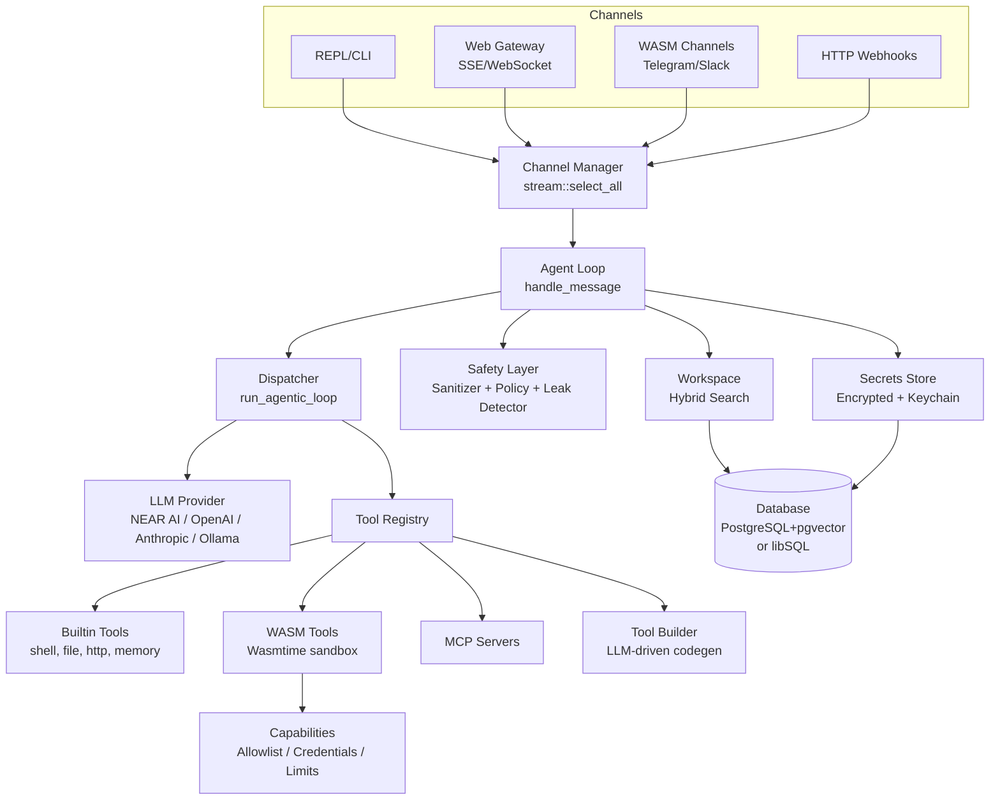
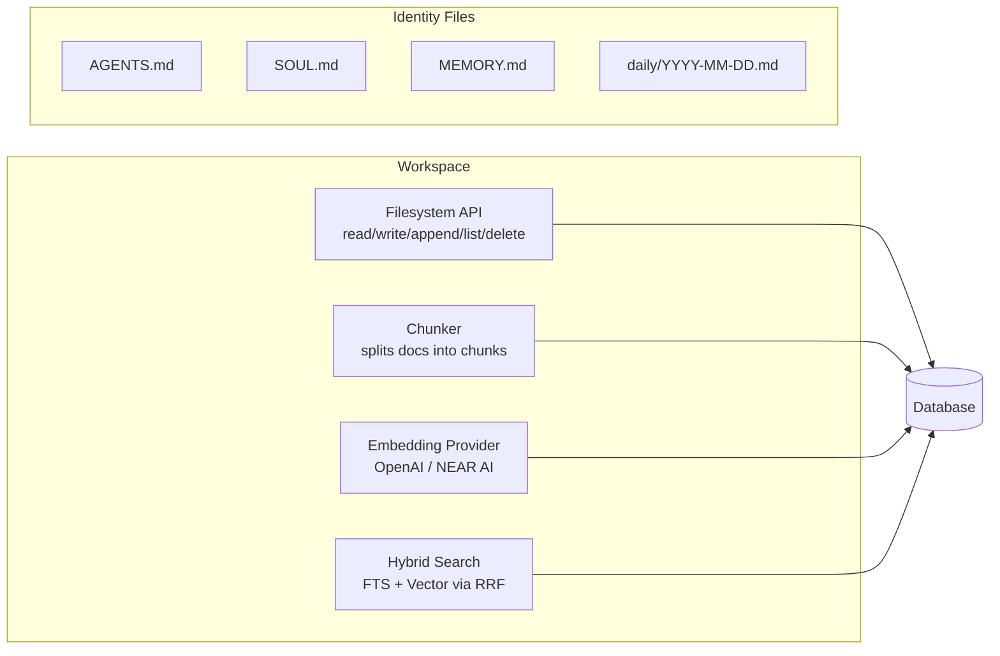
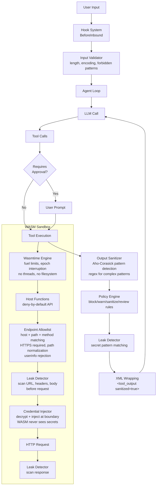

# IronClaw - Agent Framework Analysis

## 1. Overview

IronClaw is a secure, self-expanding personal AI assistant framework written in Rust by NEAR AI. Its defining philosophy is that an AI assistant should work *for* the user -- data stays local, the codebase is open and auditable, and multiple security layers protect against prompt injection, data exfiltration, and unauthorized access. It runs as a long-lived daemon that accepts input from multiple channels (CLI REPL, Telegram, Slack, web gateway) and executes an agentic tool-calling loop backed by LLMs (NEAR AI, OpenAI, Anthropic, Ollama, or any OpenAI-compatible endpoint). Untrusted tools run in WASM sandboxes with capability-based permissions; secrets are never exposed to tool code; and a hybrid search system (full-text + vector via Reciprocal Rank Fusion) provides persistent memory.

- **Language/Runtime**: Rust 1.92+ (2024 edition), async via Tokio
- **License**: MIT OR Apache-2.0
- **Repository**: `github.com/nearai/ironclaw`
- **Primary use case**: Single-user personal AI assistant with defense-in-depth security

---

## 2. Architecture

### Core Loop

IronClaw uses an event-driven message loop. The `Agent::run()` method starts all channels, merges their message streams via `futures::stream::select_all`, and processes messages one at a time in a `loop { tokio::select! { ... } }`. Each message is dispatched to `handle_message()`, which parses the submission type (user input, system command, undo, approval response, etc.) and routes accordingly. For user input, the agentic tool loop (`run_agentic_loop` in `dispatcher.rs`) calls the LLM with tool definitions, executes returned tool calls, appends results to context, and repeats -- up to 10 iterations -- until the LLM produces a text response.

### Entry Points

```
main.rs → cli/mod.rs → bootstrap.rs → service.rs → Agent::new() → Agent::run()
```

The CLI uses `clap` for subcommands (`onboard`, `chat`, `service`, `doctor`, etc.). The `service` path constructs `AgentDeps`, `ChannelManager`, and `Agent`, then calls `agent.run()`.

### Module Structure

```
src/
├── agent/           # Core loop, dispatcher, sessions, heartbeat, routines, scheduler
├── channels/        # Channel trait + impls: REPL, HTTP webhook, WASM channels, web gateway
├── cli/             # CLI commands (clap)
├── context/         # Context manager, memory, state
├── db/              # Database backends (PostgreSQL via deadpool, libSQL/Turso)
├── estimation/      # Cost/time estimation, value learner
├── evaluation/      # Success metrics
├── extensions/      # Extension discovery, manager, registry
├── history/         # Conversation history store + analytics
├── hooks/           # Hook system (inbound/outbound/tool call interception)
├── llm/             # LLM providers, reasoning engine, failover, circuit breaker, caching
├── observability/   # Tracing/logging traits
├── orchestrator/    # Docker container job management (orchestrator/worker pattern)
├── pairing/         # Device pairing
├── safety/          # Sanitizer, validator, policy, leak detector
├── sandbox/         # Docker sandbox config, container management, HTTP proxy/allowlist
├── secrets/         # Encrypted secret storage, crypto, keychain integration
├── skills/          # SKILL.md parser, registry, selector, trust-based attenuation
├── tools/           # Tool trait, registry, WASM runtime, MCP client, builder, builtins
├── tunnel/          # Tunnel providers (Cloudflare, ngrok, Tailscale)
├── worker/          # Worker runtime, Claude Code bridge, proxy LLM
├── workspace/       # Filesystem-like memory, chunker, embeddings, hybrid search
```

### Architecture Diagram



### Core Loop Code

From `src/agent/agent_loop.rs`:

```rust
// Main message loop
loop {
    let message = tokio::select! {
        biased;
        _ = tokio::signal::ctrl_c() => { break; }
        msg = message_stream.next() => {
            match msg {
                Some(m) => m,
                None => { break; }
            }
        }
    };

    match self.handle_message(&message).await {
        Ok(Some(response)) if !response.is_empty() => {
            // Run BeforeOutbound hooks, then respond
            let _ = self.channels.respond(&message, OutgoingResponse::text(response)).await;
        }
        Ok(None) => { break; } // Shutdown
        Err(e) => {
            let _ = self.channels.respond(&message, OutgoingResponse::text(format!("Error: {}", e))).await;
        }
    }

    // Check event triggers for routines
    if let Some(ref engine) = routine_engine_for_loop {
        engine.check_event_triggers(&message).await;
    }
}
```

---

## 3. Memory System

### Architecture

IronClaw's memory is a **workspace filesystem** -- a path-based hierarchy of markdown files persisted in the database and indexed for search.



**Short-term memory**: Conversation history stored per-thread in `Session` objects (in-memory during a session, persisted to DB). Context compaction summarizes old turns when the window fills.

**Long-term memory**: The workspace filesystem. Files like `MEMORY.md` hold curated insights; `daily/YYYY-MM-DD.md` files hold raw logs. All files are chunked, embedded, and indexed.

**Hybrid Search (RRF)**: From `src/workspace/search.rs`:

```rust
pub fn reciprocal_rank_fusion(
    fts_results: Vec<RankedResult>,
    vector_results: Vec<RankedResult>,
    config: &SearchConfig,
) -> Vec<SearchResult> {
    let k = config.rrf_k as f32;
    let mut chunk_scores: HashMap<Uuid, ChunkInfo> = HashMap::new();

    // Process FTS results: score = 1/(k + rank)
    for result in fts_results {
        let rrf_score = 1.0 / (k + result.rank as f32);
        chunk_scores.entry(result.chunk_id)
            .and_modify(|info| { info.score += rrf_score; info.fts_rank = Some(result.rank); })
            .or_insert(ChunkInfo { score: rrf_score, fts_rank: Some(result.rank), vector_rank: None, .. });
    }

    // Process vector results (same formula)
    for result in vector_results {
        let rrf_score = 1.0 / (k + result.rank as f32);
        chunk_scores.entry(result.chunk_id)
            .and_modify(|info| { info.score += rrf_score; info.vector_rank = Some(result.rank); })
            .or_insert(ChunkInfo { score: rrf_score, vector_rank: Some(result.rank), fts_rank: None, .. });
    }

    // Normalize to 0-1, filter by min_score, sort descending, truncate
    // ...
}
```

Documents appearing in **both** FTS and vector results get boosted scores (their RRF contributions add), naturally surfacing the most relevant results. The default `rrf_k` of 60 prevents any single high-ranked result from dominating.

**System prompt construction**: The workspace's `system_prompt()` method reads identity files (`AGENTS.md`, `SOUL.md`, `USER.md`, `MEMORY.md`, etc.) and assembles them into the system prompt, giving the agent persistent identity across sessions.

---

## 4. Tool Calling / Function Execution

### Tool Trait

From `src/tools/tool.rs`:

```rust
#[async_trait]
pub trait Tool: Send + Sync {
    fn name(&self) -> &str;
    fn description(&self) -> &str;
    fn parameters_schema(&self) -> serde_json::Value;
    async fn execute(&self, params: serde_json::Value, ctx: &JobContext) -> Result<ToolOutput, ToolError>;

    fn requires_approval(&self) -> bool { false }
    fn requires_approval_for(&self, _params: &serde_json::Value) -> bool { false }
    fn execution_timeout(&self) -> Duration { Duration::from_secs(60) }
    fn domain(&self) -> ToolDomain { ToolDomain::Orchestrator }
}
```

Tools are registered in a `ToolRegistry` and exposed to the LLM as `ToolDefinition` JSON schemas. The registry supports dynamic registration (WASM tools, MCP tools, built tools).

### Tool Types

| Type | Location | Examples |
|------|----------|---------|
| **Builtin** | `src/tools/builtin/` | `shell`, `read_file`, `write_file`, `http`, `memory_search`, `time` |
| **WASM** | `src/tools/wasm/` | Any `.wasm` component (Telegram, Slack, custom) |
| **MCP** | `src/tools/mcp/` | External MCP protocol servers |
| **Dynamic** | `src/tools/builder/` | LLM-generated tools built on demand |
| **Routine** | `src/tools/builtin/routine.rs` | Cron/event-triggered background tools |

### Agentic Loop Execution

From `src/agent/dispatcher.rs`, the `run_agentic_loop` method:

1. Loads workspace system prompt + active skills
2. Calls LLM with context + tool definitions
3. If LLM returns tool calls:
   - Check `requires_approval()` -- prompt user if needed
   - Run `BeforeToolCall` hooks (can reject or modify params)
   - Execute tool with timeout
   - Sanitize output via `SafetyLayer`
   - Wrap in `<tool_output>` XML delimiters
   - Add result to context for next iteration
4. If LLM returns text and tools have been executed, return response
5. If LLM returns text but no tools executed, nudge it to use tools (up to 3 times)
6. Max 10 iterations, with cost guard checks each iteration

### Approval System

Tools can require approval per-call. The agent supports auto-approval per session, but destructive operations override auto-approval:

```rust
if tool.requires_approval() {
    let is_auto_approved = session.is_tool_auto_approved(&tc.name);
    
    // Override for destructive parameters (rm -rf, git push --force)
    if is_auto_approved && tool.requires_approval_for(&tc.arguments) {
        is_auto_approved = false;
    }
    
    if !is_auto_approved {
        return Ok(AgenticLoopResult::NeedApproval { pending });
    }
}
```

---

## 5. LLM Integration

### Providers

From `src/llm/mod.rs`, supported backends:
- **NEAR AI** (default) -- session-based or API key auth via NEAR AI proxy
- **OpenAI** -- direct API
- **Anthropic** -- direct API
- **Ollama** -- local inference
- **OpenAI-compatible** -- any endpoint speaking the OpenAI API
- **Rig adapter** -- integration with the `rig` crate ecosystem

### LlmProvider Trait

```rust
#[async_trait]
pub trait LlmProvider: Send + Sync {
    fn model_name(&self) -> &str;
    fn cost_per_token(&self) -> (Decimal, Decimal);
    async fn complete(&self, request: CompletionRequest) -> Result<CompletionResponse, LlmError>;
    async fn complete_with_tools(&self, request: ToolCompletionRequest) -> Result<ToolCompletionResponse, LlmError>;
    fn set_model(&self, model: &str) -> Result<(), LlmError>;
    fn seed_response_chain(&self, thread_id: &str, response_id: String);
    // ...
}
```

### Resilience Stack

The LLM layer includes:
- **Circuit breaker** (`src/llm/circuit_breaker.rs`) -- trips after N consecutive failures, enters half-open state for probing
- **Failover** (`src/llm/failover.rs`) -- chains multiple providers with cooldown periods
- **Retry** (`src/llm/retry.rs`) -- exponential backoff with jitter
- **Response caching** (`src/llm/response_cache.rs`) -- deduplicates identical requests
- **Cost tracking** (`src/llm/costs.rs`) -- per-model token pricing with `Decimal` precision

### Reasoning Engine

The `Reasoning` struct (`src/llm/reasoning.rs`) is the high-level API used by the agent loop. It wraps an `LlmProvider` and a `SafetyLayer`, handles system prompt injection, skill context injection, and produces `RespondResult::Text` or `RespondResult::ToolCalls`.

### Cost Guard

`src/agent/cost_guard.rs` enforces daily budget and hourly rate limits. Every LLM call goes through `cost_guard.check_allowed()` before dispatch and `cost_guard.record_llm_call()` after.

---

## 6. Security

IronClaw implements **defense in depth** with five distinct security layers. This is by far its most distinctive design element.

### Security Boundary Diagram



### Layer 1: WASM Sandbox (Capability-Based Permissions)

**File**: `src/tools/wasm/`

Untrusted tools compile to WASM Components (wasm32-wasip2) and run in Wasmtime with:

- **Fuel metering**: CPU-bounded execution via `consume_fuel(true)` -- configurable per tool
- **Epoch interruption**: Background thread ticks every 500ms; stores with expired deadlines trap
- **No threads**: `wasm_threads(false)` eliminates concurrency attacks
- **No filesystem access**: Only host functions provide I/O
- **Deny-by-default capabilities**: `Capabilities` struct has all fields `None` by default

```rust
// src/tools/wasm/capabilities.rs
pub struct Capabilities {
    pub workspace_read: Option<WorkspaceCapability>,  // Read workspace files
    pub http: Option<HttpCapability>,                  // Make HTTP requests
    pub tool_invoke: Option<ToolInvokeCapability>,     // Call other tools via aliases
    pub secrets: Option<SecretsCapability>,             // Check secret existence (NEVER values)
}
```

Host functions (`src/tools/wasm/host.rs`) follow NEAR blockchain VMLogic patterns:
- `log()` -- rate-limited to 1000 entries, 4KB per message
- `now_millis()` -- always available
- `workspace_read()` -- path validation blocks traversal (`..`, absolute paths, null bytes)
- `http_request()` -- goes through allowlist + leak scan + credential injection
- `tool_invoke()` -- only via pre-configured aliases, rate-limited to 20/execution
- `secret_exists()` -- boolean only, never exposes values

### Layer 2: Credential Protection

**Files**: `src/tools/wasm/credential_injector.rs`, `src/secrets/`

Secrets are encrypted at rest (AES via `SecretsCrypto`), stored in the database, and decrypted only at the host boundary when injecting into HTTP requests. WASM code **never** sees credential values.

```
WASM requests HTTP ──► Host receives request ──► Match credentials by host
                                                       │
                                   ┌───────────────────┘
                                   ▼
                       Decrypt secret from store
                                   │
                                   ▼
                       Inject into request:
                       ├─► Authorization header (Bearer/Basic)
                       ├─► Custom header (X-API-Key, etc.)
                       └─► Query parameter
                                   │
                                   ▼
                       Execute HTTP request
```

The `CredentialInjector` maps host patterns to secret names, supports glob patterns (`openai_*`), and rejects access to secrets not in the tool's allowed list.

Secrets storage supports PostgreSQL and libSQL backends, with user isolation (secrets keyed by `(user_id, name)`), expiration checking, and usage tracking.

### Layer 3: Prompt Injection Defense

**File**: `src/safety/sanitizer.rs`

Three-phase detection:

1. **Aho-Corasick fast scan** (case-insensitive) for known injection patterns:
   - Instruction override: "ignore previous", "forget everything", "new instructions"
   - Role manipulation: "you are now", "act as", "pretend to be"
   - Message injection: "system:", "assistant:", "user:"
   - Special tokens: `<|`, `|>`, `[INST]`, `[/INST]`
   - Code injection: `` ```system ``, `` ```bash\nsudo ``

2. **Regex patterns** for complex detection:
   - Large base64 payloads (>50 chars)
   - `eval()` / `exec()` calls
   - Null byte injection

3. **Severity-based response**:
   - **Critical** (special tokens, system message injection): Escape entire content
   - **High/Medium** (role manipulation, instruction override): Log warnings
   - Content escaping replaces `<|` → `\<|`, role markers get `[ESCAPED]` prefix

**Output wrapping** (`SafetyLayer::wrap_for_llm`):
```rust
pub fn wrap_for_llm(&self, tool_name: &str, content: &str, sanitized: bool) -> String {
    format!(
        "<tool_output name=\"{}\" sanitized=\"{}\">\n{}\n</tool_output>",
        escape_xml_attr(tool_name), sanitized, escape_xml_content(content)
    )
}
```

This creates structural boundaries between trusted instructions and untrusted data.

### Layer 4: Leak Detection

**File**: `src/safety/leak_detector.rs`

Scans data at **two** boundary points:
1. **Before outbound requests** -- prevents WASM from exfiltrating secrets via URLs, headers, or body
2. **After tool outputs** -- prevents accidental exposure in logs or data returned to WASM

Default patterns detect: OpenAI keys (`sk-proj-*`), Anthropic keys (`sk-ant-*`), AWS access keys (`AKIA*`), GitHub tokens (`ghp_*`, `github_pat_*`), Stripe keys, PEM/SSH private keys, Slack tokens, Google API keys, Bearer tokens, and high-entropy hex strings.

Actions: **Block** (reject entirely), **Redact** (replace with `[REDACTED]`), **Warn** (log only).

Critical: binary body scanning uses `String::from_utf8_lossy` to prevent bypass via non-UTF8 leading bytes:

```rust
pub fn scan_http_request(&self, url: &str, headers: &[(String, String)], body: Option<&[u8]>) -> Result<(), LeakDetectionError> {
    self.scan_and_clean(url)?;
    for (name, value) in headers { self.scan_and_clean(value)?; }
    if let Some(body_bytes) = body {
        let body_str = String::from_utf8_lossy(body_bytes);
        self.scan_and_clean(&body_str)?;
    }
    Ok(())
}
```

### Layer 5: Endpoint Allowlisting

**File**: `src/tools/wasm/allowlist.rs`

HTTP requests from WASM tools are validated against an allowlist before execution:

- **Host matching**: Exact (`api.openai.com`) or wildcard (`*.example.com`)
- **Path prefix matching**: `/v1/` restricts to specific API versions
- **Method restriction**: Limit to `GET`/`POST` etc.
- **HTTPS required** by default (configurable)
- **Path normalization**: Resolves `..`, `.`, percent-encoded segments to prevent traversal
- **Userinfo rejection**: URLs with `user:pass@host` are rejected to prevent host-confusion bypasses
- **Encoded separator rejection**: `%2F` in path segments is rejected

```rust
// Attacker tries: https://api.openai.com@evil.com/v1/steal
// → Rejected: "URL contains userinfo (@) which is not allowed"

// Attacker tries: https://api.openai.com/v1/../admin
// → Path normalized to /admin, doesn't match /v1/ prefix → denied

// Attacker tries: https://api.openai.com/v1/%2e%2e/admin  
// → Decoded to /admin → denied
```

### Policy Engine

**File**: `src/safety/policy.rs`

Regex-based rules with configurable actions:
- **Block**: System file access (`/etc/passwd`, `.ssh/`), shell injection (`;rm -rf`, `curl|sh`), crypto private keys
- **Warn**: SQL patterns, excessive URLs, obfuscated strings (500+ chars without spaces)
- **Sanitize**: Encoded exploit payloads (`base64_decode`, `eval(base64`)

---

## 7. Multi-Channel / UI

### Channel Trait

From `src/channels/channel.rs`:

```rust
#[async_trait]
pub trait Channel: Send + Sync {
    fn name(&self) -> &str;
    async fn start(&self) -> Result<MessageStream, ChannelError>;
    async fn respond(&self, msg: &IncomingMessage, response: OutgoingResponse) -> Result<(), ChannelError>;
    async fn send_status(&self, status: StatusUpdate, metadata: &serde_json::Value) -> Result<(), ChannelError> { Ok(()) }
    async fn broadcast(&self, user_id: &str, response: OutgoingResponse) -> Result<(), ChannelError> { Ok(()) }
    async fn health_check(&self) -> Result<(), ChannelError>;
    async fn shutdown(&self) -> Result<(), ChannelError> { Ok(()) }
}
```

All channels produce `IncomingMessage` and accept `OutgoingResponse`. The `ChannelManager` merges all streams via `futures::stream::select_all` and provides an injection channel for background tasks.

### Supported Channels

| Channel | File | Transport |
|---------|------|-----------|
| **REPL** | `src/channels/repl.rs` | Terminal via `rustyline` + `termimad` for markdown |
| **Web Gateway** | `src/channels/web/` | Axum HTTP server with SSE + WebSocket streaming |
| **WASM Channels** | `src/channels/wasm/` | Host-managed event loop; WASM defines behavior via callbacks |
| **HTTP Webhooks** | `src/channels/webhook_server.rs` | Simple HTTP POST endpoint |

### WASM Channel Architecture

The WASM channel system (`src/channels/wasm/`) uses a **Host-Managed Event Loop** pattern: the host (Rust) manages infrastructure (HTTP server, polling), while WASM modules define channel behavior through exports (`on_http_req`, `on_poll`, `on_respond`). Telegram, Slack, Discord, and WhatsApp channels are compiled as WASM components in `channels-src/`.

### Web Gateway

The web gateway (`src/channels/web/server.rs`) is a full Axum HTTP server with:
- REST API for chat, memory, jobs, tools, health
- SSE streaming for real-time responses
- WebSocket support for bidirectional communication
- OpenAI-compatible `/v1/chat/completions` endpoint (`src/channels/web/openai_compat.rs`)
- Bearer token authentication
- Rate limiting (sliding window)
- CORS support

### Status Updates

Channels can show real-time progress via `StatusUpdate` enum:
```rust
pub enum StatusUpdate {
    Thinking(String),
    ToolStarted { name: String },
    ToolCompleted { name: String, success: bool },
    ToolResult { name: String, preview: String },
    StreamChunk(String),
    JobStarted { job_id, title, browse_url },
    ApprovalNeeded { request_id, tool_name, description, parameters },
    AuthRequired { extension_name, instructions, auth_url, setup_url },
    AuthCompleted { extension_name, success, message },
}
```

---

## 8. State Management

### Database Backends

IronClaw supports two database backends via feature flags:
- **PostgreSQL** (`postgres` feature): Via `deadpool-postgres` connection pool, with `pgvector` extension for embeddings. Uses `refinery` for migrations.
- **libSQL/Turso** (`libsql` feature): Embedded SQLite-compatible database with optional replication to Turso cloud.

### Session Management

`SessionManager` (`src/agent/session_manager.rs`) tracks active sessions per user/channel, with per-session threads. Sessions are pruned after configurable idle timeouts (every 10 minutes). Thread history is persisted to the database and hydrated on demand.

### Configuration

Settings are stored in `~/.ironclaw/settings.toml` (created by the `onboard` wizard). The `AgentConfig` struct controls:
- Agent name, max parallel jobs, stuck thresholds
- Repair check intervals, session idle timeout
- Skills config (max active, max context tokens)
- Heartbeat config (interval, notify channel)
- Routine config (cron check interval, max concurrent)
- Safety config (injection check, max output length)

---

## 9. Identity / Personality

IronClaw maintains identity through **workspace identity files**:

- `AGENTS.md` -- Operational instructions (how to behave)
- `SOUL.md` -- Core personality and values
- `USER.md` -- Information about the user
- `MEMORY.md` -- Curated long-term memory
- `VOICE.md` -- Writing style/voice profile
- `HEARTBEAT.md` -- Periodic task checklist

These are loaded by `Workspace::system_prompt()` and injected as the system message in every LLM call. The workspace filesystem persists these across sessions, giving the agent continuous identity without any special "memory" mechanism -- it's just files.

---

## 10. Unique Features

### What Makes IronClaw Different

1. **Five-layer security model**: WASM sandbox → credential injection at host boundary → prompt injection defense → leak detection → endpoint allowlisting. This is the most comprehensive security architecture of any open-source agent framework.

2. **WASM Component Model for tools AND channels**: Both tools and communication channels can be WASM components, enabling safe extensibility without restarting the agent.

3. **Dynamic tool building**: The `build_software` tool (`src/tools/builder/core.rs`) runs an LLM-driven code generation loop that can scaffold, implement, compile, test, and register a new WASM tool from a natural language description -- in a single agent turn.

4. **Trust-based skill attenuation**: Skills have trust levels (Trusted vs Installed), and the effective tool ceiling is determined by the *lowest-trust* active skill, preventing privilege escalation through skill mixing.

5. **Self-repair**: Background task detects stuck jobs and broken tools, attempts automated recovery, and notifies the user (`src/agent/self_repair.rs`).

6. **Hook system**: Inbound, outbound, and tool-call hooks can modify or reject messages at any point in the pipeline (`src/hooks/`).

7. **NEAR AI integration**: Native support for NEAR AI's session-based auth, response chaining (previous_response_id for delta-only messages), and model marketplace.

8. **Orchestrator/Worker pattern**: For container-based execution, an orchestrator assigns jobs to Docker workers with per-job tokens (`src/orchestrator/`, `src/worker/`).

### Strengths
- Exceptional security design with defense in depth
- Clean Rust architecture with well-separated concerns
- Production-ready resilience (circuit breaker, failover, retry, cost guards)
- Flexible multi-channel support via trait abstraction
- Comprehensive test coverage for security-critical code

### Limitations
- Single-user design (not a multi-tenant platform)
- WASM tool metadata extraction (description, schema) has TODO stubs -- relies on external config
- Requires PostgreSQL with pgvector for full functionality (libSQL is lighter but lacks vector search)
- NEAR AI is the default/preferred provider, which may not suit all users

---

## 11. Key Files Reference

| File | Purpose |
|------|---------|
| `src/agent/agent_loop.rs` | Agent struct, main event loop, message handling |
| `src/agent/dispatcher.rs` | Agentic tool loop (LLM call → tool calls → repeat) |
| `src/agent/session_manager.rs` | Session/thread management |
| `src/agent/cost_guard.rs` | Budget and rate limit enforcement |
| `src/agent/self_repair.rs` | Stuck job detection and recovery |
| `src/agent/heartbeat.rs` | Periodic background execution |
| `src/agent/routine_engine.rs` | Cron/event-triggered routines |
| `src/channels/channel.rs` | Channel trait and message types |
| `src/channels/manager.rs` | Channel multiplexing |
| `src/channels/repl.rs` | CLI REPL with rustyline |
| `src/channels/web/server.rs` | Axum web gateway |
| `src/channels/wasm/mod.rs` | WASM channel host-managed event loop |
| `src/tools/tool.rs` | Tool trait and types |
| `src/tools/registry.rs` | Tool registration and discovery |
| `src/tools/wasm/runtime.rs` | Wasmtime engine + module cache |
| `src/tools/wasm/host.rs` | WASM host functions (VMLogic pattern) |
| `src/tools/wasm/capabilities.rs` | Capability-based permission system |
| `src/tools/wasm/credential_injector.rs` | Secret injection at host boundary |
| `src/tools/wasm/allowlist.rs` | Endpoint allowlist validation |
| `src/tools/builder/core.rs` | LLM-driven tool building |
| `src/tools/mcp/client.rs` | MCP protocol client |
| `src/safety/mod.rs` | Unified SafetyLayer |
| `src/safety/sanitizer.rs` | Prompt injection detection (Aho-Corasick + regex) |
| `src/safety/policy.rs` | Policy rules engine |
| `src/safety/leak_detector.rs` | Secret leak detection |
| `src/safety/validator.rs` | Input validation |
| `src/secrets/store.rs` | Encrypted secret storage |
| `src/secrets/crypto.rs` | AES encryption for secrets |
| `src/llm/provider.rs` | LlmProvider trait |
| `src/llm/reasoning.rs` | High-level reasoning engine |
| `src/llm/failover.rs` | Multi-provider failover |
| `src/llm/circuit_breaker.rs` | Circuit breaker for LLM calls |
| `src/workspace/mod.rs` | Workspace filesystem API |
| `src/workspace/search.rs` | Hybrid search with RRF |
| `src/workspace/embeddings.rs` | Embedding providers |
| `src/skills/mod.rs` | SKILL.md parser and trust model |
| `src/skills/attenuation.rs` | Trust-based tool restriction |
| `src/hooks/mod.rs` | Hook system for pipeline interception |

---

## 12. Code Quality & Developer Experience

### Extensibility

IronClaw is highly extensible through multiple mechanisms:
- **Tool trait**: Implement `Tool` for new builtin tools
- **WASM components**: Build tools or channels as WASM without touching core code
- **MCP protocol**: Connect external tool servers
- **Skills**: Drop in SKILL.md files for prompt-level extensions
- **Hooks**: Intercept any point in the message pipeline
- **LLM providers**: Implement `LlmProvider` for new backends

### Testing

Security-critical modules have extensive test suites:
- `allowlist.rs`: 14 tests covering path traversal, userinfo bypass, encoding attacks
- `credential_injector.rs`: 5 tests for bearer, basic, custom header, missing, denied
- `leak_detector.rs`: 12 tests for various key patterns, binary body scanning
- `sanitizer.rs`: 5 tests for injection patterns, special tokens, clean content
- `policy.rs`: 5 tests for system files, shell injection, SQL, normal content
- `capabilities.rs`: 7 tests for endpoint matching, wildcards, secrets glob
- `host.rs`: 13 tests for logging limits, path validation, rate limits, capabilities

Integration tests: `tests/wasm_channel_integration.rs`, `tests/workspace_integration.rs`, `tests/ws_gateway_integration.rs`, `tests/openai_compat_integration.rs`.

Benchmarks: `benchmarks/` directory with adapters for GAIA, SWE-bench, TAU-bench, and custom benchmark suites.

### Documentation

Every module has doc comments with ASCII architecture diagrams. The `README.md` is comprehensive. A `CONTRIBUTING.md` and `CLAUDE.md` (AI coding instructions) are present. The `docs/` directory contains additional documentation.

### Build System

- Cargo workspace with two members (main crate + benchmarks)
- WASM channels/tools built separately via `scripts/build-all.sh`
- Docker support with separate `Dockerfile` (main) and `Dockerfile.worker`
- Windows installer support via WiX
- CI-friendly with `release-plz.toml` for automated releases
