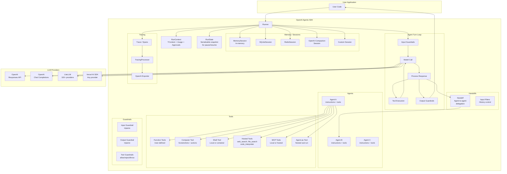
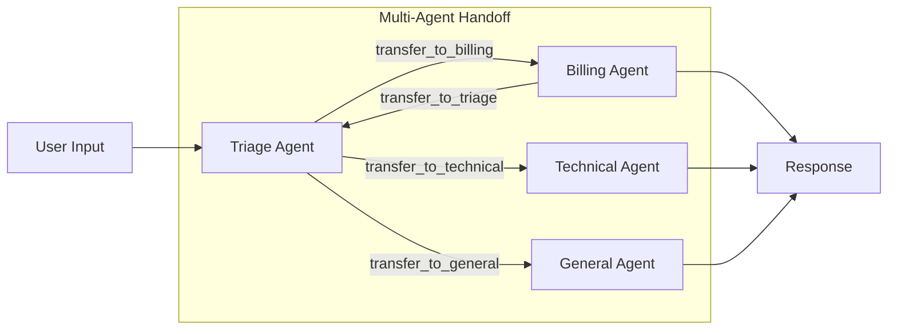

# OpenAI Agents SDK

## 1. Overview

The OpenAI Agents SDK is a lightweight, production-grade framework for building multi-agent workflows, available in both Python and JavaScript/TypeScript. Unlike the other frameworks in this comparison -- which are standalone agent applications -- the Agents SDK is a *library* for building agents into your own applications. It was open-sourced by OpenAI in March 2025 (Python) and May 2025 (JavaScript), and has rapidly become one of the most popular agent frameworks by star count.

- **Primary Use Case:** Building multi-agent LLM workflows with tool use, guardrails, handoffs, human-in-the-loop approval, memory, and tracing
- **Repository:** [github.com/openai/openai-agents-python](https://github.com/openai/openai-agents-python)
- **Language/Runtime:** Python 3.10+ and TypeScript (Node.js 22+, Deno, Bun)
- **License:** MIT

### Design Philosophy

The SDK is built around five primitives: **Agents** (LLMs configured with instructions and tools), **Handoffs** (agent-to-agent delegation), **Guardrails** (input/output safety checks), **Tools** (functions the LLM can call), and **Tracing** (built-in observability). The architecture is provider-agnostic at the core layer, with OpenAI wired as the default. The Python version is significantly more mature, with features like sandbox agents, voice pipelines, realtime agents, and a richer session ecosystem not yet in the JS version.

## 2. Architecture

### Core Loop / Runner

The `Runner` is the central orchestrator. It manages the agent turn loop, tool execution, guardrail evaluation, handoffs, and tracing. Three entry points exist:

| Entry Point | Python | JS/TS |
|---|---|---|
| Async run | `Runner.run(agent, input)` | `run(agent, input)` |
| Sync run | `Runner.run_sync(agent, input)` | N/A |
| Streaming | `Runner.run_streamed(agent, input)` | `run(agent, input, { stream: true })` |

The core loop (simplified):

```
1. Prepare input (load session history, normalize)
2. Create tracing context
3. WHILE turns < max_turns (default 10):
   a. Resolve agent config: tools, MCP servers, handoffs, output schema
   b. Run input guardrails (parallel with model call, or blocking)
   c. Call model (Responses API or Chat Completions)
   d. Process response -> categorize: tool calls, handoffs, final output
   e. SWITCH on next_step:
      - final_output: Run output guardrails, return result
      - handoff: Switch agent, continue loop
      - run_again: Execute tools, feed results back, re-invoke model
      - interruption: Pause for human approval, return with pending approvals
4. Persist to session
5. Return RunResult
```

### Package Structure

**Python** (`src/agents/`):

```
agent.py              # Agent dataclass: instructions, tools, guardrails, handoffs, output_type
run.py                # Runner (public facade) + AgentRunner (internal engine)
run_state.py          # Serializable state machine for pause/resume (schema v1.9)
run_context.py        # RunContextWrapper[TContext] -- mutable shared context
run_config.py         # RunConfig -- global run settings
result.py             # RunResult, RunResultStreaming
tool.py               # FunctionTool, ComputerTool, ShellTool, WebSearchTool, etc.
guardrail.py          # InputGuardrail, OutputGuardrail
handoffs/             # Handoff, handoff(), input filters
memory/               # Session protocol, SQLiteSession, OpenAI compaction sessions
models/               # Model interface, OpenAIResponsesModel, ChatCompletionsModel, MultiProvider
mcp/                  # MCPServer (stdio, SSE, StreamableHTTP), hosted MCP
tracing/              # Trace, Span, TracingProcessor, span_data types
run_internal/         # Internal: run_loop, turn_resolution, tool_execution, streaming
voice/                # VoicePipeline: STT -> agent workflow -> TTS
realtime/             # RealtimeAgent, RealtimeSession (WebSocket to OpenAI Realtime API)
sandbox/              # SandboxAgent, Docker/Unix clients, capabilities, workspace manifests
extensions/           # LiteLLM/any-llm providers; Redis/SQLAlchemy/MongoDB sessions; sandbox providers
```

**JavaScript** (monorepo):

```
packages/
  agents-core/        # Provider-agnostic runtime (Agent, Runner, tools, guardrails, handoffs, tracing)
  agents-openai/      # OpenAI Responses + Chat Completions models, sessions
  agents-realtime/    # Realtime/voice agents (WebRTC, WebSocket, SIP)
  agents-extensions/  # Vercel AI SDK integration, Cloudflare/Twilio transports
  agents/             # Convenience bundle: sets OpenAI as default, re-exports all
```

The JS version's `@openai/agents` package is a thin wrapper:

```typescript
import { setDefaultModelProvider } from '@openai/agents-core';
import { OpenAIProvider } from '@openai/agents-openai';

setDefaultModelProvider(new OpenAIProvider({ cacheResponsesWebSocketModels: false }));

export * from '@openai/agents-core';
export * from '@openai/agents-openai';
export * as realtime from '@openai/agents-realtime';
```

### Architecture Diagram



### RunState: Serializable Pause/Resume

`RunState` is a critical abstraction that captures the entire state of a run as a JSON-serializable object. It enables:

1. **Human-in-the-loop**: Run pauses when a tool needs approval, state is serialized, stored, and later deserialized to resume
2. **Durable workflows**: State can be persisted across processes or requests
3. **Schema versioning**: Currently at v1.9 (Python) / v1.8 (JS), with formal migration support

Key fields: current agent, generated items, model responses, approval state, conversation IDs, turn counter, and sandbox state.

## 3. Memory System

### Session Interface

The SDK defines a `Session` protocol (Python) / interface (JS) for conversation history persistence:

```python
# Python
class Session(Protocol):
    session_id: str
    async def get_items(self, limit: int | None = None) -> list[TResponseInputItem]: ...
    async def add_items(self, items: list[TResponseInputItem]) -> None: ...
    async def pop_item(self) -> TResponseInputItem | None: ...
    async def clear_session(self) -> None: ...
```

```typescript
// JavaScript
interface Session {
  getSessionId(): Promise<string>;
  getItems(limit?: number): Promise<AgentInputItem[]>;
  addItems(items: AgentInputItem[]): Promise<void>;
  popItem(): Promise<AgentInputItem | undefined>;
  clearSession(): Promise<void>;
}
```

### Built-in Session Backends

| Backend | Python | JS | Notes |
|---|---|---|---|
| In-memory | `SQLiteSession(":memory:")` | `MemorySession` | Demo/testing only |
| SQLite | `SQLiteSession` | -- | File-based, thread-safe |
| Redis | `RedisSession` (extension) | -- | For distributed workloads |
| SQLAlchemy | `SQLAlchemySession` (extension) | -- | PostgreSQL, MySQL, etc. |
| MongoDB | `MongoDBSession` (extension) | -- | Document store |
| Dapr | `DaprSession` (extension) | -- | Cloud-native state store |
| Encrypted | `EncryptSession` (extension) | -- | Wraps any session with encryption |
| OpenAI Conversations | `OpenAIConversationsSession` | `OpenAIConversationsSession` | Server-managed history |
| OpenAI Compaction | `OpenAIResponsesCompactionSession` | `OpenAIResponsesCompactionSession` | Auto-summarize long conversations |

### Context Window Management

The SDK provides several mechanisms:

1. **Server-managed conversations**: `conversationId` / `previousResponseId` delegates history to OpenAI servers. Only incremental new items are sent.
2. **Session compaction**: `runCompaction()` calls the `responses.compact` API to summarize long conversations into a shorter representation.
3. **Truncation**: `modelSettings.truncation: 'auto'` lets the server handle overflow.
4. **Input filter**: `callModelInputFilter` callback can edit system instructions and input items before each model call (custom token trimming).
5. **Handoff input filters**: Control what history transfers between agents on handoff.
6. **Session limits**: `SessionSettings.default_limit` caps how many items are retrieved from session storage.

### No Long-term Memory

The SDK does not include built-in long-term memory (vector stores, embeddings, RAG). The OpenAI Responses API's `file_search` hosted tool provides server-side retrieval, but this is a model feature, not an SDK abstraction. Long-term memory is expected to be implemented by the application using tools and external stores.

## 4. Tool Calling / Function Execution

### Tool Type Hierarchy

The SDK supports a rich set of tool types:

| Tool Type | Description | Execution |
|---|---|---|
| `FunctionTool` | User-defined functions with JSON schema | Local (in-process) |
| `ComputerTool` | CUA: screenshots + mouse/keyboard actions | Local (Computer interface) |
| `ShellTool` | Shell command execution | Local or hosted container |
| `ApplyPatchTool` | Code diff application | Local (Editor interface) |
| `WebSearchTool` | Web search | Server-side (OpenAI) |
| `FileSearchTool` | Vector store search | Server-side (OpenAI) |
| `CodeInterpreterTool` | Python code execution | Server-side (OpenAI) |
| `ImageGenerationTool` | Image generation | Server-side (OpenAI) |
| `HostedMCPTool` | MCP tools on OpenAI infra | Server-side |
| `MCPServer` tools | MCP tools via local server | Local MCP subprocess or HTTP |
| Agent-as-Tool | Nested agent sub-workflow | Local (nested Runner.run) |

### Defining Function Tools

**Python** -- the `@function_tool` decorator:

```python
@function_tool
async def get_weather(city: str) -> str:
    """Get the weather for a given city."""
    return f"The weather in {city} is sunny"
```

The decorator automatically extracts the name from the function name, description from the docstring, and JSON schema from type hints. It handles both sync and async functions. If the first parameter is `RunContextWrapper` or `ToolContext`, it is injected automatically and excluded from the schema.

**JavaScript** -- the `tool()` builder:

```typescript
const getWeather = tool({
  name: 'get_weather',
  description: 'Get the weather for a given city',
  parameters: z.object({ city: z.string() }),
  execute: async ({ city }) => {
    return `The weather in ${city} is sunny`;
  },
});
```

Uses Zod schemas (vs. Pydantic in Python). The Zod schema is auto-converted to JSON Schema for the model, and responses are parsed and validated.

### Tool Execution Pipeline

```
1. Model returns tool call(s) in response
2. For each tool call:
   a. Find matching tool by name
   b. Check needs_approval -> if yes and not pre-approved, create interruption
   c. Run tool input guardrails (allow / reject_content / throw_exception)
   d. Invoke tool with timeout (if configured)
   e. Run tool output guardrails
   f. Return output as tool result item
3. Feed all tool results back to model for next turn
```

### Tool Approval (Human-in-the-Loop)

Tools can declare `needs_approval: True` (or a predicate function). When triggered:

1. The run pauses with `result.interruptions` containing pending approvals
2. The `RunState` can be serialized to JSON and stored (database, queue, etc.)
3. A human reviews and approves/rejects each pending tool call
4. The state is deserialized, approvals applied, and the run resumes

```python
# Python
result = await Runner.run(agent, input)
if result.interruptions:
    state = result.state.to_json()  # Serialize, store, wait for human
    # ... later ...
    state = RunState.from_json(agent, stored_json)
    state.approve(interruption)  # or state.reject(interruption, message="...")
    result = await Runner.run(agent, state)  # Resume
```

### Tool Use Behavior

The `tool_use_behavior` config controls what happens after tools execute:

- `"run_llm_again"` (default): Feed tool results back to the model
- `"stop_on_first_tool"`: Use the first tool output as the final output (skip re-invoking LLM)
- `StopAtTools(["tool_name"])`: Stop on specific named tools
- Custom function: Dynamic decision based on tool results

### MCP Integration

Full Model Context Protocol support with three transport types:

- `MCPServerStdio`: Subprocess-based (stdio)
- `MCPServerSse`: HTTP SSE transport
- `MCPServerStreamableHttp`: Streamable HTTP

MCP tools are discovered via `list_tools()`, converted to function tools, and seamlessly integrated into the agent's tool set. Approval policies (`"always"`, `"never"`, per-tool mapping) control which MCP tools need human approval.

**Hosted MCP** runs MCP servers on OpenAI's infrastructure, configured with `serverUrl` or `connectorId`.

### Agent-as-Tool

An agent can be used as a tool within another agent:

```python
# Python
main_agent = Agent(
    name="Main",
    tools=[weather_agent],  # weather_agent is an Agent, used as a tool
)
```

```typescript
// JavaScript
const mainAgent = new Agent({
  tools: [weatherAgent.asTool({ toolName: 'ask_weather', toolDescription: '...' })],
});
```

This creates a nested `Runner.run()` invocation. The nested agent runs a full sub-workflow, and the result is returned as tool output.

## 5. LLM Integration

### Provider Architecture

The SDK is provider-agnostic via abstract `Model` and `ModelProvider` interfaces:

```python
# Python
class Model(abc.ABC):
    async def get_response(self, system_instructions, input, model_settings,
                          tools, output_schema, handoffs, tracing, *,
                          previous_response_id, conversation_id, prompt) -> ModelResponse
    def stream_response(self, ...) -> AsyncIterator[TResponseStreamEvent]
```

### Built-in Providers

| Provider | API | Python | JS |
|---|---|---|---|
| `OpenAIResponsesModel` | Responses API | Yes | Yes |
| `OpenAIChatCompletionsModel` | Chat Completions | Yes | Yes |
| `OpenAIResponsesWSModel` | Responses API (WebSocket) | Yes | Yes |
| `LitellmModel` | LiteLLM (100+ providers) | Extension | -- |
| `AnyLLMModel` | any-llm | Extension | -- |
| Vercel AI SDK | Any AI SDK provider | -- | Extension |

### Multi-Provider Routing (Python)

The `MultiProvider` routes model names by prefix:

```python
# No prefix or "openai/" -> OpenAI
# "litellm/" -> LiteLLM (Anthropic, Google, Cohere, etc.)
# "any-llm/" -> any-llm provider
agent = Agent(model="litellm/anthropic/claude-sonnet-4-20250514")
```

### AI SDK Extension (JavaScript)

The JS version can use any Vercel AI SDK provider:

```typescript
import { wrapLanguageModel } from '@openai/agents-extensions/ai-sdk';
import { anthropic } from '@ai-sdk/anthropic';

const model = wrapLanguageModel(anthropic('claude-sonnet-4-20250514'));
```

### Default Model

The default model is `gpt-4.1`. GPT-5 family models get special treatment with automatic reasoning effort defaults and verbosity settings.

### ModelSettings

Extensive configuration via `ModelSettings`:

- `temperature`, `top_p`, `frequency_penalty`, `presence_penalty`
- `tool_choice`: `"auto"`, `"required"`, `"none"`, or specific tool name
- `parallel_tool_calls`: boolean
- `truncation`: `"auto"` or `"disabled"`
- `max_tokens`, `store`, `prompt_cache_retention`
- `reasoning`: `{ effort, summary }` for reasoning models
- `retry`: Exponential backoff with jitter, custom retry policies

Settings are resolved by merging agent-level with run-level overrides.

### Retry System

Sophisticated retry with:
- Exponential backoff with configurable jitter, max delay, max retries
- Provider-specific retry advice (status codes, `Retry-After` headers, network errors)
- Custom `RetryPolicy` callbacks
- Both streaming and non-streaming paths support retry

## 6. Security

### Guardrails

Guardrails are the primary security mechanism. They run at three levels:

**Agent Input Guardrails:**
- Run on initial input before (or in parallel with) the first LLM call
- If `tripwire_triggered`, the entire run halts with `InputGuardrailTripwireTriggered`
- Use case: content filtering, injection detection, authorization checks

```python
content_filter = InputGuardrail(
    name="content_filter",
    guardrail_function=async_check_for_banned_content,
    run_in_parallel=True,  # Run concurrently with LLM call
)
```

**Agent Output Guardrails:**
- Run on the final output after the agent produces a response
- If `tripwire_triggered`, raises `OutputGuardrailTripwireTriggered`
- Use case: PII detection, hallucination checks, format validation

**Tool Guardrails:**
- Per-tool input and output validation
- Three behaviors: `allow` (continue), `reject_content` (return error message to model), `throw_exception` (fail the run)
- Use case: parameter validation, sensitive data detection, output sanitization

### No Local Sandbox

Function tools execute in-process with full access to the runtime. There is **no sandboxing** for local function tools. The SDK mitigates this through:

- **Tool approval** (`needs_approval`): Gates tool execution behind human approval
- **Container-based shell tools**: Shell execution in Docker containers with network policies
- **Hosted tools**: `web_search`, `file_search`, `code_interpreter` run server-side on OpenAI
- **Strict JSON schemas**: `strict=True` constrains model output to match exact schema

### Sandbox Agents (Python Only)

The Python SDK includes a full sandbox system for long-running workspace tasks:

- `DockerSandboxClient`: Docker container isolation
- `UnixLocalSandboxClient`: Local filesystem (less isolated)
- External providers: E2B, Modal, Runloop, Daytona, Cloudflare, Blaxel, Vercel
- Capabilities: shell, filesystem, compaction, memory, skills

### Data Privacy

```python
# Environment variables
OPENAI_AGENTS_DONT_LOG_MODEL_DATA=1    # Suppress model data in logs
OPENAI_AGENTS_DONT_LOG_TOOL_DATA=1     # Suppress tool data in logs

# RunConfig
run_config = RunConfig(trace_include_sensitive_data=False)
```

## 7. Multi-Agent Patterns

### Handoffs (Agent-to-Agent Delegation)

Handoffs are a first-class primitive. An agent's `handoffs` array lists agents it can delegate to. Each handoff becomes a tool (`transfer_to_<agent_name>`) that the model can call:

```python
triage_agent = Agent(
    name="Triage",
    instructions="Route to the appropriate specialist",
    handoffs=[billing_agent, technical_agent, general_agent],
)
```

When the model calls `transfer_to_billing_agent`, the runner switches the active agent and continues the loop. Handoffs support:

- **Input filters**: Control what conversation history the next agent sees
- **Nested history**: Collapse prior conversation into a single message before handoff
- **Structured input**: Require the model to provide structured arguments for the handoff (e.g., a reason)
- **Dynamic enable/disable**: `is_enabled` predicate based on context
- **On-handoff callbacks**: Execute side effects when a handoff occurs



### Orchestration Patterns

The SDK supports several multi-agent patterns:

1. **Routing / Triage**: A coordinator agent routes to specialists based on input
2. **Sequential**: Fixed agent pipeline (A -> B -> C) via handoffs
3. **Parallel**: Multiple agents run concurrently via tools or `asyncio.gather`
4. **Agent-as-Tool**: One agent calls another as a subordinate tool (nested sub-run, parent retains control)
5. **Hierarchical**: Supervisor delegates sub-tasks to worker agents

The key distinction between handoffs and agent-as-tools:
- **Handoff**: Control transfers completely to the new agent. The triage agent "exits" and the specialist takes over.
- **Agent-as-tool**: The parent agent stays in control. The child agent runs as a tool call and returns results to the parent.

## 8. State Management

### RunContext

`RunContext` (Python: `RunContextWrapper[TContext]`, JS: `RunContext<TContext>`) is the shared mutable context carrier:

```python
@dataclass
class RunContextWrapper(Generic[TContext]):
    context: TContext          # User-provided mutable state (NOT sent to LLM)
    usage: Usage               # Accumulated token usage
    _approvals: dict           # Tool approval state
```

The generic `TContext` flows through all agents, tools, guardrails, and handoffs. It is a mutable shared object for application state:

```python
@dataclass
class MyContext:
    user_id: str
    db: Database

agent = Agent(
    instructions=lambda ctx: f"Help user {ctx.context.user_id}",
    tools=[my_tool],  # my_tool receives RunContextWrapper[MyContext]
)
result = await Runner.run(agent, input, context=MyContext(user_id="123", db=db))
```

### Dynamic Instructions

Agent instructions can be static strings or dynamic functions that receive the context:

```python
agent = Agent(
    instructions=async lambda ctx, agent: f"User plan: {await get_plan(ctx.context.user_id)}"
)
```

### Structured Output

Agents can produce typed output via `output_type`:

```python
class WeatherReport(BaseModel):
    city: str
    temperature: float
    summary: str

agent = Agent(output_type=WeatherReport)
result = await Runner.run(agent, "What's the weather in NYC?")
print(result.final_output.city)  # "NYC" -- typed WeatherReport
```

The JSON schema is generated automatically from the Pydantic model (Python) or Zod schema (JS), and the model's output is validated against it.

## 9. Identity / Personality

The SDK has no built-in identity or personality system. Agent behavior is entirely defined by the `instructions` string (or function). There is no SOUL.md, persona files, or personality configuration -- just the system prompt.

However, the SDK supports **OpenAI Prompt objects** for server-managed prompt templates:

```python
agent = Agent(
    prompt=Prompt(
        id="my-prompt-template",
        version="1",
        variables={"name": "John", "role": "assistant"},
    )
)
```

This enables managing agent prompts centrally on the OpenAI platform rather than in code.

## 10. Unique Features

### Voice Pipeline (Python Only)

A three-stage pipeline for voice agents:

```python
pipeline = VoicePipeline(
    workflow=my_agent_workflow,
    stt_model=OpenAISTTModel(),
    tts_model=OpenAITTSModel(),
)
result = await pipeline.run(audio_input)
```

Supports single-turn and multi-turn streaming audio. The workflow runs between STT and TTS, enabling voice-controlled agent interactions.

### Realtime Agents (Both Languages)

Live voice agents using OpenAI's Realtime API (`gpt-realtime-1.5`):

- `RealtimeAgent`: Specialized agent class (model determined by the session)
- `RealtimeSession`: WebSocket connection to OpenAI Realtime API
- Full agent features (tools, handoffs, guardrails) work in realtime mode
- JS version supports WebRTC, WebSocket, and SIP transports (browser-friendly)

### Sandbox Agents (Python Only)

Full sandbox system for long-running workspace tasks:

- **Workspace manifests**: Define workspace contents (git repos, local dirs, cloud storage)
- **Capabilities**: Shell, filesystem, compaction, memory, skills
- **Isolation**: Docker containers or external providers (E2B, Modal, Vercel, etc.)
- **Two-phase memory**: Rollout extraction and consolidation for long sessions

### Provider Agnosticism

The core runtime (`agents-core` in JS, `Model` interface in Python) is completely provider-agnostic. The Python `MultiProvider` with LiteLLM gives access to 100+ LLM providers. The JS AI SDK extension enables any Vercel AI SDK provider.

### Human-in-the-Loop as a First-Class Pattern

The approval system is deeply integrated with serializable state. Unlike most frameworks where HITL is an afterthought, here the entire run state (including pending tool approvals) can be serialized to JSON, stored in a database, and resumed days later. This makes it practical to build approval workflows in production web applications.

### Tracing

Built-in OpenTelemetry-style tracing with automatic span creation for every agent, tool, guardrail, and handoff execution. Spans include token usage, timing, and optional sensitive data. The default exporter sends to OpenAI's tracing backend, but custom processors can export to any destination.

### Tool Search and Namespaces

The SDK supports lazy tool loading via `tool_search` -- tools are discovered semantically rather than pre-loaded. `tool_namespace()` groups related tools. This is important for agents with hundreds of potential tools where loading all schemas would waste context.

## 11. Key Files Reference

### Python (`src/agents/`)

| File | Purpose |
|------|---------|
| `agent.py` | `Agent` dataclass -- the primary abstraction |
| `run.py` | `Runner` facade + `AgentRunner` internal engine |
| `run_state.py` | `RunState` -- serializable pause/resume snapshots |
| `run_context.py` | `RunContextWrapper[TContext]` -- shared mutable context |
| `tool.py` | All tool types + `@function_tool` decorator |
| `guardrail.py` | `InputGuardrail`, `OutputGuardrail` |
| `tool_guardrails.py` | `ToolInputGuardrail`, `ToolOutputGuardrail` |
| `handoffs/__init__.py` | `Handoff` + `handoff()` factory |
| `memory/session.py` | `Session` protocol |
| `models/interface.py` | Abstract `Model` + `ModelProvider` |
| `models/openai_responses.py` | `OpenAIResponsesModel` |
| `models/multi_provider.py` | `MultiProvider` -- routes by prefix |
| `mcp/server.py` | `MCPServer` -- stdio, SSE, StreamableHTTP |
| `run_internal/run_loop.py` | Core turn loop implementation |
| `run_internal/tool_execution.py` | Tool invocation pipeline |
| `tracing/` | Trace, Span, processors, exporters |
| `voice/pipeline.py` | `VoicePipeline` -- STT -> workflow -> TTS |
| `realtime/agent.py` | `RealtimeAgent` |
| `sandbox/sandbox_agent.py` | `SandboxAgent` |
| `function_schema.py` | Auto JSON schema from Python type hints |

### JavaScript (`packages/agents-core/src/`)

| File | Purpose |
|------|---------|
| `agent.ts` | `Agent` class |
| `run.ts` | `Runner` class + `run()` function (~1100 lines) |
| `runState.ts` | `RunState` -- serializable state machine |
| `runContext.ts` | `RunContext<TContext>` |
| `tool.ts` | All tool types + `tool()` builder |
| `guardrail.ts` | Input/output guardrails |
| `handoff.ts` | `Handoff` + `handoff()` |
| `memory/session.ts` | `Session` interface |
| `model.ts` | `Model` + `ModelProvider` interfaces |
| `mcp.ts` | MCP server interface |
| `lifecycle.ts` | `AgentHooks`, `RunHooks` |
| `events.ts` | `RunStreamEvent` types |

## 12. Code Quality & Developer Experience

### Schema Validation

Both implementations use strict schema validation:
- **Python**: Pydantic for output types, `function_schema.py` for auto-generating JSON schemas from type hints
- **JS**: Zod for tool parameters and output types, auto-converted to JSON Schema

### Type Safety

Both are fully typed. The generic `TContext` parameter flows through the entire stack, ensuring type-safe access to user context in tools, guardrails, and hooks.

### Testing

Both repos include extensive test suites. The Python repo has comprehensive unit and integration tests. The JS monorepo uses Vitest.

### Documentation

Both repos include full documentation sites:
- Python: Extensive docs with guides for every feature, plus translations (Chinese, Japanese, etc.)
- JS: Astro/Starlight documentation site

### DX Ergonomics

The SDK is designed to minimize boilerplate. A minimal agent requires ~5 lines:

```python
from agents import Agent, Runner

agent = Agent(name="Assistant", instructions="You are a helpful assistant")
result = Runner.run_sync(agent, "Hello!")
print(result.final_output)
```

The `@function_tool` decorator (Python) and `tool()` builder (JS) handle all the schema generation and validation automatically. Guardrails, handoffs, and tracing are opt-in additions that don't add complexity to simple use cases.

### Cross-Language Parity

While the Python version is more mature (sandbox, voice pipeline, more session backends), the core architecture is intentionally mirrored: same abstractions (Agent, Runner, Tool, Handoff, Guardrail, RunState, RunContext), same turn loop, same tracing model. Code patterns translate directly between languages.
