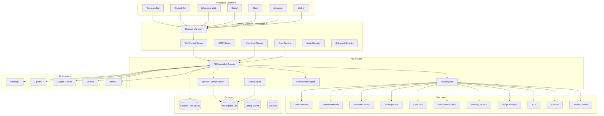
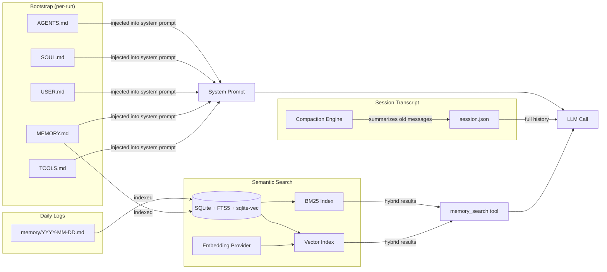
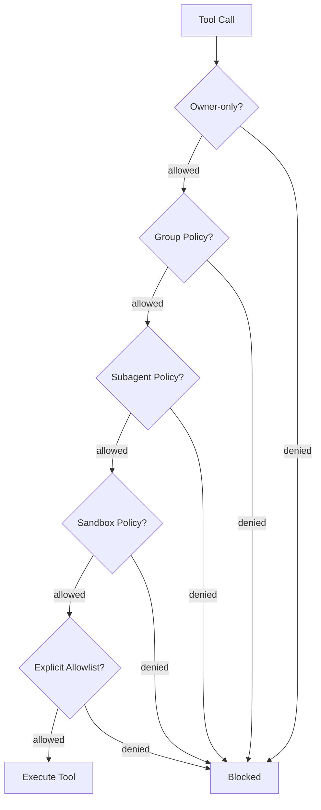
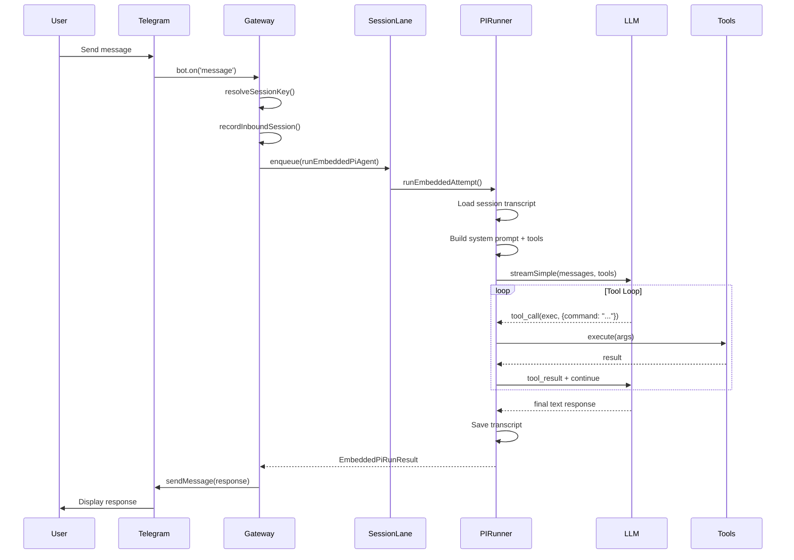

# OpenClaw - Deep Technical Analysis

## 1. Overview

OpenClaw is a self-hosted, multi-channel AI agent gateway written in TypeScript/Node.js. It acts as a persistent daemon that bridges LLM providers (Anthropic, OpenAI, Google, Ollama, etc.) with messaging platforms (Telegram, Discord, WhatsApp, Signal, Slack, iMessage, web) while providing the agent with a rich tool environment including file I/O, shell execution, browser automation, cron scheduling, memory search, and sub-agent orchestration. The agent maintains persistent identity through workspace markdown files (SOUL.md, MEMORY.md, AGENTS.md) and uses a session-based architecture where each conversation thread gets its own transcript file with automatic compaction when context windows fill.

- **Language/Runtime**: TypeScript on Node.js v22+
- **License**: MIT
- **Primary Use Case**: Personal AI assistant that runs 24/7 on your machine, accessible from any messaging platform, with full filesystem and shell access
- **Codebase Size**: ~2,100 non-test TypeScript source files, ~4,000 total including tests

## 2. Architecture

### Core Loop

OpenClaw uses an **event-driven, request-response architecture with asynchronous tool loops**. The flow is:

1. A message arrives on a channel (Telegram, Discord, etc.)
2. The gateway resolves the session key and workspace
3. The message is enqueued into a per-session lane (concurrency control)
4. The embedded PI (Personal Intelligence) runner sends the full session transcript + new message to the LLM
5. The LLM streams back a response, potentially including tool calls
6. Tool calls are executed, results appended to the transcript, and the LLM is called again (tool loop)
7. The final text response is delivered back through the originating channel

Between user messages, the **heartbeat system** periodically wakes the agent to check for pending work (emails, calendar, system events, completed background processes).

### Entry Points

Execution starts in two entry points:

- **`src/entry.ts`** - CLI bootstrap. Normalizes environment, suppresses experimental warnings via process respawn, then loads `src/cli/run-main.js`
- **`src/index.ts`** - Library entry & CLI program builder. Loads dotenv, captures console output, validates runtime, builds the Commander program via `src/cli/program.ts`

The primary runtime command is `openclaw gateway start`, which calls:

```
src/gateway/server.impl.ts → startGatewayServer()
```

### Module/Package Structure

```
src/
├── agents/           # Core agent logic (~300 files)
│   ├── pi-embedded-runner/  # LLM execution engine
│   ├── tools/               # Individual tool implementations
│   ├── skills/              # Skill discovery and workspace integration
│   ├── sandbox/             # Docker sandbox for isolated execution
│   └── subagent-*           # Sub-agent spawning and lifecycle
├── gateway/          # WebSocket/HTTP server, the central daemon
│   ├── server.impl.ts       # Gateway startup orchestration
│   ├── server-chat.ts       # Chat run state management
│   ├── server-channels.ts   # Channel plugin lifecycle
│   ├── server-cron.ts       # Cron service integration
│   └── server-methods.ts    # Gateway RPC method handlers
├── channels/         # Channel abstraction layer
│   └── plugins/             # Channel plugin type system
├── telegram/         # Telegram bot integration
├── discord/          # Discord bot integration
├── whatsapp/         # WhatsApp Web integration
├── signal/           # Signal messenger integration
├── slack/            # Slack integration
├── imessage/         # iMessage integration (macOS)
├── cron/             # Scheduled task system
├── memory/           # Embedding-based memory search
├── browser/          # Playwright browser automation
├── security/         # Security audit and policy
├── plugins/          # Plugin loader and hook system
├── hooks/            # Internal webhook/event hooks
├── config/           # Configuration (JSON5) and validation
├── infra/            # Infrastructure utilities
├── routing/          # Session key parsing and routing
├── sessions/         # Session key utilities
├── tts/              # Text-to-speech
├── process/          # Command queue and exec management
└── cli/              # CLI command definitions
```

### Architecture Diagram



### Core Execution Path

The heart of the system is `runEmbeddedPiAgent()` in `src/agents/pi-embedded-runner/run.ts`:

```typescript
// src/agents/pi-embedded-runner/run.ts
export async function runEmbeddedPiAgent(
  params: RunEmbeddedPiAgentParams,
): Promise<EmbeddedPiRunResult> {
  const sessionLane = resolveSessionLane(params.sessionKey?.trim() || params.sessionId);
  const globalLane = resolveGlobalLane(params.lane);
  // Double-enqueue: first into per-session lane, then global lane
  // This ensures per-session serialization AND global concurrency limits
  const enqueueGlobal = params.enqueue ?? ((task, opts) => enqueueCommandInLane(globalLane, task, opts));
  const enqueueSession = params.enqueue ?? ((task, opts) => enqueueCommandInLane(sessionLane, task, opts));

  return enqueueSession(() =>
    enqueueGlobal(async () => {
      // ... resolve workspace, model, auth, build payloads
      // Then delegate to runEmbeddedAttempt() with failover logic
    })
  );
}
```

The actual LLM interaction happens in `runEmbeddedAttempt()` (`src/agents/pi-embedded-runner/run/attempt.ts`, 1282 lines), which:

1. Resolves the sandbox context (Docker or native)
2. Loads workspace bootstrap files (AGENTS.md, SOUL.md, etc.)
3. Builds the system prompt via `buildSystemPromptParams()`
4. Loads or creates the session transcript (JSON file on disk)
5. Builds tool definitions from all sources (core, OpenClaw, skills, plugins)
6. Calls `subscribeEmbeddedPiSession()` to stream the LLM response
7. Handles the tool-call loop (LLM calls tools → results fed back → LLM continues)
8. Returns the final result with usage statistics

## 3. Memory System

OpenClaw has a **multi-layered memory architecture**:

### Short-term: Session Transcript Files

Each conversation is stored as a JSON file on disk containing the full message history:

```
~/.openclaw/state/sessions/<agent-id>/<session-key>.json
```

The transcript is loaded at the start of each run and all messages (user, assistant, tool calls, tool results) are appended in real-time. This gives the LLM full conversational context.

### Context Window Management: Compaction

When the session transcript approaches the model's context window limit, **compaction** kicks in (`src/agents/compaction.ts`):

```typescript
// src/agents/compaction.ts
export const BASE_CHUNK_RATIO = 0.4;
export const MIN_CHUNK_RATIO = 0.15;
export const SAFETY_MARGIN = 1.2; // 20% buffer for estimateTokens() inaccuracy

export function estimateMessagesTokens(messages: AgentMessage[]): number {
  const safe = stripToolResultDetails(messages);
  return safe.reduce((sum, message) => sum + estimateTokens(message), 0);
}
```

Compaction splits older messages into chunks and uses the LLM to generate a summary, which replaces the original messages. This preserves key decisions and context while freeing token space.

### Long-term: Workspace Files (MEMORY.md pattern)

The agent's persistent memory lives in workspace markdown files:

| File | Purpose |
|------|---------|
| `MEMORY.md` | Curated long-term memories (only loaded in main session for security) |
| `memory/YYYY-MM-DD.md` | Daily raw logs of events and conversations |
| `SOUL.md` | Agent personality and identity |
| `USER.md` | Information about the human user |
| `AGENTS.md` | Meta-instructions for how the agent operates |
| `TOOLS.md` | Environment-specific tool notes |
| `HEARTBEAT.md` | Checklist for periodic heartbeat checks |

These files are injected as **bootstrap context** into the system prompt via `resolveBootstrapContextForRun()` (`src/agents/bootstrap-files.ts`):

```typescript
// src/agents/bootstrap-files.ts
export async function resolveBootstrapContextForRun(params: {
  workspaceDir: string;
  config?: OpenClawConfig;
  sessionKey?: string;
  // ...
}): Promise<{
  bootstrapFiles: WorkspaceBootstrapFile[];
  contextFiles: EmbeddedContextFile[];
}> {
  const bootstrapFiles = await resolveBootstrapFilesForRun(params);
  const contextFiles = buildBootstrapContextFiles(bootstrapFiles, { /* ... */ });
  return { bootstrapFiles, contextFiles };
}
```

### Semantic Memory Search (Embeddings)

The `src/memory/` module provides **hybrid search** (BM25 + vector embeddings) over workspace files:

```typescript
// src/memory/manager.ts
export class MemoryIndexManager extends MemoryManagerEmbeddingOps implements MemorySearchManager {
  protected db: DatabaseSync;  // SQLite with sqlite-vec extension
  protected provider: EmbeddingProvider | null;  // OpenAI, Gemini, Voyage, or local
  // ...
}
```

Key capabilities:
- **BM25 keyword search** via SQLite FTS5
- **Vector search** via `sqlite-vec` extension with embeddings from OpenAI/Gemini/Voyage/local models
- **Hybrid ranking** merging both approaches with MMR (Maximal Marginal Relevance) for diversity
- **File watching** via chokidar for automatic re-indexing
- **Batch embedding** support for bulk indexing

The agent accesses this through `memory_search` and `memory_get` tools exposed in the system prompt.

### Memory Architecture Diagram



## 4. Tool Calling / Function Execution

### Tool Definition

Tools are defined as objects conforming to `AnyAgentTool`, which wraps the `@mariozechner/pi-coding-agent` tool interface. Each tool has a name, JSON schema for parameters, and an async execute function:

```typescript
// src/agents/tools/common.ts - pattern used across all tools
export type AnyAgentTool = {
  name: string;
  description?: string;
  inputSchema: Record<string, unknown>;
  execute: (args: unknown, context?: unknown) => Promise<ToolResult>;
};
```

### Tool Registration

Tools are assembled in `createOpenClawCodingTools()` (`src/agents/pi-tools.ts`, 505 lines) which merges multiple sources:

1. **Core coding tools** (from `@mariozechner/pi-coding-agent`): `Read`, `Write`, `Edit`, `exec`, `process`
2. **OpenClaw platform tools** (from `createOpenClawTools()` in `src/agents/openclaw-tools.ts`):
   - `browser` - Playwright browser automation
   - `canvas` - Canvas presentation
   - `nodes` - Mobile/remote node control
   - `cron` - Scheduled task management
   - `message` - Cross-channel messaging
   - `tts` - Text-to-speech
   - `web_search` / `web_fetch` - Web access
   - `image` - Vision model analysis
   - `sessions_spawn` - Sub-agent creation
   - `subagents` - Sub-agent management
   - `session_status` - Current session info
3. **Channel tools** - Per-channel specific tools (e.g., Telegram reactions)
4. **Plugin tools** - From installed plugins
5. **Skill tools** - From workspace skills (SKILL.md files)

```typescript
// src/agents/openclaw-tools.ts
export function createOpenClawTools(options?: { /* ... */ }): AnyAgentTool[] {
  const tools: AnyAgentTool[] = [
    createBrowserTool({ /* ... */ }),
    createCanvasTool({ /* ... */ }),
    createNodesTool({ /* ... */ }),
    createCronTool({ /* ... */ }),
    createMessageTool({ /* ... */ }),
    createTtsTool({ /* ... */ }),
    // ... 15+ more tools
  ];
  const pluginTools = resolvePluginTools({ /* ... */ });
  return [...tools, ...pluginTools];
}
```

### Tool Policy System

Before tools reach the LLM, they pass through a **policy pipeline** (`src/agents/tool-policy-pipeline.ts`):

1. **Owner-only policy** - Restrict tools to the config owner
2. **Group policy** - Per-group/channel tool restrictions
3. **Subagent policy** - Restricted tool set for sub-agents
4. **Sandbox policy** - Docker sandbox restrictions
5. **Plugin allowlist** - Filter to explicitly allowed plugin tools
6. **Explicit allowlist** - User-configured tool allowlists

```typescript
// src/agents/pi-tools.policy.ts
export function isToolAllowedByPolicies(
  toolName: string,
  policies: ToolPolicy[],
): boolean { /* ... */ }
```

### Tool Execution: Exec Tool

The most powerful tool is `exec` which runs shell commands. It supports:
- **PTY mode** for interactive programs (`pty: true`)
- **Background execution** with `yieldMs` for long-running processes
- **Host/sandbox/node targeting** for running on different machines
- **Security modes**: `deny`, `allowlist`, `full`
- **Approval workflow** for dangerous commands

```typescript
// src/agents/bash-tools.exec.ts
export function createExecTool(defaults?: ExecToolDefaults) {
  return {
    name: "exec",
    inputSchema: { /* command, workdir, env, timeout, background, pty, etc. */ },
    execute: async (args) => {
      // Resolve security policy
      // Apply safe-bins allowlist if in allowlist mode
      // Run via child_process.spawn or node-pty
      // Handle background processes via registry
    }
  };
}
```

## 5. LLM Integration

### Provider Support

OpenClaw supports virtually every major LLM provider through a unified streaming interface:

- **Anthropic** (Claude) - Primary, deeply integrated
- **OpenAI** (GPT-4, etc.) - Full support including Responses API
- **Google** (Gemini) - With turn-ordering fixes for Gemini's constraints
- **Ollama** - Local models with custom streaming
- **GitHub Copilot** - Token exchange authentication
- **Others**: HuggingFace, Together, Venice, MiniMax, Chutes, Bedrock, Qwen

### API Call Pattern

The LLM call uses the `@mariozechner/pi-ai` library's `streamSimple()` function, wrapped with provider-specific adaptations:

```typescript
// src/agents/pi-embedded-runner/run/attempt.ts (simplified)
import { streamSimple } from "@mariozechner/pi-ai";
import { createAgentSession, SessionManager } from "@mariozechner/pi-coding-agent";

// The session manager handles the full tool loop:
// 1. Send messages to LLM
// 2. Receive streaming response (text + tool calls)
// 3. Execute tool calls
// 4. Append tool results
// 5. Send again if there are pending tool calls
// 6. Repeat until final text response
```

### Streaming

Streaming is handled by `subscribeEmbeddedPiSession()` (`src/agents/pi-embedded-subscribe.ts`) which:
- Processes streaming deltas chunk-by-chunk
- Detects `<thinking>` tags for reasoning display
- Splits long responses into paragraph-sized "block replies" for incremental delivery to chat
- Tracks messaging tool sends to avoid duplicate delivery
- Handles compaction retries when context overflows mid-stream

### Token Management

```typescript
// src/agents/usage.ts
export function normalizeUsage(usage: UsageLike) {
  return {
    input: usage.input ?? 0,
    output: usage.output ?? 0,
    cacheRead: usage.cacheRead ?? 0,
    cacheWrite: usage.cacheWrite ?? 0,
    total: usage.total ?? 0,
  };
}
```

Usage tracking accumulates across tool-loop iterations, with special handling for cache fields (only the last API call's cache values are used for context-size calculation to avoid inflated numbers).

### Auth Profile Rotation

OpenClaw supports **multiple API keys per provider** with automatic rotation and cooldown:

```typescript
// src/agents/auth-profiles.ts
// Tracks per-key failure state, cooldown periods, and usage ordering
// Automatically rotates to next key on rate limits or errors
```

### Model Failover

If one model/provider fails, OpenClaw can failover to alternatives (`src/agents/model-fallback.ts`), with configurable fallback chains and thinking level downgrades.

## 6. Security

### Sandboxing

OpenClaw supports **Docker-based sandboxing** for agent tool execution:

```typescript
// src/agents/sandbox/context.ts
export async function resolveSandboxContext(params: {
  config: OpenClawConfig;
  sessionKey: string;
  workspaceDir: string;
}): Promise<SandboxContext | null> {
  // Resolves sandbox scope: "off" | "agent" | "all"
  // Creates Docker container with workspace mounted
  // Controls filesystem access: "rw" | "ro" | "none"
}
```

### Tool Policy Enforcement

A multi-layered policy system controls tool access:



### Exec Security Modes

The exec tool has three security levels:
- **`deny`**: No shell execution allowed
- **`allowlist`**: Only pre-approved "safe bins" can run
- **`full`**: Full shell access (default for owner)

### Security Audit

OpenClaw includes a comprehensive security audit system (`src/security/audit.ts`):

```typescript
export type SecurityAuditFinding = {
  checkId: string;
  severity: "info" | "warn" | "critical";
  title: string;
  detail: string;
  remediation?: string;
};
```

Checks include: filesystem permissions, secrets in config, plugin trust, exposed endpoints, channel security, and more.

### External Content Wrapping

Untrusted content (browser snapshots, web fetches) is wrapped with security markers:

```typescript
// src/security/external-content.ts
export function wrapExternalContent(text: string, opts: {
  source: string;
  includeWarning?: boolean;
}) { /* wraps in markers so the LLM knows content is untrusted */ }
```

### Gateway Authentication

The gateway server supports:
- Token-based auth for WebSocket/HTTP connections
- Rate limiting per auth identity
- Device auth for mobile nodes (ECDSA key pairs)
- Origin checking for web connections

## 7. Multi-Channel Architecture

### Channel Plugin Interface

Every messaging platform is implemented as a **channel plugin** conforming to `ChannelPlugin`:

```typescript
// src/channels/plugins/types.plugin.ts (reconstructed from exports)
export type ChannelPlugin = {
  id: ChannelId;  // "telegram" | "discord" | "whatsapp" | "signal" | "slack" | "imessage" | "web"
  meta: ChannelMeta;
  
  // Adapters (all optional - channels implement what they support)
  setup?: ChannelSetupAdapter;
  status?: ChannelStatusAdapter;
  auth?: ChannelAuthAdapter;
  gateway?: ChannelGatewayAdapter;
  outbound?: ChannelOutboundAdapter;
  messaging?: ChannelMessagingAdapter;
  heartbeat?: ChannelHeartbeatAdapter;
  directory?: ChannelDirectoryAdapter;
  threading?: ChannelThreadingAdapter;
  streaming?: ChannelStreamingAdapter;
  security?: ChannelSecurityAdapter;
  agentPrompt?: ChannelAgentPromptAdapter;
  agentTools?: ChannelAgentToolFactory;
  // ...
};
```

### Channel Registration

Plugins are loaded at gateway startup through the plugin registry:

```typescript
// src/channels/plugins/index.ts
function listPluginChannels(): ChannelPlugin[] {
  const registry = requireActivePluginRegistry();
  return registry.channels.map((entry) => entry.plugin);
}

export function listChannelPlugins(): ChannelPlugin[] {
  const combined = dedupeChannels(listPluginChannels());
  return combined.toSorted(/* by configured order */);
}
```

### Message Flow



### Session Key Format

Session keys encode the full routing path:

```
agent:<agentId>:<channelType>:<chatType>:<chatId>
agent:main:telegram:dm:123456789
agent:main:discord:group:987654321
agent:main:subagent:<uuid>
agent:main:cron:<job-id>
```

```typescript
// src/routing/session-key.ts
export const DEFAULT_AGENT_ID = "main";
export const DEFAULT_MAIN_KEY = "main";

export function toAgentStoreSessionKey(params: {
  agentId: string;
  requestKey: string;
  mainKey?: string;
}): string {
  // Constructs the canonical session key
}
```

## 8. State Management

### File-Based State

All state is file-based (no external databases required):

| Path | Content |
|------|---------|
| `~/.openclaw/config.json5` | Main configuration |
| `~/.openclaw/state/` | Runtime state directory |
| `~/.openclaw/state/sessions/<agent>/` | Session transcript JSON files |
| `~/.openclaw/state/cron.json` | Cron job definitions and state |
| `~/.openclaw/state/auth-profiles/` | API key rotation state |
| `~/.openclaw/workspace/` | Agent workspace (AGENTS.md, SOUL.md, etc.) |
| `~/.openclaw/workspace/memory/` | Daily memory logs |

### Configuration System

Configuration is JSON5 (`~/.openclaw/config.json5`) validated with Zod schemas:

```typescript
// src/config/config.ts (re-exports from io.ts, types.ts, zod-schema.ts)
export { loadConfig, writeConfigFile, readConfigFileSnapshot } from "./io.js";
export { OpenClawSchema } from "./zod-schema.js";
```

Config supports:
- Model/provider configuration with multiple auth profiles
- Per-agent overrides (multiple agents with different configs)
- Per-channel settings (DM policies, group allowlists, threading)
- Tool policies (allowlists, deny lists, exec security modes)
- Gateway settings (bind address, TLS, auth, CORS)
- Plugin configuration

### Session Write Locking

Concurrent access to session files is protected by file locks:

```typescript
// src/agents/session-write-lock.ts
export async function acquireSessionWriteLock(params: {
  sessionsDir: string;
  sessionId: string;
  maxHoldMs?: number;
}): Promise<{ release: () => Promise<void> }> { /* ... */ }
```

### Concurrency: Lane-Based Command Queue

All work is serialized through a **lane-based command queue** (`src/process/command-queue.ts`):

- **Per-session lanes**: Ensure only one LLM call per conversation at a time
- **Global lanes**: Control overall concurrency (e.g., max simultaneous LLM calls)
- **Subagent lanes**: Separate concurrency pool for sub-agent runs

## 9. Identity / Personality

### Workspace Bootstrap Files

The agent's identity is defined through markdown files in the workspace, injected as context at the top of every system prompt:

```typescript
// src/agents/workspace.ts
export const DEFAULT_AGENTS_FILENAME = "AGENTS.md";
export const DEFAULT_SOUL_FILENAME = "SOUL.md";
export const DEFAULT_TOOLS_FILENAME = "TOOLS.md";
export const DEFAULT_IDENTITY_FILENAME = "IDENTITY.md";
export const DEFAULT_USER_FILENAME = "USER.md";
export const DEFAULT_HEARTBEAT_FILENAME = "HEARTBEAT.md";
export const DEFAULT_BOOTSTRAP_FILENAME = "BOOTSTRAP.md";
export const DEFAULT_MEMORY_FILENAME = "MEMORY.md";
```

### System Prompt Construction

The system prompt is assembled from many sections (`src/agents/system-prompt.ts`, 678 lines):

```typescript
// src/agents/system-prompt.ts
export type PromptMode = "full" | "minimal" | "none";
// "full" - main agent with all sections
// "minimal" - subagents get reduced context (Tooling, Workspace, Runtime only)
// "none" - just basic identity line

// Sections include:
// - Skills (mandatory skill scanning instructions)
// - Memory Recall (memory_search instructions)
// - User Identity (owner info)
// - Current Date & Time
// - Reply Tags (channel-specific reply formatting)
// - Messaging (cross-session messaging instructions)
// - Voice/TTS hints
// - Workspace files (AGENTS.md, SOUL.md, etc. as "Project Context")
// - Runtime info (model, channel, OS, capabilities)
```

The prompt includes a **Runtime** line that tells the agent about its current environment:

```
Runtime: agent=main | host=Zakk's MacBook Pro | os=Darwin 25.2.0 (arm64) | 
model=anthropic/claude-opus-4-6 | channel=telegram | capabilities=inlineButtons | thinking=low
```

## 10. Unique Features

### Sub-Agent System

OpenClaw can **spawn child agents** that run in isolated sessions with their own model/thinking configuration:

```typescript
// src/agents/subagent-spawn.ts
export async function spawnSubagentDirect(
  params: SpawnSubagentParams,
  ctx: SpawnSubagentContext,
): Promise<SpawnSubagentResult> {
  // Creates a new session key: agent:<parentAgent>:subagent:<uuid>
  // Runs with reduced system prompt (PromptMode="minimal")
  // Auto-announces completion back to parent session
  // Supports depth limits to prevent infinite spawning
}
```

Sub-agents get a restricted tool set and a context block explaining their role:

```
# Subagent Context
You are a **subagent** spawned by the main agent for a specific task.
- Complete this task. That's your entire purpose.
- You are NOT the main agent. Don't try to be.
```

### Heartbeat System

The heartbeat is a **periodic wake mechanism** that triggers the agent without user input:

```typescript
// src/infra/heartbeat-runner.ts
export type HeartbeatRunner = {
  // Runs every N minutes (configurable, default ~30min)
  // Injects system events (exec completions, cron results) as context
  // Agent can check email, calendar, weather, etc.
  // Responses are delivered to configured channel
  // Supports "active hours" to avoid waking at night
};
```

The heartbeat can be triggered by:
1. **Timer** - Regular interval (e.g., every 30 minutes)
2. **System events** - Background exec completion, cron job results
3. **Manual wake** - Via gateway API call

### Skills System

Skills are **discoverable tool packages** defined by SKILL.md files in the workspace or installed directories:

```typescript
// src/agents/skills/workspace.ts
// Skills are scanned from:
// 1. Workspace skills/ directory
// 2. Bundled skills (shipped with OpenClaw)
// 3. Plugin-provided skill directories
// 4. Installed skill packages (npm/bun)

// Each skill has a SKILL.md with frontmatter metadata:
// ---
// name: github
// description: GitHub API integration
// tools: [exec]
// ---
// Instructions for using this skill...
```

The system prompt includes a `<available_skills>` section, and the agent reads the relevant SKILL.md before executing.

### Cron System

Full cron scheduling with two modes:

```typescript
// src/cron/types.ts
export type CronSessionTarget = "main" | "isolated";
// "main" - runs in the main session (heartbeat wake)
// "isolated" - runs in its own session with fresh context

export type CronPayload =
  | { kind: "systemEvent"; text: string }   // Injected as context
  | { kind: "agentTurn"; message: string; model?: string; /* ... */ };  // Full LLM turn
```

### Mobile Node Pairing

OpenClaw can pair with mobile devices (iOS app) for camera access, location, screen recording, and remote notifications:

```typescript
// src/gateway/node-registry.ts
// Nodes connect via WebSocket with ECDSA device auth
// Capabilities: camera, screen, location, browser, run, invoke
```

### Plugin Hook System

Extensible via lifecycle hooks:

```typescript
// src/plugins/hooks.ts
// Hook points: before_agent_start, after_tool_call, on_compaction,
// gateway_start, gateway_stop, message_send, session_start, etc.
```

## 11. Key Files Reference

| File | Lines | Purpose |
|------|-------|---------|
| `src/gateway/server.impl.ts` | 737 | Gateway daemon startup and orchestration |
| `src/agents/pi-embedded-runner/run/attempt.ts` | 1282 | Core LLM execution loop with tool handling |
| `src/agents/pi-embedded-runner/run.ts` | ~200 | Entry point for agent runs with lane queueing |
| `src/agents/system-prompt.ts` | 678 | System prompt assembly from all context sources |
| `src/agents/pi-tools.ts` | 505 | Tool registry assembly and policy application |
| `src/agents/openclaw-tools.ts` | ~200 | OpenClaw platform tool creation |
| `src/agents/pi-embedded-subscribe.ts` | ~100 | LLM response stream subscription and chunk processing |
| `src/agents/compaction.ts` | ~200 | Session transcript compaction (summarization) |
| `src/agents/subagent-spawn.ts` | ~200 | Sub-agent lifecycle management |
| `src/agents/workspace.ts` | ~80 | Workspace file paths and template loading |
| `src/agents/bootstrap-files.ts` | ~60 | Bootstrap file resolution for system prompt injection |
| `src/agents/skills/workspace.ts` | ~80 | Skill discovery and prompt building |
| `src/memory/manager.ts` | ~100+ | Memory index with hybrid BM25/vector search |
| `src/infra/heartbeat-runner.ts` | ~100+ | Periodic heartbeat wake system |
| `src/cron/service.ts` | ~60 | Cron job scheduling service |
| `src/cron/types.ts` | ~120 | Cron job type definitions |
| `src/channels/plugins/index.ts` | ~80 | Channel plugin registry |
| `src/routing/session-key.ts` | ~80 | Session key parsing and construction |
| `src/security/audit.ts` | ~80 | Security audit framework |
| `src/config/config.ts` | ~15 | Config re-exports (actual logic in io.ts, zod-schema.ts) |
| `src/entry.ts` | ~80 | CLI entry point with process respawn |
| `src/index.ts` | ~80 | Library entry and Commander program |

## 12. Code Quality & Developer Experience

### Extensibility

OpenClaw is highly extensible through multiple mechanisms:

1. **Channel Plugins** - Add new messaging platforms by implementing the `ChannelPlugin` interface
2. **Tool Plugins** - Register new tools through the plugin system
3. **Hooks** - Tap into lifecycle events (before/after tool calls, compaction, etc.)
4. **Skills** - Add domain-specific capabilities via SKILL.md packages
5. **Workspace Customization** - The agent's behavior is fully configurable through workspace markdown files

### Testing

The project has extensive testing (~2000 test files):
- **Unit tests** (`*.test.ts`) - Pure logic testing
- **E2E tests** (`*.e2e.test.ts`) - Full integration tests that start the gateway
- **Test harnesses** - Reusable test setup patterns (e.g., `test-harness.ts` files)
- **Mock helpers** - Comprehensive mocking for channels, LLM responses, etc.

### External Dependencies

Key dependencies:
- `@mariozechner/pi-agent-core` - Agent message types
- `@mariozechner/pi-ai` - LLM streaming interface
- `@mariozechner/pi-coding-agent` - Session management, tool definitions, coding tools
- `chokidar` - File watching for memory sync
- `commander` - CLI framework
- Uses Node.js built-in `node:sqlite` for memory index (no external DB)

### Code Patterns

- **Subsystem loggers**: `createSubsystemLogger("gateway/heartbeat")` for hierarchical logging
- **Lane-based concurrency**: All async work flows through command queues
- **Resolve pattern**: Functions named `resolve*` compute derived values from config/state
- **Builder pattern**: System prompts, tool sets, and payloads are assembled via builder functions
- **Registry pattern**: Tools, channels, plugins, subagents all use registries

### Strengths

- **Zero external infrastructure**: Runs entirely on one machine with file-based state
- **Incredible channel breadth**: 7+ messaging platforms with unified abstraction
- **Rich tool environment**: The agent can do almost anything a human can on the host machine
- **Thoughtful security**: Multi-layered tool policies, sandbox support, security audits
- **Production-hardened**: Extensive error handling, failover, retry logic, lock management

### Limitations

- **Single-machine**: Designed for personal use on one host (no horizontal scaling)
- **File-based state**: No database; relies on filesystem for all persistence
- **Complex codebase**: 2100+ source files with deep abstraction layers
- **Tight coupling to workspace convention**: The AGENTS.md/SOUL.md pattern is baked in
- **Node.js specific**: Can't easily port tool execution to other runtimes
