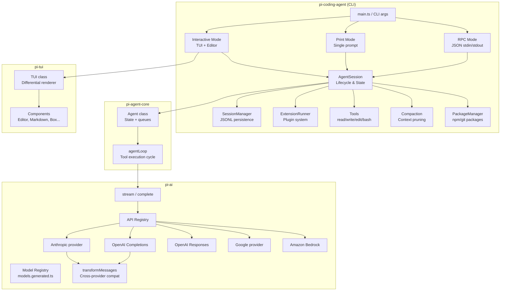
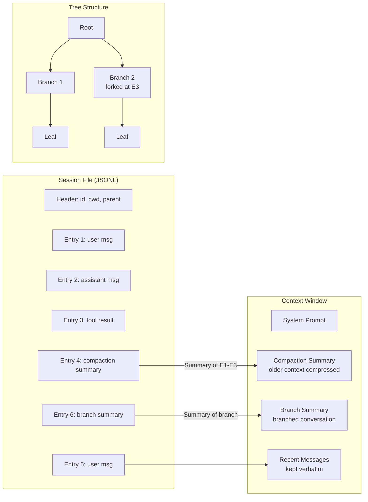
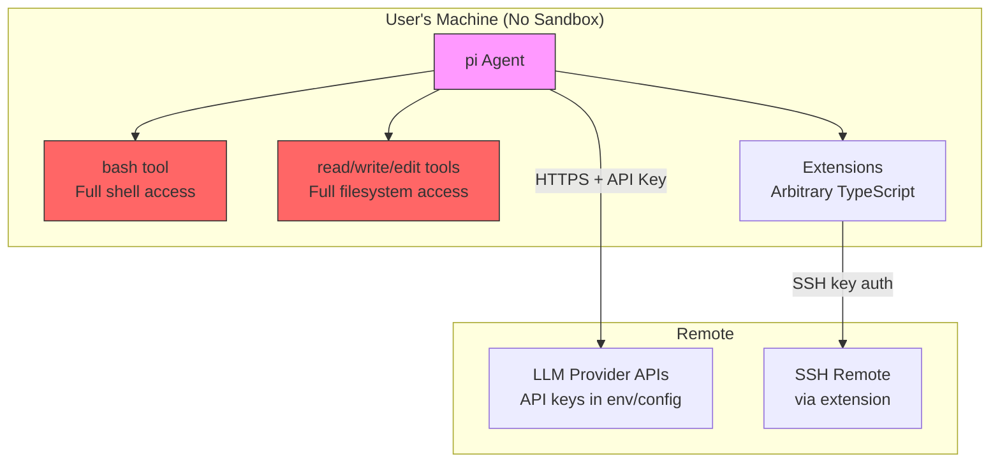

# pi (pi.dev)

## 1. Overview

**pi** is an opinionated, minimalist coding agent framework built by Mario Zechner (badlogic) as a personal alternative to Claude Code, Codex, and similar harnesses. It is a TypeScript monorepo containing a unified multi-provider LLM API (`pi-ai`), an agent loop with state management (`pi-agent-core`), a custom retained-mode terminal UI framework (`pi-tui`), a web UI component library (`pi-web-ui`), and the actual coding agent CLI (`pi-coding-agent`). The philosophy is radical minimalism: a ~150-word system prompt, four tools (read, write, edit, bash), no built-in sub-agents, no plan mode, no MCP support, and no background bash -- all by explicit design choice. Despite this, it achieves competitive benchmark scores and provides an extremely extensible plugin system that can add all of those features back via extensions.

- **Primary Use Case:** Interactive coding agent CLI with multi-provider LLM support
- **Repository:** [github.com/badlogic/pi-mono](https://github.com/badlogic/pi-mono)
- **Language/Runtime:** TypeScript, Node.js (also builds with Bun)
- **License:** MIT

## 2. Architecture

### Core Loop

pi uses a classic agentic loop: user message -> LLM call -> tool calls -> tool results -> LLM call -> ... until the LLM stops calling tools. The loop is event-driven, emitting fine-grained events for every lifecycle phase (turn start/end, message start/update/end, tool execution start/update/end).

### Entry Points

Execution starts at `packages/coding-agent/src/main.ts` which parses CLI args and dispatches to one of three modes:
1. **Interactive mode** (`modes/interactive/interactive-mode.ts`) -- full TUI experience
2. **Print mode** (`modes/print-mode.ts`) -- single prompt, output to stdout
3. **RPC mode** (`modes/rpc/rpc-mode.ts`) -- headless JSON-line protocol on stdin/stdout

All three modes share the `AgentSession` class (`core/agent-session.ts`) which wires together the `Agent` from `pi-agent-core`, the session manager, extension system, tools, and compaction logic.

### Module/Package Structure

| Package | npm name | Description |
|---------|----------|-------------|
| `packages/ai` | `@mariozechner/pi-ai` | Unified LLM API: streaming, tool calling, context handoff, token/cost tracking |
| `packages/agent` | `@mariozechner/pi-agent-core` | Agent loop, Agent class, state management, proxy transport |
| `packages/coding-agent` | `@mariozechner/pi-coding-agent` | The CLI: tools, session management, extensions, compaction, TUI components |
| `packages/tui` | `@mariozechner/pi-tui` | Terminal UI framework: retained-mode, differential rendering |
| `packages/web-ui` | `@mariozechner/pi-web-ui` | Lit-based web UI components for chat interfaces |
| `packages/mom` | `@mariozechner/pi-mom` | Slack bot that delegates to the coding agent |
| `packages/pods` | `@mariozechner/pi` | CLI for managing vLLM deployments on GPU pods |

### Architecture Diagram



### Core Loop Code

The agent loop in `packages/agent/src/agent-loop.ts`:

```typescript
// packages/agent/src/agent-loop.ts (simplified)
async function runLoop(currentContext, newMessages, config, signal, stream, streamFn) {
    let firstTurn = true;
    let pendingMessages = (await config.getSteeringMessages?.()) || [];

    while (true) {
        let hasMoreToolCalls = true;
        let steeringAfterTools = null;

        while (hasMoreToolCalls || pendingMessages.length > 0) {
            // Inject pending steering messages
            if (pendingMessages.length > 0) {
                for (const message of pendingMessages) {
                    currentContext.messages.push(message);
                    newMessages.push(message);
                }
                pendingMessages = [];
            }

            // Stream assistant response (transforms AgentMessage[] -> Message[] at boundary)
            const message = await streamAssistantResponse(currentContext, config, signal, stream, streamFn);
            newMessages.push(message);

            if (message.stopReason === "error" || message.stopReason === "aborted") {
                stream.push({ type: "agent_end", messages: newMessages });
                return;
            }

            // Execute tool calls sequentially
            const toolCalls = message.content.filter(c => c.type === "toolCall");
            hasMoreToolCalls = toolCalls.length > 0;

            if (hasMoreToolCalls) {
                const toolExecution = await executeToolCalls(
                    currentContext.tools, message, signal, stream, config.getSteeringMessages
                );
                // ... add results to context
            }

            // Check for steering messages after turn
            pendingMessages = (await config.getSteeringMessages?.()) || [];
        }

        // Check for follow-up messages when agent would stop
        const followUpMessages = (await config.getFollowUpMessages?.()) || [];
        if (followUpMessages.length > 0) {
            pendingMessages = followUpMessages;
            continue;
        }
        break;
    }
}
```

Key design: The loop has **two message queues** -- steering messages (interrupt mid-tool-execution) and follow-up messages (queued until agent finishes). This enables responsive user interaction while the agent works.

## 3. Memory System

### Short-term Memory (Conversation History)

pi uses a **JSONL append-only session file** format. Each entry is a JSON line with an `id` and `parentId`, forming a **tree structure** that supports branching:

```typescript
// packages/coding-agent/src/core/session-manager.ts
export type SessionEntry =
    | SessionMessageEntry      // user/assistant/toolResult messages
    | ThinkingLevelChangeEntry // model parameter changes
    | ModelChangeEntry         // mid-session model switches
    | CompactionEntry          // context compaction summaries
    | BranchSummaryEntry       // summaries when branching
    | CustomEntry              // extension-specific data
    | CustomMessageEntry       // extension messages injected into LLM context
    | LabelEntry               // user bookmarks on entries
    | SessionInfoEntry;        // session display name
```

Sessions are stored in `~/.pi/sessions/` as JSONL files. The tree structure enables:
- **Branching**: Fork at any point, creating a new branch
- **Tree navigation**: Navigate between branches with summaries
- **Resume**: Continue any session from where it left off

### Context Compaction (Long-term within session)

When context tokens approach the model's window limit, pi performs **automatic compaction** -- summarizing older messages into a compact summary using the LLM itself:

```typescript
// packages/coding-agent/src/core/compaction/compaction.ts
export interface CompactionResult<T = unknown> {
    summary: string;
    firstKeptEntryId: string;
    tokensBefore: number;
    details?: T;  // Extension-specific data (e.g., artifact tracking)
}

export const DEFAULT_COMPACTION_SETTINGS = {
    enabled: true,
    reserveTokens: 16384,     // tokens reserved for LLM response
    keepRecentTokens: 20000,  // recent messages to preserve verbatim
};
```

Compaction tracks **file operations** (reads and modifications) across compaction boundaries, ensuring the LLM knows which files were touched even after older messages are summarized away.

### Memory Architecture Diagram



### No Long-term / Semantic Memory

pi has no built-in embeddings, vector store, or cross-session memory. It relies on:
1. **AGENTS.md** files (hierarchical project context loaded into system prompt)
2. **Skills** (markdown files the LLM can invoke via `/skill:name`)
3. The LLM's own ability to read files from the filesystem

## 4. Tool Calling / Function Execution

### Tool Definition

Tools are defined using TypeBox schemas for type-safe parameter validation:

```typescript
// packages/coding-agent/src/core/tools/edit.ts
const editSchema = Type.Object({
    path: Type.String({ description: "Path to the file to edit" }),
    oldText: Type.String({ description: "Exact text to find and replace" }),
    newText: Type.String({ description: "New text to replace the old text with" }),
});

export function createEditTool(cwd: string, options?: EditToolOptions): AgentTool<typeof editSchema> {
    const ops = options?.operations ?? defaultEditOperations;
    return {
        name: "edit",
        label: "edit",
        description: "Edit a file by replacing exact text...",
        parameters: editSchema,
        execute: async (_toolCallId, { path, oldText, newText }, signal?) => {
            const absolutePath = resolveToCwd(path, cwd);
            // ... perform edit with fuzzy matching fallback
            return {
                content: [{ type: "text", text: `Edited ${path}` }],
                details: { diff, firstChangedLine }
            };
        }
    };
}
```

### Built-in Tools

| Tool | File | Description |
|------|------|-------------|
| `read` | `core/tools/read.ts` | Read file contents (text + images), supports offset/limit |
| `write` | `core/tools/write.ts` | Create/overwrite files, auto-creates directories |
| `edit` | `core/tools/edit.ts` | Surgical find-and-replace with fuzzy matching fallback |
| `bash` | `core/tools/bash.ts` | Execute shell commands with streaming output |
| `grep` | `core/tools/grep.ts` | Search files (read-only mode) |
| `find` | `core/tools/find.ts` | Find files by glob (read-only mode) |
| `ls` | `core/tools/ls.ts` | List directory (read-only mode) |

### Pluggable Operations Pattern

Every tool uses an **operations interface** for its I/O, enabling remote execution:

```typescript
// packages/coding-agent/src/core/tools/bash.ts
export interface BashOperations {
    exec: (command: string, cwd: string, options: {
        onData: (data: Buffer) => void;
        signal?: AbortSignal;
        timeout?: number;
        env?: NodeJS.ProcessEnv;
    }) => Promise<{ exitCode: number | null }>;
}

// Default: local shell
const defaultBashOperations: BashOperations = {
    exec: (command, cwd, { onData, signal, timeout, env }) => {
        return new Promise((resolve, reject) => {
            const { shell, args } = getShellConfig();
            const child = spawn(shell, [...args, command], {
                cwd, detached: true, env: env ?? getShellEnv(),
                stdio: ["ignore", "pipe", "pipe"],
            });
            // ... stream stdout/stderr, handle timeout/abort
        });
    }
};
```

This pattern is how the SSH extension (`examples/extensions/ssh.ts`) works -- it replaces all tool operations with SSH-based equivalents without changing any core code.

### Tool Result Structure

Tools return **split results**: content for the LLM and details for the UI:

```typescript
export interface AgentToolResult<T> {
    content: (TextContent | ImageContent)[];  // Sent to LLM
    details: T;                                // For UI rendering (diffs, paths, etc.)
}
```

### Validation

Tool arguments are validated via TypeBox + AJV before execution. Invalid arguments produce detailed error messages fed back to the LLM.

## 5. LLM Integration

### Supported Providers

pi-ai supports a comprehensive set of providers via four underlying API protocols:

| API Protocol | Providers |
|-------------|-----------|
| `anthropic-messages` | Anthropic, GitHub Copilot (Anthropic models) |
| `openai-completions` | OpenAI, xAI, Groq, Cerebras, OpenRouter, Mistral, MiniMax, HuggingFace, any OpenAI-compatible endpoint (Ollama, vLLM, LM Studio, etc.) |
| `openai-responses` | OpenAI (newer API), Azure OpenAI |
| `openai-codex-responses` | OpenAI Codex |
| `google-generative-ai` | Google |
| `google-gemini-cli` | Google Gemini CLI auth |
| `google-vertex` | Google Vertex AI |
| `bedrock-converse-stream` | Amazon Bedrock |

### API Registry Pattern

Providers register via a central registry:

```typescript
// packages/ai/src/api-registry.ts
export function registerApiProvider<TApi extends Api>(
    provider: ApiProvider<TApi, TOptions>,
    sourceId?: string
): void {
    apiProviderRegistry.set(provider.api, {
        provider: { api, stream: wrapStream(api, stream), streamSimple: wrapStreamSimple(api, streamSimple) },
        sourceId,
    });
}

// Usage:
const provider = resolveApiProvider(model.api);
return provider.stream(model, context, options);
```

### Cross-Provider Context Handoff

A key differentiator. pi-ai handles:
1. **Thinking block conversion**: Anthropic thinking traces become `<thinking>` tagged text for OpenAI/Google
2. **Tool call ID normalization**: OpenAI Responses generates 450+ char IDs; Anthropic requires `^[a-zA-Z0-9_-]+$` max 64 chars
3. **Signature stripping**: Provider-specific opaque signatures removed when switching
4. **System prompt role mapping**: `developer` vs `system` role based on provider support

```typescript
// packages/ai/src/providers/transform-messages.ts
export function transformMessages<TApi extends Api>(
    messages: Message[], model: Model<TApi>,
    normalizeToolCallId?: (id: string, model: Model<TApi>, source: AssistantMessage) => string
): Message[] {
    return messages.map(msg => {
        if (msg.role === "assistant") {
            const isSameModel = msg.provider === model.provider && msg.api === model.api;
            return {
                ...msg,
                content: msg.content.flatMap(block => {
                    if (block.type === "thinking") {
                        if (isSameModel && block.thinkingSignature) return block;
                        if (!block.thinking?.trim()) return [];
                        if (isSameModel) return block;
                        return { type: "text", text: block.thinking }; // Convert for other providers
                    }
                    // ... handle text and toolCall blocks
                })
            };
        }
        return msg;
    });
}
```

### Streaming

All LLM calls go through streaming by default. The `AssistantMessageEventStream` provides:
- Fine-grained events: `text_start`, `text_delta`, `text_end`, `thinking_*`, `toolcall_*`
- **Partial JSON parsing** for tool call arguments (progressive display)
- Abort support via `AbortSignal` throughout the pipeline
- Partial results on abort (not discarded)

### Token and Cost Tracking

Every `AssistantMessage` includes a `Usage` object:

```typescript
export interface Usage {
    input: number;
    output: number;
    cacheRead: number;
    cacheWrite: number;
    totalTokens: number;
    cost: {
        input: number;    // calculated from model.cost rates
        output: number;
        cacheRead: number;
        cacheWrite: number;
        total: number;
    };
}
```

Cost rates come from `models.generated.ts`, auto-generated from OpenRouter and models.dev data. The `AgentSession` aggregates costs across all messages for session-level tracking.

### Model Registry

Type-safe model definitions with auto-generated TypeScript types:

```typescript
// Custom model definition
const ollamaModel: Model<'openai-completions'> = {
    id: 'llama-3.1-8b',
    name: 'Llama 3.1 8B (Ollama)',
    api: 'openai-completions',
    provider: 'ollama',
    baseUrl: 'http://localhost:11434/v1',
    reasoning: false,
    input: ['text'],
    cost: { input: 0, output: 0, cacheRead: 0, cacheWrite: 0 },
    contextWindow: 128000,
    maxTokens: 32000
};
```

### Stealth Mode (Anthropic)

pi uses "stealth mode" with Anthropic -- renaming tools to match Claude Code's tool names (Read, Write, Edit, Bash) and sending Claude Code's version string. This leverages any RL-training that Claude models have received specifically for Claude Code's toolset:

```typescript
// packages/ai/src/providers/anthropic.ts
const claudeCodeVersion = "2.1.2";
const claudeCodeTools = ["Read", "Write", "Edit", "Bash", "Grep", "Glob", ...];
const toClaudeCodeName = (name: string) => ccToolLookup.get(name.toLowerCase()) ?? name;
```

## 6. Security

### No Built-in Sandboxing

pi runs tools directly in the user's shell with no sandboxing. This is a deliberate design choice -- the blog post explicitly states "YOLO by default." There is no Docker isolation, no WASM sandbox, no file permission gates, no path protection.

### Permission Model

- **Default**: All four tools (read, write, edit, bash) available with no confirmation
- **Read-only mode**: Can restrict to `grep`, `find`, `ls` tools only via CLI flags
- **No per-tool confirmation**: Unlike Claude Code's permission system, pi trusts the model completely by default
- **Extension-based permissions**: Extensions can intercept tool calls via `tool_call` events and reject/modify them

### Path Handling

The `resolveToCwd` function in `core/tools/path-utils.ts` resolves paths relative to the working directory. It handles `~` expansion and macOS Unicode quirks, but does **not** enforce path restrictions:

```typescript
// packages/coding-agent/src/core/tools/path-utils.ts
export function resolveToCwd(filePath: string, cwd: string): string {
    const expanded = expandPath(filePath);
    if (isAbsolute(expanded)) return expanded;
    return resolvePath(cwd, expanded);
}
```

### Credential Management

- API keys: Environment variables (`ANTHROPIC_API_KEY`, etc.) or JSON config file
- OAuth: Supported for Claude Pro/Max, GitHub Copilot, OpenAI Codex, Google Gemini CLI
- Keys stored in `~/.pi/auth/` via `AuthStorage`
- Config values support `env:VARIABLE_NAME` and `cmd:command` syntax for dynamic resolution

### Security Boundary Diagram



## 7. Multi-Channel / UI

### Three Modes

**1. Interactive TUI** (`modes/interactive/interactive-mode.ts`):
- Built on `pi-tui` retained-mode framework
- Differential rendering with synchronized output (no flicker)
- Custom editor with fuzzy file search, path completion, multi-line paste
- Markdown rendering with syntax-highlighted code blocks
- Image display in supported terminals (iTerm2, Ghostty, Kitty)

**2. Print Mode** (`modes/print-mode.ts`):
- Single prompt -> stream response to stdout
- Used for scripting and piping

**3. RPC Mode** (`modes/rpc/rpc-mode.ts`):
- JSON lines on stdin/stdout
- Full bidirectional control: prompt, steer, abort, model switching, compaction, session management
- Enables building custom UIs on top

```typescript
// packages/coding-agent/src/modes/rpc/rpc-types.ts
export type RpcCommand =
    | { type: "prompt"; message: string; images?: ImageContent[] }
    | { type: "steer"; message: string }
    | { type: "follow_up"; message: string }
    | { type: "abort" }
    | { type: "set_model"; provider: string; modelId: string }
    | { type: "compact"; customInstructions?: string }
    | { type: "bash"; command: string }
    | { type: "get_messages" }
    // ... 25+ command types
```

**4. Web UI** (`packages/web-ui`):
- Lit web components for browser-based chat interfaces
- Exports: `ChatPanel`, `MessageList`, `Input`, `AgentInterface`, etc.
- Works with pi-ai directly in browser (Anthropic and xAI support CORS)
- Artifact rendering (HTML, SVG, PDF, Excel, Markdown)

**5. Slack Bot** (`packages/mom`):
- Delegates messages to the coding agent
- Docker-based sandbox for code execution
- Separate tool implementations for sandboxed environment

### TUI Architecture

```mermaid
graph TB
    TUI[TUI class<br/>Container + Renderer]
    BB[Backbuffer<br/>Previous lines]
    
    subgraph Components
        EDITOR[Editor<br/>Input with autocomplete]
        MD[Markdown<br/>Syntax highlighting]
        BOX[Box<br/>Bordered content]
        TOOL[ToolExecution<br/>Streaming output]
        DIFF[Diff<br/>File changes]
    end

    TUI -->|render(width)| Components
    Components -->|string[] lines| TUI
    TUI -->|diff against| BB
    TUI -->|"CSI ?2026h<br/>write changes<br/>CSI ?2026l"| TERMINAL[Terminal]
```

## 8. State Management

### Session Persistence

Sessions are stored as **append-only JSONL files** with tree structure:

```
~/.pi/
├── sessions/
│   ├── session-2025-01-15T10-30-00.jsonl
│   └── session-2025-01-15T11-00-00.jsonl
├── settings.json          # User settings (global)
├── auth/                  # OAuth tokens
└── packages/              # Installed npm/git packages
    ├── npm/
    └── git/
```

Project-level settings in `.pi/settings.json` merge with global settings.

### Settings System

Hierarchical settings with deep merge:

```typescript
// packages/coding-agent/src/core/settings-manager.ts
export interface Settings {
    defaultProvider?: string;
    defaultModel?: string;
    defaultThinkingLevel?: ThinkingLevel;
    transport?: TransportSetting;
    compaction?: CompactionSettings;
    retry?: RetrySettings;
    packages?: PackageSource[];      // npm/git package sources
    extensions?: string[];           // local extension paths
    skills?: string[];               // local skill paths
    themes?: string[];               // local theme paths
    // ... 20+ settings
}
```

### Configuration Resolution

Config values support dynamic resolution:

```json
{
    "apiKey": "env:MY_API_KEY",           // Read from environment variable
    "apiKey": "cmd:vault get api-key",     // Execute command to get value
    "apiKey": "sk-..."                     // Direct value
}
```

## 9. Identity / Personality

### Minimal System Prompt

pi's default system prompt is intentionally terse (~150 words):

```typescript
// packages/coding-agent/src/core/system-prompt.ts
let prompt = `You are an expert coding assistant operating inside pi, a coding agent harness.
You help users by reading files, executing commands, editing code, and writing new files.

Available tools:
${toolsList}

Guidelines:
${guidelines}

Pi documentation:
- Main documentation: ${readmePath}
- ...`;
```

### AGENTS.md Context Files

Like Claude Code, pi supports hierarchical context files:
1. **Global** `~/.pi/AGENTS.md` -- applies to all sessions
2. **Project** `.pi/AGENTS.md` -- project-specific
3. Both are appended to the system prompt under "# Project Context"

Users can **replace the entire system prompt** via AGENTS.md frontmatter:
```yaml
---
system-prompt: |
  You are a specialized assistant for...
---
```

### Skills System

Skills are markdown files with frontmatter that the LLM can invoke:

```typescript
// packages/coding-agent/src/core/skills.ts
export interface Skill {
    name: string;
    description: string;
    filePath: string;
    baseDir: string;
    source: string;
    disableModelInvocation: boolean;
}
```

Skills are listed in the system prompt with descriptions. The LLM can invoke them via `/skill:name` commands, causing the skill content to be injected into context.

## 10. Unique Features

### What pi Explicitly Does NOT Have (by design)

From the blog post, Mario Zechner lists intentional omissions:

- **No sub-agents** -- "The context windows are so big now that you don't need to split tasks"
- **No plan mode** -- "I've never found plan mode useful"
- **No MCP support** -- "MCP is a protocol for tools. pi already has a tool system"
- **No background bash** -- "Background processes are a footgun"
- **No built-in to-dos** -- "The model can use files for that"

### Cross-Provider Context Handoff

The ability to switch models mid-session (e.g., start with Claude, continue with GPT, finish with Gemini) with automatic message format conversion is unique among coding agents.

### Extension System

pi has a powerful extension system that can add virtually any capability. Extensions are TypeScript modules loaded via jiti (no compilation needed):

```typescript
// packages/coding-agent/examples/extensions/ssh.ts (simplified)
export default function(pi: ExtensionAPI) {
    // Register CLI flags
    pi.registerFlag("ssh", { description: "SSH remote", type: "string" });

    // Register tools (replace built-in tools with remote versions)
    pi.registerTool({ ...localBash, execute: async (id, params, signal, onUpdate, ctx) => {
        const ssh = getSsh();
        if (ssh) return createBashTool(cwd, { operations: createRemoteBashOps(...) }).execute(...);
        return localBash.execute(...);
    }});

    // Subscribe to lifecycle events
    pi.on("session_start", async (event, ctx) => { /* ... */ });
    pi.on("before_agent_start", async (event) => { /* modify system prompt */ });
    pi.on("user_bash", (event) => { /* intercept ! commands */ });
}
```

Extensions can:
- Register tools, commands, keyboard shortcuts, CLI flags
- Subscribe to 20+ lifecycle events (session_start, turn_start, tool_call, message_end, etc.)
- Render custom UI components (widgets, overlays, custom editors, footers, headers)
- Intercept and modify tool calls and results
- Modify the system prompt before each agent run
- Override compaction and branch summarization
- Register custom message renderers

### Package Manager

Extensions, skills, prompts, and themes can be installed from npm or git:

```json
// settings.json
{
    "packages": [
        "some-npm-package",
        "github:user/repo",
        { "source": "some-package", "extensions": ["ext1.ts"], "skills": ["skill1/"] }
    ]
}
```

The package manager (`core/package-manager.ts`) resolves resources from packages, supporting:
- npm packages with a `pi-manifest` in package.json
- Git repos cloned to `~/.pi/packages/git/`
- Filtering: load only specific resources from a package
- Scoping: user-level or project-level

### Pluggable Tool Operations

Every tool's I/O goes through an operations interface. This means you can redirect all file and command operations to a remote machine (SSH), a Docker container, or any custom backend without touching the tool logic. The SSH extension demonstrates this perfectly.

### Session Branching and Tree Navigation

Sessions form a tree structure. Users can:
- Fork at any message to explore alternatives
- Navigate back to previous branches
- Get auto-generated summaries when branching/returning
- Label/bookmark specific entries

### Stealth Mode with Anthropic

pi renames its tools to match Claude Code's naming convention and sends Claude Code's version string when using Anthropic models, potentially benefiting from Claude's RL training on its native coding harness.

### Proxy Transport

The `packages/agent/src/proxy.ts` provides a stream function that routes LLM calls through a proxy server. This enables:
- Server-managed authentication
- Centralized rate limiting
- Bandwidth optimization (strips partial messages from SSE stream, reconstructs client-side)

## 11. Key Files Reference

| File | Purpose |
|------|---------|
| `packages/ai/src/types.ts` | Core types: Message, Model, Tool, Context, Usage, streaming events |
| `packages/ai/src/stream.ts` | Top-level `stream()` and `complete()` functions |
| `packages/ai/src/api-registry.ts` | Provider registration and lookup |
| `packages/ai/src/providers/anthropic.ts` | Anthropic provider with stealth mode |
| `packages/ai/src/providers/openai-completions.ts` | OpenAI Completions provider (most providers use this) |
| `packages/ai/src/providers/transform-messages.ts` | Cross-provider message transformation |
| `packages/ai/src/models.ts` | Model lookup, cost calculation |
| `packages/agent/src/agent-loop.ts` | Core agent loop with steering/follow-up support |
| `packages/agent/src/agent.ts` | Agent class: state, queues, subscriptions |
| `packages/agent/src/types.ts` | AgentTool, AgentEvent, AgentMessage, extensible via declaration merging |
| `packages/agent/src/proxy.ts` | Proxy transport for server-routed LLM calls |
| `packages/coding-agent/src/core/agent-session.ts` | Central session orchestration (~1500 lines) |
| `packages/coding-agent/src/core/session-manager.ts` | JSONL session persistence with tree structure |
| `packages/coding-agent/src/core/system-prompt.ts` | System prompt construction |
| `packages/coding-agent/src/core/tools/*.ts` | Tool implementations (read, write, edit, bash, grep, find, ls) |
| `packages/coding-agent/src/core/tools/path-utils.ts` | Path resolution and ~ expansion |
| `packages/coding-agent/src/core/compaction/compaction.ts` | Context compaction logic |
| `packages/coding-agent/src/core/extensions/types.ts` | Extension API types (~1300 lines) |
| `packages/coding-agent/src/core/extensions/runner.ts` | Extension lifecycle and event dispatch |
| `packages/coding-agent/src/core/extensions/loader.ts` | Extension loading via jiti with virtual modules |
| `packages/coding-agent/src/core/package-manager.ts` | npm/git package installation and resolution |
| `packages/coding-agent/src/core/model-registry.ts` | Custom model definitions and API key resolution |
| `packages/coding-agent/src/core/settings-manager.ts` | Hierarchical settings (global + project) |
| `packages/coding-agent/src/core/skills.ts` | Skill discovery and loading |
| `packages/coding-agent/src/modes/rpc/rpc-types.ts` | RPC protocol types for headless operation |
| `packages/tui/src/tui.ts` | TUI framework: differential rendering engine |
| `packages/tui/src/components/editor.ts` | Input editor with autocomplete |
| `packages/web-ui/src/ChatPanel.ts` | Web UI chat panel component |

## 12. Code Quality & Developer Experience

### Extension Development

Extensions are TypeScript files loaded at runtime via jiti -- no build step needed. The extension API is comprehensive (~1300 lines of types) and well-documented:

```typescript
export interface ExtensionAPI {
    // Lifecycle events (20+ event types)
    on(event: string, handler: Function): void;

    // Tool registration
    registerTool(tool: ToolDefinition): void;

    // Command registration
    registerCommand(command: RegisteredCommand): void;

    // CLI flag registration
    registerFlag(name: string, config: FlagConfig): void;

    // Keyboard shortcut registration
    registerShortcut(key: KeyId, handler: Function): void;

    // Custom message renderer
    registerMessageRenderer(type: string, renderer: MessageRenderer): void;

    // Get flag value
    getFlag(name: string): unknown;
}
```

### Virtual Module System

For compiled Bun binaries, extensions can still import pi packages via virtual modules:

```typescript
// packages/coding-agent/src/core/extensions/loader.ts
const VIRTUAL_MODULES = {
    "@sinclair/typebox": _bundledTypebox,
    "@mariozechner/pi-agent-core": _bundledPiAgentCore,
    "@mariozechner/pi-tui": _bundledPiTui,
    "@mariozechner/pi-ai": _bundledPiAi,
    "@mariozechner/pi-coding-agent": _bundledPiCodingAgent,
};
```

### Testing

Extensive test suite with 50+ test files in `packages/coding-agent/test/`:
- Session management (branching, compaction, tree navigation)
- Tool behavior (path resolution, truncation)
- Extension lifecycle
- RPC protocol
- Model resolution
- Package management

### Documentation

- Comprehensive READMEs for each package
- Inline JSDoc throughout
- Example extensions covering common use cases:
  - `ssh.ts` -- remote execution
  - `todo.ts` -- task tracking
  - `pirate.ts` -- personality modification
  - `timed-confirm.ts` -- tool call confirmation gate
  - `space-invaders.ts` -- game overlay (TUI demo)
  - `doom-overlay/` -- Doom in the terminal (!)
  - `custom-compaction.ts` -- custom compaction logic
  - `claude-rules.ts` -- Claude Code rules compatibility

### Strengths

1. **Radical simplicity**: Four tools, tiny system prompt, works remarkably well
2. **Cross-provider context handoff**: Unique capability for mid-session model switching
3. **Extension system**: Comprehensive event-based plugin architecture
4. **Pluggable operations**: Tool I/O can be redirected anywhere (SSH, Docker, etc.)
5. **Session branching**: Tree-structured sessions with summaries
6. **Custom TUI**: Purpose-built for coding agents, minimal flicker
7. **RPC mode**: First-class headless operation for building custom UIs
8. **Cost tracking**: Per-message token and cost accounting

### Limitations

1. **No sandboxing**: Full filesystem and shell access by default, no guardrails
2. **No confirmation gates**: Unlike Claude Code's permission system (though achievable via extensions)
3. **No MCP**: Can't use the growing ecosystem of MCP servers
4. **No sub-agents**: Single-threaded execution only
5. **No semantic memory**: No cross-session context beyond files on disk
6. **Single developer**: Bus factor of one, though the code is clean and well-structured
7. **Un-Googleable name**: By design, but makes discovery difficult
