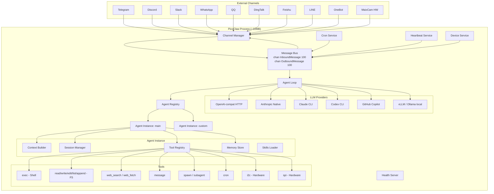
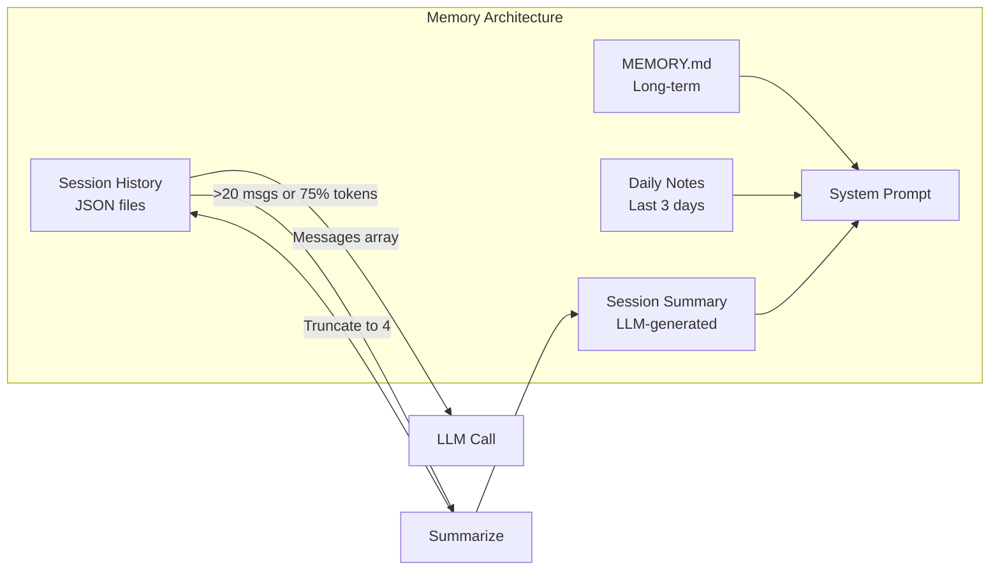
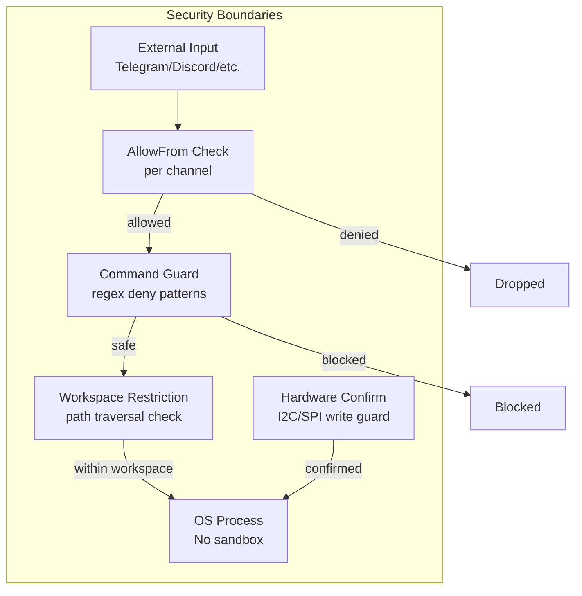

# PicoClaw

## 1. Overview

PicoClaw is an ultra-lightweight personal AI agent framework written in Go, designed to run on severely constrained hardware -- as cheap as $10 SBCs with <10MB RAM and 0.6GHz single-core CPUs. It is a spiritual successor to [nanobot](https://github.com/HKUDS/nanobot) (Python), refactored from the ground up in Go through what the creators claim was a 95% AI-bootstrapped process. PicoClaw achieves a single static binary that cross-compiles to RISC-V, ARM64, LoongArch, and x86_64 from a single `go build` invocation. Despite its minimal footprint, it implements the full agent loop pattern (LLM + tool calling + multi-channel messaging) and even includes hardware I2C/SPI tools for direct sensor interaction on Linux SBCs.

- **Primary Use Case:** Running a personal AI assistant on ultra-cheap embedded Linux hardware (LicheeRV Nano, MaixCam, etc.)
- **Repository:** [github.com/sipeed/picoclaw](https://github.com/sipeed/picoclaw)
- **Language/Runtime:** Go 1.25+, single static binary
- **License:** MIT

## 2. Architecture

### Core Loop

PicoClaw uses an event-driven message bus architecture. The `AgentLoop` consumes inbound messages from a central `MessageBus`, routes them to the appropriate agent instance, runs the LLM tool-call iteration loop, and publishes outbound responses back through the bus. Channel adapters (Telegram, Discord, etc.) bridge external platforms to the bus.

### Entry Points

Execution starts at `cmd/picoclaw/main.go` which dispatches to subcommands:
- `picoclaw agent` -- Direct CLI interaction
- `picoclaw gateway` -- Long-running daemon with channels, cron, heartbeat, health server
- `picoclaw onboard` -- First-time setup

The gateway path (`gatewayCmd()`) is the primary production mode:

```
main() -> gatewayCmd() -> providers.CreateProvider() -> agent.NewAgentLoop()
  -> channels.NewManager() -> channelManager.StartAll()
  -> agentLoop.Run(ctx) [goroutine: consume bus messages]
  -> healthServer.Start() [goroutine]
  -> signal.Notify(SIGINT) [block]
```

### Module/Package Structure

```
cmd/picoclaw/          # Binary entry point, CLI commands
pkg/
  agent/               # Core agent loop, context builder, memory, agent registry
  auth/                # OAuth2, PKCE, token store
  bus/                 # In-process message bus (inbound/outbound channels)
  channels/            # Platform adapters (Telegram, Discord, Slack, WhatsApp, QQ, DingTalk, Feishu, LINE, OneBot, MaixCam)
  config/              # JSON config with env var overlay
  constants/           # Channel name constants
  cron/                # Cron job scheduler
  devices/             # Hardware device event monitoring (USB hotplug)
  health/              # HTTP health/readiness endpoints
  heartbeat/           # Periodic heartbeat service
  logger/              # Structured logging
  migrate/             # OpenClaw -> PicoClaw migration
  providers/           # LLM provider abstraction (OpenAI-compat HTTP, Anthropic native, Claude CLI, Codex CLI, GitHub Copilot, vLLM, Ollama, etc.)
  routing/             # Multi-agent routing (agent ID, session keys, bindings)
  session/             # Conversation history persistence (JSON files)
  skills/              # Skill loader (SKILL.md files from workspace/global/builtin dirs)
  state/               # Atomic state persistence
  tools/               # Tool interface + implementations (exec, filesystem, edit, web, message, spawn, subagent, cron, I2C, SPI)
  utils/               # String truncation, media helpers
  voice/               # Groq transcription
workspace/             # Default workspace templates (embedded via go:embed)
```

### Architecture Diagram



### Core Loop Code

From `pkg/agent/loop.go`, the main `Run()` method:

```go
func (al *AgentLoop) Run(ctx context.Context) error {
    al.running.Store(true)
    for al.running.Load() {
        select {
        case <-ctx.Done():
            return nil
        default:
            msg, ok := al.bus.ConsumeInbound(ctx)
            if !ok {
                continue
            }
            response, err := al.processMessage(ctx, msg)
            if err != nil {
                response = fmt.Sprintf("Error processing message: %v", err)
            }
            if response != "" {
                // Check if message tool already sent response (avoid duplicates)
                alreadySent := false
                // ... dedup check ...
                if !alreadySent {
                    al.bus.PublishOutbound(bus.OutboundMessage{
                        Channel: msg.Channel, ChatID: msg.ChatID, Content: response,
                    })
                }
            }
        }
    }
    return nil
}
```

The LLM iteration loop in `runLLMIteration()` follows the standard pattern: call LLM, check for tool calls, execute tools, append results to messages, loop until LLM returns a plain text response (max 20 iterations by default). It includes retry logic for context window errors with automatic history compression.

## 3. Memory System

### Short-term: Session History

Sessions are persisted as JSON files in `{workspace}/sessions/{sanitized_key}.json`. Each session stores the full message array (user, assistant, tool calls, tool results) plus an optional summary string.

```go
// pkg/session/manager.go
type Session struct {
    Key      string              `json:"key"`
    Messages []providers.Message `json:"messages"`
    Summary  string              `json:"summary,omitempty"`
    Created  time.Time           `json:"created"`
    Updated  time.Time           `json:"updated"`
}
```

Sessions are loaded from disk on startup and saved after each interaction using atomic writes (write to temp file, fsync, rename).

### Long-term: File-based Memory

`pkg/agent/memory.go` implements a `MemoryStore` with two tiers:
- **Long-term:** `{workspace}/memory/MEMORY.md` -- persistent curated memory
- **Daily notes:** `{workspace}/memory/YYYYMM/YYYYMMDD.md` -- chronological logs

The memory context is injected into the system prompt by the `ContextBuilder`:

```go
func (ms *MemoryStore) GetMemoryContext() string {
    // Reads MEMORY.md + last 3 days of daily notes
    // Returns formatted markdown for system prompt injection
}
```

### Summarization

When session history exceeds 20 messages or ~75% of the context window token estimate, `maybeSummarize()` triggers an async background summarization:

1. Splits history into batches (multi-part for >10 messages)
2. Calls LLM with a summarization prompt per batch
3. Merges batch summaries into one
4. Stores as `session.Summary`, truncates history to last 4 messages

Emergency compression (`forceCompression`) drops the oldest 50% of conversation messages when context window errors are hit.



### No Embeddings, No Vector DB

This is deliberate. PicoClaw has zero embedding or vector search infrastructure. Memory is purely file-based and prompt-injected. This is a core architectural decision for the <10MB constraint -- there's no SQLite, no FAISS, no embedding model. The LLM reads MEMORY.md via the system prompt and can use the `read_file` tool for anything else.

## 4. Tool Calling / Function Execution

### Tool Interface

```go
// pkg/tools/base.go
type Tool interface {
    Name() string
    Description() string
    Parameters() map[string]interface{}
    Execute(ctx context.Context, args map[string]interface{}) *ToolResult
}

type ContextualTool interface {
    Tool
    SetContext(channel, chatID string)
}

type AsyncTool interface {
    Tool
    SetCallback(cb AsyncCallback)
}
```

### Tool Registry

`pkg/tools/registry.go` -- Simple `map[string]Tool` with RWMutex. Tools are registered at agent instance creation time. Each `AgentInstance` gets its own `ToolRegistry`.

### Built-in Tools

| Tool | File | Description |
|------|------|-------------|
| `exec` | `pkg/tools/shell.go` | Shell command execution with regex-based safety guards |
| `read_file` | `pkg/tools/filesystem.go` | Read files (with workspace restriction) |
| `write_file` | `pkg/tools/filesystem.go` | Write files |
| `list_dir` | `pkg/tools/filesystem.go` | List directory contents |
| `edit_file` | `pkg/tools/edit.go` | Surgical text edits (oldText -> newText) |
| `append_file` | `pkg/tools/filesystem.go` | Append to files |
| `web_search` | `pkg/tools/web.go` | Brave, DuckDuckGo, or Perplexity search |
| `web_fetch` | `pkg/tools/web.go` | Fetch URL, extract text content |
| `message` | `pkg/tools/message.go` | Send messages to channels |
| `spawn` | `pkg/tools/spawn.go` | Async subagent (background goroutine) |
| `subagent` | `pkg/tools/subagent.go` | Sync subagent (blocks until complete) |
| `cron` | `pkg/tools/cron.go` | Schedule recurring tasks |
| `i2c` | `pkg/tools/i2c.go` + `i2c_linux.go` | I2C bus detect/scan/read/write (Linux syscalls) |
| `spi` | `pkg/tools/spi.go` + `spi_linux.go` | SPI bus list/transfer/read (Linux syscalls) |

### Security: Shell Command Guards

The `exec` tool has an extensive deny-pattern list (40+ regex patterns) blocking dangerous commands:

```go
// pkg/tools/shell.go
var defaultDenyPatterns = []*regexp.Regexp{
    regexp.MustCompile(`\brm\s+-[rf]{1,2}\b`),
    regexp.MustCompile(`\bsudo\b`),
    regexp.MustCompile(`\beval\b`),
    regexp.MustCompile(`\$\([^)]+\)`),       // command substitution
    regexp.MustCompile(`\bgit\s+push\b`),
    regexp.MustCompile(`\bdocker\s+run\b`),
    // ... 35+ more patterns
}
```

Workspace restriction prevents path traversal. Configurable via `tools.exec.enable_deny_patterns` and `tools.exec.custom_deny_patterns` in config.

### Hardware Tool: I2C Direct Syscalls

The I2C tool (`pkg/tools/i2c_linux.go`) talks directly to `/dev/i2c-*` via Linux syscalls -- no C library, no CGO:

```go
// SMBus probe using raw ioctl
func smbusProbe(fd int, addr int, hasQuick bool) bool {
    args := i2cSmbusArgs{
        readWrite: i2cSmbusWrite,
        command:   0,
        size:      i2cSmbusQuick,
        data:      nil,
    }
    _, _, errno := syscall.Syscall(syscall.SYS_IOCTL, uintptr(fd), i2cSmbus, uintptr(unsafe.Pointer(&args)))
    return errno == 0
}
```

On non-Linux platforms, `i2c_other.go` and `spi_other.go` provide stub implementations that return "Linux only" errors. This build-tag approach means the binary compiles everywhere but hardware tools only function on Linux.

### Tool Result Pattern

```go
// pkg/tools/result.go
type ToolResult struct {
    ForLLM  string // Content sent back to LLM as tool result
    ForUser string // Content sent directly to user (optional)
    Silent  bool   // If true, ForUser is suppressed
    IsError bool
    Async   bool   // Tool started async work, result will come later
    Err     error
}
```

This dual-output pattern (`ForLLM` vs `ForUser`) allows tools to send different content to the LLM and the human -- e.g., full JSON to the LLM but a summary to the user.

## 5. LLM Integration

### Provider Abstraction

```go
// pkg/providers/types.go
type LLMProvider interface {
    Chat(ctx context.Context, messages []Message, tools []ToolDefinition,
         model string, options map[string]interface{}) (*LLMResponse, error)
    GetDefaultModel() string
}
```

### Supported Providers

PicoClaw supports an enormous number of providers via a unified factory (`pkg/providers/factory.go`):

| Provider | Implementation | Notes |
|----------|---------------|-------|
| OpenRouter | OpenAI-compat HTTP | Default fallback |
| OpenAI | OpenAI-compat HTTP | With web search option |
| Anthropic | Native Claude API (`pkg/providers/anthropic/`) | Also Claude CLI wrapper |
| Groq | OpenAI-compat HTTP | Also used for voice transcription |
| Zhipu/GLM | OpenAI-compat HTTP | Default model: `glm-4.7` |
| Gemini | OpenAI-compat HTTP | Via Google's OpenAI-compat endpoint |
| DeepSeek | OpenAI-compat HTTP | |
| Nvidia | OpenAI-compat HTTP | |
| Ollama | OpenAI-compat HTTP | Local models |
| vLLM | OpenAI-compat HTTP | Local models |
| Moonshot/Kimi | OpenAI-compat HTTP | |
| ShengSuanYun | OpenAI-compat HTTP | Chinese cloud provider |
| GitHub Copilot | Custom provider | Via SDK or CLI |
| Claude CLI | Subprocess wrapper | Delegates to `claude` binary |
| Codex CLI | Subprocess wrapper | Delegates to `codex` binary |

The default model is `glm-4.7` (Zhipu) -- reflecting PicoClaw's Chinese hardware company origins.

### Provider Resolution

`resolveProviderSelection()` in `pkg/providers/factory.go` uses a two-phase approach:
1. **Explicit provider name** from config (`agents.defaults.provider`)
2. **Model name inference** -- e.g., model containing "claude" routes to Anthropic

Most providers go through `HTTPProvider` which delegates to `openai_compat.Provider` -- a single OpenAI-compatible HTTP client that works with ~15 different API endpoints.

### Fallback Chain

`pkg/providers/fallback.go` implements a fallback chain with cooldown tracking. If the primary model fails with a retriable error (rate limit, timeout, overloaded), it tries the next candidate. Non-retriable errors (format/bad request) skip fallback.

```go
type FallbackCandidate struct {
    Provider string
    Model    string
}
```

### No Streaming

PicoClaw does **not** implement streaming responses. All LLM calls are request-response. This is a deliberate simplification for constrained environments where SSE/WebSocket overhead is unnecessary.

### Token Management

Token estimation uses a character-based heuristic (no tokenizer library):

```go
func (al *AgentLoop) estimateTokens(messages []providers.Message) int {
    totalChars := 0
    for _, m := range messages {
        totalChars += utf8.RuneCountInString(m.Content)
    }
    return totalChars * 2 / 5  // ~2.5 chars per token (accounts for CJK)
}
```

No cost tracking is implemented.

## 6. Security

### Sandboxing: None

PicoClaw has **no process isolation, WASM sandbox, or containerization** for tool execution. The `exec` tool runs shell commands directly via `os/exec`. Safety relies entirely on:

1. **Regex deny patterns** (40+ dangerous command patterns)
2. **Workspace restriction** (optional, prevents path traversal)
3. **AllowFrom lists** per channel (sender ID whitelisting)
4. **I2C/SPI write confirmation** (requires `confirm: true` parameter)

### Credential Management

- API keys stored in `~/.picoclaw/config.json` (file mode 0600)
- OAuth tokens stored via `pkg/auth/store.go` (JSON file in config dir)
- PKCE flow for OpenAI OAuth
- Token refresh support
- No secret encryption at rest

### Channel Access Control

Each channel has an `allow_from` list in config. The `BaseChannel.IsAllowed()` method checks sender IDs with support for compound `id|username` formats.



## 7. Multi-Channel / UI

### Supported Channels (10!)

PicoClaw supports an impressive 10 messaging channels, reflecting its Chinese market focus:

| Channel | File | Protocol |
|---------|------|----------|
| Telegram | `pkg/channels/telegram.go` | Bot API (telego library) |
| Discord | `pkg/channels/discord.go` | Gateway WebSocket (discordgo) |
| Slack | `pkg/channels/slack.go` | Socket Mode (slack-go) |
| WhatsApp | `pkg/channels/whatsapp.go` | Bridge WebSocket |
| QQ | `pkg/channels/qq.go` | Official Bot SDK |
| DingTalk | `pkg/channels/dingtalk.go` | Stream SDK |
| Feishu/Lark | `pkg/channels/feishu_64.go` | OAPI SDK |
| LINE | `pkg/channels/line.go` | Webhook |
| OneBot | `pkg/channels/onebot.go` | WebSocket |
| MaixCam | `pkg/channels/maixcam.go` | Raw TCP JSON |

### Channel Abstraction

```go
// pkg/channels/base.go
type Channel interface {
    Name() string
    Start(ctx context.Context) error
    Stop(ctx context.Context) error
    Send(ctx context.Context, msg bus.OutboundMessage) error
    IsRunning() bool
    IsAllowed(senderID string) bool
}
```

All channels embed `BaseChannel` which provides `IsAllowed()` and `HandleMessage()` (publishes to the bus). The `Manager` handles lifecycle and dispatches outbound messages:

```go
// pkg/channels/manager.go
func (m *Manager) dispatchOutbound(ctx context.Context) {
    for {
        msg, ok := m.bus.SubscribeOutbound(ctx)
        if !ok { continue }
        if constants.IsInternalChannel(msg.Channel) { continue }
        channel, exists := m.channels[msg.Channel]
        if exists {
            channel.Send(ctx, msg)
        }
    }
}
```

### MaixCam: Hardware Camera Channel

The MaixCam channel (`pkg/channels/maixcam.go`) is unique -- it's a raw TCP server that accepts JSON messages from Sipeed's MaixCam hardware (a tiny camera module with AI inference). It handles person detection events and forwards them to the agent:

```go
func (c *MaixCamChannel) handlePersonDetection(msg MaixCamMessage) {
    content := fmt.Sprintf("Person detected!\nClass: %s\nConfidence: %.2f%%\nPosition: (%.0f, %.0f)",
        classInfo, score*100, x, y)
    c.HandleMessage(senderID, chatID, content, []string{}, metadata)
}
```

This is where PicoClaw's embedded/IoT DNA shows -- the agent can react to hardware sensor events, not just chat messages.

## 8. State Management

### Configuration

JSON config at `~/.picoclaw/config.json` with environment variable overlay via `caarlos0/env`:

```go
// All config fields have env tags like:
Model string `json:"model" env:"PICOCLAW_AGENTS_DEFAULTS_MODEL"`
```

### State Persistence

- **Sessions:** JSON files in `{workspace}/sessions/` (atomic write-rename)
- **Cron jobs:** JSON file at `{workspace}/cron/jobs.json`
- **Agent state:** `pkg/state/state.go` -- atomic JSON for last channel, last chat ID
- **Memory:** Markdown files in `{workspace}/memory/`
- **Skills:** `SKILL.md` files in `{workspace}/skills/`

No database of any kind. Everything is flat files. This is critical for the <10MB constraint.

### Workspace Structure

```
~/.picoclaw/
  config.json              # Main config
  auth.json                # OAuth credentials
  workspace/
    AGENTS.md              # Agent persona
    SOUL.md                # Identity
    USER.md                # User profile
    IDENTITY.md            # Additional identity
    memory/
      MEMORY.md            # Long-term memory
      202602/
        20260218.md        # Daily notes
    sessions/
      telegram_123456.json # Session history
    skills/
      weather/SKILL.md     # Installed skills
    cron/
      jobs.json            # Scheduled tasks
```

## 9. Identity / Personality

### System Prompt Construction

`pkg/agent/context.go`'s `ContextBuilder.BuildSystemPrompt()` assembles the system prompt from multiple sources:

1. **Core identity** (`getIdentity()`) -- static template with runtime info, workspace path, available tools list
2. **Bootstrap files** -- `AGENTS.md`, `SOUL.md`, `USER.md`, `IDENTITY.md` from workspace
3. **Skills summary** -- one-liner per installed skill
4. **Memory context** -- `MEMORY.md` + last 3 days of daily notes
5. **Session summary** -- LLM-generated summary of earlier conversation
6. **Current session info** -- channel and chat ID

The system prompt is rebuilt fresh for every message, which means personality and memory are always up-to-date but the prompt can grow large.

### OpenClaw-Compatible Workspace Pattern

PicoClaw deliberately mirrors OpenClaw's `AGENTS.md` / `SOUL.md` / `USER.md` workspace convention. It even includes a `picoclaw migrate` command that copies workspace files from `~/.openclaw/` to `~/.picoclaw/`.

## 10. Unique Features

### What Makes PicoClaw Different

1. **Hardware-native tools (I2C, SPI):** Direct Linux syscall access to hardware buses. No other agent framework has this. The agent can literally read temperature sensors and control actuators.

2. **MaixCam integration:** A dedicated channel for Sipeed's camera hardware with person detection event handling. The agent reacts to physical-world events.

3. **USB device monitoring:** `pkg/devices/` watches for USB hotplug events (Linux udev) and notifies the agent when hardware is connected/disconnected.

4. **Zero-dependency runtime:** Single static binary. No Node.js, no Python, no runtime. `GOOS=linux GOARCH=riscv64 go build` and you have a binary for a $10 RISC-V board.

5. **10 messaging channels** including Chinese platforms (QQ, DingTalk, Feishu, WeChat via OneBot) that no Western framework supports.

6. **OpenClaw migration path:** Built-in migration from OpenClaw with workspace file sync.

7. **Feishu 32-bit workaround:** `pkg/channels/feishu_32.go` vs `feishu_64.go` -- the Feishu SDK doesn't compile on 32-bit, so PicoClaw has a stub for 32-bit architectures. This attention to cross-compilation edge cases is rare.

### Strengths

- Extraordinary resource efficiency (Go's goroutine scheduler + no GC pressure from minimal allocations)
- Truly cross-platform single binary (6 target architectures in the Makefile)
- Clean OpenAI-compatible provider abstraction that works with 15+ backends
- Solid tool interface design with dual-output (ForLLM/ForUser) pattern
- File-based everything = debuggable, inspectable, no database to corrupt

### Limitations

- **No streaming** -- all LLM responses are buffered, which means slow time-to-first-token
- **No sandboxing** -- shell commands run with the agent's full privileges
- **No browser/web automation** -- no headless browser, no page interaction
- **No embeddings/RAG** -- memory is limited to what fits in the system prompt
- **No multi-modal** -- no image/audio processing (except voice transcription via Groq)
- **Regex-based security** -- command deny patterns are bypassable with encoding tricks
- **No cost tracking** -- no token counting beyond rough heuristic for summarization triggers

### How It Achieves <10MB RAM

1. **Go's compiled binary:** No interpreter, no JIT, no VM. The Go runtime is ~2-4MB.
2. **No database:** All state is flat files read on demand, not loaded into memory.
3. **Buffered channels (size 100):** The message bus uses small fixed-size Go channels, not unbounded queues.
4. **No embedding models:** No ML model weights loaded in memory.
5. **No browser engine:** No Chromium, no Playwright.
6. **Lazy channel init:** Channels are only initialized if enabled in config. A minimal deployment (CLI only) loads almost nothing.
7. **Build tags:** `-tags stdjson` avoids pulling in heavy JSON libraries on some platforms. Hardware tools compile to stubs on non-Linux.
8. **`-ldflags "-s -w"`:** Strip debug info and DWARF symbols from binary.
9. **Session files loaded on demand:** `loadSessions()` reads from disk, but individual sessions are small JSON files.

### How It Achieves 1-Second Boot

1. **No dependency resolution:** No `npm install`, no `pip install`, no module downloads.
2. **No JIT warmup:** Go compiles to native machine code.
3. **No database migrations:** No SQLite schema checks, no Prisma migrations.
4. **Minimal initialization:** `main()` -> parse config JSON -> create structs -> start goroutines. That's it.
5. **go:embed for workspace templates:** Default workspace files are embedded in the binary, no external file copies needed for first run.
6. **No model loading:** LLM inference happens via HTTP API calls, not local models.

### Single Binary Cross-Platform Compilation

The Makefile shows the complete matrix:

```makefile
build-all:
    GOOS=linux GOARCH=amd64 go build ...
    GOOS=linux GOARCH=arm64 go build ...
    GOOS=linux GOARCH=loong64 go build ...
    GOOS=linux GOARCH=riscv64 go build ...
    GOOS=darwin GOARCH=arm64 go build ...
    GOOS=windows GOARCH=amd64 go build ...
```

Key architectural decisions enabling this:
- **No CGO:** All syscalls (I2C, SPI) use Go's `syscall` package, not C libraries
- **Build tags:** `i2c_linux.go` / `i2c_other.go`, `spi_linux.go` / `spi_other.go`, `feishu_32.go` / `feishu_64.go`
- **No platform-specific dependencies:** All networking via Go stdlib

### What's Stripped vs OpenClaw

| Feature | OpenClaw | PicoClaw |
|---------|----------|----------|
| Language | TypeScript/Node.js | Go |
| Runtime | Node.js + npm | Single binary |
| RAM | >1GB | <10MB |
| Browser automation | Full Playwright | None |
| Canvas/UI | HTML canvas rendering | None |
| Node pairing | Mobile device control | None |
| TTS | ElevenLabs integration | None (Groq transcription only) |
| Image analysis | Vision model tool | None |
| Embeddings/RAG | None (but could add) | None (by design) |
| Database | None | None |
| Sandboxing | Process isolation | Regex guards only |
| Streaming | SSE support | None |
| **Added in PicoClaw** | | |
| Hardware I2C/SPI | N/A | Direct syscall |
| MaixCam camera | N/A | TCP channel |
| USB monitoring | N/A | udev events |
| Chinese platforms | N/A | QQ, DingTalk, Feishu, OneBot |
| RISC-V support | N/A | Native compilation |

### The 95% AI-Bootstrapped Claim

The README states "95% Agent-generated core with human-in-the-loop refinement." Evidence in the codebase:

1. **Consistent code style** across all files -- unnaturally uniform for a multi-contributor project
2. **Comments include Chinese** (`// 获取全局配置目录和内置 skills 目录`, `// 内置 skills`) mixed with English, suggesting prompts in Chinese
3. **Boilerplate-heavy patterns** -- every file has the same copyright header, every tool follows the exact same structure
4. **The migration from nanobot (Python) to Go** is a known AI-assisted refactoring pattern -- the architecture maps cleanly
5. **"Diegox-17" comment** in `context.go` -- a contributor fix comment in the style of a PR merge, suggesting some human contributions
6. **Rapid development timeline** -- "Built in 1 day" claim in README, plausible with AI assistance

The code quality is solid but not exceptional. It reads like well-prompted AI output: correct, consistent, but with occasional over-engineering (e.g., the multi-part summarization) and under-engineering (e.g., no error wrapping in some paths).

## 11. Key Files Reference

| File | Lines | Purpose |
|------|-------|---------|
| `cmd/picoclaw/main.go` | 700+ | CLI entry point, all subcommands |
| `pkg/agent/loop.go` | 550+ | Core agent loop, LLM iteration, summarization |
| `pkg/agent/instance.go` | 120 | Agent instance creation, tool registration |
| `pkg/agent/context.go` | 200 | System prompt builder, skills/memory injection |
| `pkg/agent/memory.go` | 130 | File-based memory (MEMORY.md + daily notes) |
| `pkg/agent/registry.go` | ~150 | Multi-agent routing and registry |
| `pkg/tools/registry.go` | 150 | Tool registry, execution with timing/logging |
| `pkg/tools/shell.go` | 220 | Exec tool with 40+ regex safety guards |
| `pkg/tools/i2c_linux.go` | 230 | I2C syscall implementation |
| `pkg/tools/spi_linux.go` | ~200 | SPI syscall implementation |
| `pkg/tools/toolloop.go` | 130 | Reusable LLM+tool loop (for subagents) |
| `pkg/tools/subagent.go` | 260 | Subagent manager (async + sync) |
| `pkg/providers/factory.go` | 350 | Provider resolution (15+ backends) |
| `pkg/providers/http_provider.go` | 30 | OpenAI-compat HTTP delegator |
| `pkg/channels/manager.go` | 250 | Channel lifecycle + outbound dispatch |
| `pkg/channels/maixcam.go` | 230 | MaixCam hardware camera channel |
| `pkg/config/config.go` | 430 | Full config structs with JSON + env tags |
| `pkg/session/manager.go` | 250 | Session persistence (atomic JSON files) |
| `pkg/bus/bus.go` | 80 | In-process message bus (Go channels) |
| `pkg/skills/loader.go` | 350 | Skill discovery from 3 directories |

## 12. Code Quality & Developer Experience

### Extensibility

Adding a new tool requires implementing the 4-method `Tool` interface and calling `registry.Register()`. Adding a new channel requires implementing the `Channel` interface and adding initialization in `manager.go`. Adding a new LLM provider requires implementing the `LLMProvider` interface (1 method). The abstractions are clean and minimal.

### Skills System

Skills are markdown files (`SKILL.md`) discovered from three directories:
1. Workspace skills (`~/.picoclaw/workspace/skills/`)
2. Global skills (`~/.picoclaw/skills/`)
3. Built-in skills (embedded in binary)

Skills can be installed from GitHub via `picoclaw skills install <repo>`. The skills loader generates summaries for the system prompt and the agent can read full skill content via the `read_file` tool.

### Testing

Test files exist for most packages (43 `_test.go` files). Tests use `testify/assert`. Coverage appears moderate -- core logic (tools, providers, session) has tests; channels and integration paths are less covered.

### Documentation

- Comprehensive README with comparison table, GIFs, architecture overview
- Multi-language READMEs (Chinese, Japanese, Portuguese, Vietnamese)
- Community roadmap at `docs/picoclaw_community_roadmap_260216.md`
- Inline code comments are sparse but present at key decision points

### Build System

Clean Makefile with targets for build, install, test, cross-compilation. Docker multi-stage build produces a minimal Alpine image. No complex build tooling beyond standard Go.

### Overall Assessment

PicoClaw is a remarkably complete agent framework in ~20K lines of Go. It achieves its stated goals: the architecture genuinely enables <10MB operation on $10 hardware. The trade-offs are rational -- no streaming, no browser, no embeddings -- all in service of the resource constraint. The hardware integration (I2C, SPI, MaixCam, USB monitoring) is genuinely novel and positions PicoClaw uniquely in the IoT/embedded AI space. The 10-channel support with Chinese platform coverage makes it the most internationally accessible agent framework in this analysis.
