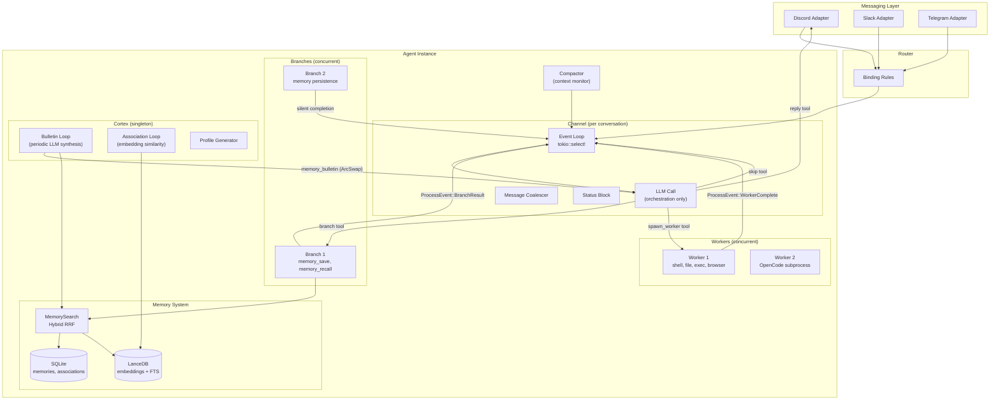
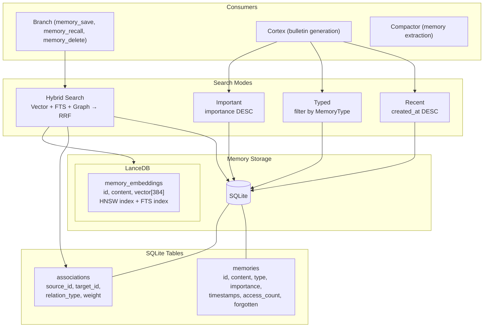
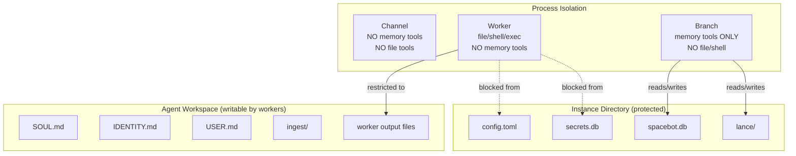
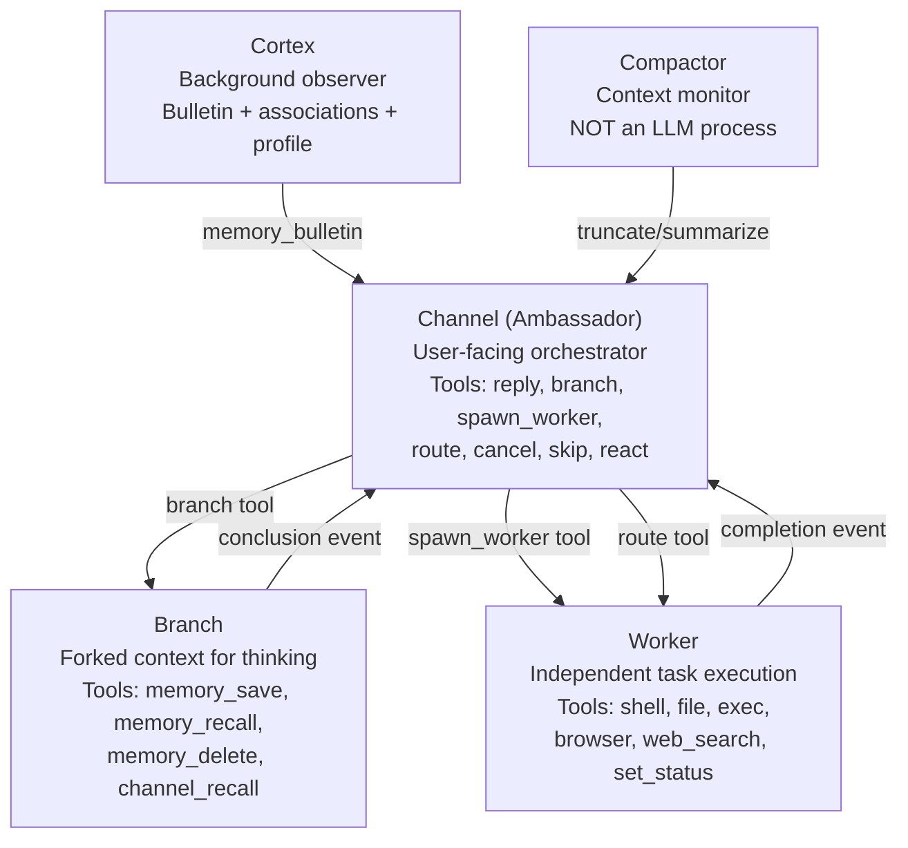

# Spacebot - Framework Analysis

## 1. Overview

Spacebot is a multi-agent AI framework built in Rust, designed for teams, communities, and multi-user environments. Its core innovation is a strict delegation model where the user-facing orchestrator (Channel) **never executes work itself** -- it only manages conversation flow, delegating all thinking to Branches and all execution to Workers. These run as concurrent tokio tasks, meaning multiple users across multiple channels can interact simultaneously without any of them blocking each other. The system maintains long-term memory in a graph database with 8 typed memory kinds, generates pre-computed "bulletins" (briefings) via a Cortex process, and handles context overflow through a tiered compaction system. Built by the Spacedrive team, it ships as a single Rust binary with native Discord, Slack, and Telegram adapters.

- **Language/Runtime**: Rust (core, ~88 .rs files), TypeScript (web UI, ~16 .ts files)
- **License**: FSL-1.1-ALv2 (Functional Source License, converts to Apache 2.0)
- **Primary use case**: Multi-user AI agent for team Discord/Slack servers, communities with concurrent conversations

## 2. Architecture

### Core Loop

Spacebot uses an **event-driven, concurrent process model**. There is no single agent loop. Instead, each conversation channel runs its own `tokio::select!` event loop that listens for inbound messages AND process events (branch completions, worker results). The Channel process is the user-facing orchestrator -- it receives messages, builds a system prompt, calls the LLM, and the LLM decides what to do via tool calls (reply, branch, spawn_worker, skip, etc.).

The critical design principle: **the Channel never does work**. It's a dispatcher. When the user asks a question requiring thought, the Channel spawns a Branch. When work needs doing (code, shell, files), it spawns a Worker. Results flow back as events, get injected into history, and the Channel re-triggers to process them.

### Entry Points

Execution starts in `src/main.rs`, which:
1. Loads config from TOML (`src/config.rs`)
2. Initializes SQLite + LanceDB databases
3. Creates per-agent `AgentDeps` bundles
4. Spawns messaging adapters (Discord, Slack, Telegram)
5. Starts the Cortex bulletin loop
6. Starts the association loop
7. Starts the ingestion loop
8. Routes inbound messages to the correct agent's Channel

### Module Structure

| Module | Path | Purpose |
|--------|------|---------|
| `agent/channel.rs` | 1499 lines | User-facing conversation orchestrator |
| `agent/cortex.rs` | 877 lines | Memory bulletin generator + association engine |
| `agent/worker.rs` | 655 lines | Independent task execution with segmented runs |
| `agent/compactor.rs` | 378 lines | Context monitoring + tiered compaction |
| `agent/branch.rs` | 225 lines | Forked context for thinking/memory ops |
| `agent/ingestion.rs` | 526 lines | File-based bulk memory import |
| `agent/cortex_chat.rs` | 396 lines | Interactive cortex sessions (web UI) |
| `agent/status.rs` | 220 lines | Live status block for context injection |
| `memory/` | ~2022 lines | Graph store, search (hybrid RRF), embeddings |
| `llm/` | ~1429 lines | Multi-provider model routing with fallbacks |
| `tools/` | ~18 tools | Channel, branch, and worker tool suites |
| `messaging/` | Discord, Slack, Telegram | Platform adapters with trait abstraction |
| `config.rs` | 2451 lines | TOML config with hot-reloadable `ArcSwap` |
| `prompts/` | MiniJinja templates | Templated system prompts per process type |

### Architecture Diagram



### Core Loop Code

The Channel's event loop (`src/agent/channel.rs`):

```rust
pub async fn run(mut self) -> Result<()> {
    loop {
        let sleep_duration = self.coalesce_deadline
            .map(|deadline| {
                let now = tokio::time::Instant::now();
                if deadline > now { deadline - now }
                else { std::time::Duration::from_millis(1) }
            })
            .unwrap_or(std::time::Duration::from_secs(3600));

        tokio::select! {
            Some(message) = self.message_rx.recv() => {
                if self.should_coalesce(&message, &config) {
                    self.coalesce_buffer.push(message);
                    self.update_coalesce_deadline(&config).await;
                } else {
                    self.flush_coalesce_buffer().await?;
                    self.handle_message(message).await?;
                }
            }
            Ok(event) = self.event_rx.recv() => {
                self.flush_coalesce_buffer().await?;
                self.handle_event(event).await?;
            }
            _ = tokio::time::sleep(sleep_duration),
                if self.coalesce_deadline.is_some() => {
                self.flush_coalesce_buffer().await?;
            }
        }
    }
}
```

## 3. Memory System

Spacebot implements a **typed memory graph** with 8 memory kinds, stored in SQLite with vector embeddings in LanceDB. The key innovation is that **the Channel never touches memory directly** -- memory operations are delegated to Branches, and the Cortex pre-synthesizes a bulletin that gives all channels ambient awareness.

### 8 Memory Types

Defined in `src/memory/types.rs`:

```rust
pub enum MemoryType {
    Fact,         // default importance: 0.6
    Preference,   // default importance: 0.7
    Decision,     // default importance: 0.8
    Identity,     // default importance: 1.0 (never decays)
    Event,        // default importance: 0.4
    Observation,  // default importance: 0.3
    Goal,         // default importance: 0.9
    Todo,         // default importance: 0.8
}
```

Each memory has: `id`, `content`, `memory_type`, `importance` (0.0-1.0), timestamps (`created_at`, `updated_at`, `last_accessed_at`), `access_count`, `source`, `channel_id`, and a `forgotten` soft-delete flag.

### Graph Structure

Memories are connected via typed associations (`src/memory/types.rs`):

```rust
pub enum RelationType {
    RelatedTo,    // General semantic connection
    Updates,      // Newer version of same info
    Contradicts,  // Conflicting information
    CausedBy,     // Causal relationship
    ResultOf,     // Result relationship
    PartOf,       // Hierarchical relationship
}
```

Associations are auto-generated by the Cortex's association loop, which scans memories for embedding similarity and creates edges. The similarity threshold and relation type are configurable:
- Similarity >= `updates_threshold` → `RelationType::Updates`
- Similarity >= `association_similarity_threshold` → `RelationType::RelatedTo`

### Memory Architecture Diagram



### Hybrid Search with Reciprocal Rank Fusion

The core search algorithm (`src/memory/search.rs`) combines three retrieval strategies:

```rust
pub async fn hybrid_search(&self, query: &str, config: &SearchConfig)
    -> Result<Vec<MemorySearchResult>>
{
    // 1. Full-text search via LanceDB inverted index
    let fts_results = self.embedding_table.text_search(query, max).await;

    // 2. Vector similarity search (all-MiniLM-L6-v2, 384 dimensions)
    let query_embedding = self.embedding_model.embed_one(query).await?;
    let vector_results = self.embedding_table.vector_search(&query_embedding, max).await;

    // 3. Graph traversal from high-importance seed memories
    let seed_memories = self.store.get_high_importance(0.8, 20).await?;
    // BFS traversal following RelatedTo and PartOf edges

    // 4. Reciprocal Rank Fusion
    reciprocal_rank_fusion(&vector_results, &fts_results, &graph_results, k=60.0)
}
```

RRF formula: `score(item) = Σ 1/(k + rank_in_list)` across all lists where the item appears. With k=60, items appearing in multiple retrieval strategies get boosted.

### Memory Bulletin (Pre-computed Briefing)

The Cortex (`src/agent/cortex.rs`) runs a periodic loop that:
1. Queries the memory store across 8 dimensions (identity, recent, decisions, high-importance, preferences, goals, events, observations)
2. Feeds raw results to an LLM for synthesis into a concise briefing
3. Stores the result in `RuntimeConfig::memory_bulletin` (an `ArcSwap<String>`)
4. Every channel reads this bulletin when building its system prompt

```rust
const BULLETIN_SECTIONS: &[BulletinSection] = &[
    BulletinSection { label: "Identity & Core Facts",     mode: Typed,     memory_type: Some(Identity),    sort_by: Importance, max_results: 15 },
    BulletinSection { label: "Recent Memories",           mode: Recent,    memory_type: None,              sort_by: Recent,     max_results: 15 },
    BulletinSection { label: "Decisions",                 mode: Typed,     memory_type: Some(Decision),    sort_by: Recent,     max_results: 10 },
    BulletinSection { label: "High-Importance Context",   mode: Important, memory_type: None,              sort_by: Importance, max_results: 10 },
    BulletinSection { label: "Preferences & Patterns",    mode: Typed,     memory_type: Some(Preference),  sort_by: Importance, max_results: 10 },
    BulletinSection { label: "Active Goals",              mode: Typed,     memory_type: Some(Goal),        sort_by: Recent,     max_results: 10 },
    BulletinSection { label: "Recent Events",             mode: Typed,     memory_type: Some(Event),       sort_by: Recent,     max_results: 10 },
    BulletinSection { label: "Observations",              mode: Typed,     memory_type: Some(Observation), sort_by: Recent,     max_results: 5  },
];
```

This is brilliant because it means no channel ever pays the cost of memory retrieval at conversation time -- the bulletin is pre-computed and injected into the system prompt as ambient knowledge.

## 4. Tool Calling / Function Execution

### Tool Topology

Spacebot has a strict tool isolation model. Each process type gets a different tool set, enforced by separate `ToolServer` instances:

**Channel Tools** (added/removed per turn):
- `reply` -- send a response to the user
- `branch` -- fork context for thinking
- `spawn_worker` -- delegate task execution
- `route` -- send follow-up input to a running worker
- `cancel` -- abort a running worker or branch
- `skip` -- explicitly decline to respond
- `react` -- add emoji reaction to the message
- `send_file` -- send a file attachment
- `cron` -- schedule recurring tasks

**Branch Tools** (registered at creation):
- `memory_save` -- persist a memory to the graph
- `memory_recall` -- search memories (hybrid/typed/recent/important)
- `memory_delete` -- soft-delete a memory
- `channel_recall` -- search conversation history

**Worker Tools** (registered at creation):
- `shell` -- run arbitrary commands
- `file` -- read, write, list files
- `exec` -- run specific programs
- `set_status` -- update worker status visible to channel
- `browser` -- headless Chrome automation (optional)
- `web_search` -- Brave Search API (optional)

The Channel has **no memory tools**. It delegates memory work to Branches. Workers have **no memory tools** either -- they do work, they don't remember.

### Tool Registration Code

From `src/tools.rs`:

```rust
pub fn create_branch_tool_server(
    memory_search: Arc<MemorySearch>,
    conversation_logger: ConversationLogger,
    channel_store: ChannelStore,
) -> ToolServerHandle {
    ToolServer::new()
        .tool(MemorySaveTool::new(memory_search.clone()))
        .tool(MemoryRecallTool::new(memory_search.clone()))
        .tool(MemoryDeleteTool::new(memory_search))
        .tool(ChannelRecallTool::new(conversation_logger, channel_store))
        .run()
}

pub fn create_worker_tool_server(
    agent_id: AgentId, worker_id: WorkerId, channel_id: Option<ChannelId>,
    event_tx: broadcast::Sender<ProcessEvent>, browser_config: BrowserConfig,
    screenshot_dir: PathBuf, brave_search_key: Option<String>,
    workspace: PathBuf, instance_dir: PathBuf,
) -> ToolServerHandle {
    let mut server = ToolServer::new()
        .tool(ShellTool::new(instance_dir.clone(), workspace.clone()))
        .tool(FileTool::new(workspace.clone()))
        .tool(ExecTool::new(instance_dir, workspace))
        .tool(SetStatusTool::new(agent_id, worker_id, channel_id, event_tx));
    if browser_config.enabled { server = server.tool(BrowserTool::new(...)); }
    if let Some(key) = brave_search_key { server = server.tool(WebSearchTool::new(key)); }
    server.run()
}
```

Tool output is truncated at 50KB (`MAX_TOOL_OUTPUT_BYTES`) to prevent context blowup.

## 5. LLM Integration

### Multi-Provider Support

Spacebot supports **11 LLM providers** (`src/llm/model.rs`):

Anthropic, OpenAI, OpenRouter, Zhipu, Groq, Together, Fireworks, DeepSeek, xAI, Mistral, OpenCode-Zen

Each provider is called through a custom `CompletionModel` implementation (`SpacebotModel`) that handles the raw HTTP calls, response parsing, and tool call extraction.

### Per-Process Model Routing

The `RoutingConfig` (`src/llm/routing.rs`) assigns a different model to each process type:

```rust
pub struct RoutingConfig {
    pub channel: String,    // e.g., "anthropic/claude-sonnet-4-20250514"
    pub branch: String,     // can be cheaper model
    pub worker: String,     // can be coding-specialized
    pub compactor: String,
    pub cortex: String,
    pub task_overrides: HashMap<String, String>,  // e.g., "coding" → specific model
    pub fallbacks: HashMap<String, Vec<String>>,  // fallback chains
    pub rate_limit_cooldown_secs: u64,
}
```

### Fallback + Retry Logic

On retriable errors (429, 502-504, timeouts), SpacebotModel:
1. Retries up to 3 times with exponential backoff (500ms base)
2. If all retries fail, tries the fallback chain (up to 3 fallback models)
3. Rate-limited models are put in cooldown so other requests don't hit them
4. Context overflow errors trigger compaction + retry rather than failure

```rust
// From src/llm/routing.rs
pub fn is_retriable_error(error_message: &str) -> bool {
    lower.contains("429") || lower.contains("502") || lower.contains("503")
        || lower.contains("rate limit") || lower.contains("overloaded")
        || lower.contains("timeout") || lower.contains("empty response")
}

pub fn is_context_overflow_error(error_message: &str) -> bool {
    lower.contains("context length") || lower.contains("maximum context")
        || lower.contains("token limit") || lower.contains("too many tokens")
        || lower.contains("request too large")
}
```

### Token Management

Token counting uses a `chars/4` heuristic (`src/agent/compactor.rs:estimate_history_tokens`) -- deliberately rough and slightly conservative. This is only used for compaction threshold checks, not billing.

## 6. Security

### File System Isolation

- Worker file operations are restricted to the agent's `workspace` directory
- Shell and exec commands are blocked from accessing `instance_dir` (contains secrets)
- Each agent has its own workspace directory under the instance dir

### Tool Server Isolation

Each Channel, Branch, and Worker gets its **own isolated ToolServer**. This prevents:
- Channels from accessing memory tools directly
- Workers from interfering with each other's state
- Cross-channel tool state leakage

### Secret Management

Secrets are stored in `src/secrets/store.rs` with encrypted-at-rest SQLite storage. API keys support `env:VAR_NAME` references to pull from environment variables.

### Security Boundary Diagram



### Permission Model

Per-channel permissions support guild, channel, and DM-level access control with hot-reloading. Bindings (`src/config.rs`) map platform conversations to specific agents.

## 7. Multi-Channel / UI

### Messaging Adapters

Native adapters for Discord (`src/messaging/discord.rs`), Slack (`src/messaging/slack.rs`), and Telegram (`src/messaging/telegram.rs`), plus a webhook adapter.

The abstraction is trait-based (`src/messaging/traits.rs`):

```rust
pub trait Messaging: Send + Sync + 'static {
    fn name(&self) -> &str;
    fn start(&self) -> impl Future<Output = Result<InboundStream>> + Send;
    fn respond(&self, message: &InboundMessage, response: OutboundResponse) -> impl Future<Output = Result<()>> + Send;
    fn send_status(&self, message: &InboundMessage, status: StatusUpdate) -> impl Future<Output = Result<()>> + Send;
    fn broadcast(&self, target: &str, response: OutboundResponse) -> impl Future<Output = Result<()>> + Send;
    fn fetch_history(&self, message: &InboundMessage, limit: usize) -> impl Future<Output = Result<Vec<HistoryMessage>>> + Send;
    fn health_check(&self) -> impl Future<Output = Result<()>> + Send;
    fn shutdown(&self) -> impl Future<Output = Result<()>> + Send;
}
```

A companion `MessagingDyn` trait provides dynamic dispatch via blanket impl for runtime polymorphism (`Arc<dyn MessagingDyn>`).

### Web UI

The `interface/` directory contains a React/Vite web interface with:
- `useCortexChat.ts` -- interactive cortex chat via SSE
- `useChannelLiveState.ts` -- live channel status updates
- `useEventSource.ts` -- SSE event stream hook

The HTTP API (`src/api/server.rs`) provides REST endpoints for agent management, memory browsing, conversation history, and cortex chat sessions.

### Message Coalescing

For high-traffic channels, rapid-fire messages are batched into a single LLM turn:

```rust
pub struct CoalesceConfig {
    pub enabled: bool,
    pub debounce_ms: u64,       // 1500ms default
    pub max_wait_ms: u64,       // 5000ms default
    pub min_messages: usize,    // 2 default
    pub multi_user_only: bool,  // true default (skip for DMs)
}
```

Batched messages are formatted with attribution and relative timestamps:
```
[3 messages arrived rapidly in this channel]

[Alice] (just now): Hey, what's the status?
[Bob] (2s ago): Can you run the tests?
[Alice] (5s ago): Also check the deployment
```

## 8. State Management

### Persistence Layer

- **SQLite** (`src/db.rs`): memories, associations, conversation logs, cortex events, agent profiles, cron jobs, ingestion progress, settings. Managed via sqlx migrations.
- **LanceDB** (`src/memory/lance.rs`): Vector embeddings (all-MiniLM-L6-v2, 384 dimensions) with HNSW index for vector search and inverted index for FTS. Table: `memory_embeddings`.
- **Files**: Identity files (SOUL.md, IDENTITY.md, USER.md), config (TOML), worker logs, screenshots.

### Hot-Reloadable Configuration

Runtime config uses `arc_swap::ArcSwap` for lock-free reads with atomic swaps:

```rust
pub struct RuntimeConfig {
    pub routing: ArcSwap<RoutingConfig>,
    pub memory_bulletin: ArcSwap<String>,
    pub prompts: ArcSwap<PromptEngine>,
    pub identity: ArcSwap<Identity>,
    pub skills: ArcSwap<SkillSet>,
    pub context_window: ArcSwap<usize>,
    pub compaction: ArcSwap<CompactionConfig>,
    pub coalesce: ArcSwap<CoalesceConfig>,
    // ... more
}
```

Changes propagate to running channels without restart.

### Daemon Mode

Spacebot runs as a Unix daemon (`src/daemon.rs`) with:
- PID file for liveness detection
- Unix domain socket for IPC (shutdown, status queries)
- Daily-rotated log files via `tracing-appender`
- Graceful shutdown with socket cleanup

## 9. Identity / Personality

### Identity Files

Agents load personality from three markdown files in their workspace (`src/identity/files.rs`):

```rust
pub struct Identity {
    pub soul: Option<String>,      // SOUL.md - personality, values, style
    pub identity: Option<String>,  // IDENTITY.md - name, nature, purpose
    pub user: Option<String>,      // USER.md - who the human is
}
```

These are rendered into the system prompt as sections:
```
## Soul
<SOUL.md content>

## Identity
<IDENTITY.md content>

## User
<USER.md content>
```

### System Prompt Assembly

The Channel's system prompt is assembled from multiple dynamic components via MiniJinja templates (`src/prompts/engine.rs`):

1. **Identity context** -- rendered from SOUL.md + IDENTITY.md + USER.md
2. **Memory bulletin** -- pre-computed by Cortex
3. **Skills prompt** -- available skill descriptions
4. **Worker capabilities** -- what tools workers have access to
5. **Conversation context** -- platform, channel name, server info
6. **Status block** -- active workers, branches, recent completions
7. **Coalesce hint** -- (for batched messages only)

## 10. Unique Features

### The Delegation Model

This is Spacebot's defining innovation. The five process types form a strict hierarchy:



**Key constraint**: The Channel's LLM call ONLY has access to delegation tools. It cannot read files, run commands, or search memories. This forces it to delegate, which means it stays responsive -- it never gets stuck in a 30-second tool execution.

### Nothing Blocks

Every spawn is a `tokio::spawn`. When the Channel spawns a Branch or Worker, it immediately returns to its event loop. Multiple workers and branches can run concurrently. When they complete, they send events through a `broadcast::Sender<ProcessEvent>`, which the Channel receives in its `tokio::select!` loop.

```rust
let handle = tokio::spawn(async move {
    if let Err(error) = branch.run(&prompt).await {
        tracing::error!(branch_id = %branch_id, %error, "branch failed");
    }
});
state.active_branches.write().await.insert(branch_id, handle);
```

### Context Compaction Tiers

The Compactor (`src/agent/compactor.rs`) monitors context usage as a percentage of the model's context window:

| Threshold | Action | Method |
|-----------|--------|--------|
| **80%** (`background_threshold`) | Background compaction | Spawns worker: LLM summarizes oldest 30% of messages + extracts memories |
| **85%** (`aggressive_threshold`) | Aggressive compaction | Same but removes 50% of messages |
| **95%** (`emergency_threshold`) | Emergency truncation | **No LLM** -- drops oldest 50%, inserts marker. Synchronous. |

Workers also self-compact: they run in 25-turn segments, checking context usage between segments. On context overflow from the provider, they compact 75% and retry (up to 3 times).

### Auto Memory Persistence

Every N user messages (configurable, default 50), the Channel spawns a **silent memory persistence branch** that:
1. Recalls existing memories
2. Saves new ones from the recent conversation
3. Completes without injecting results into channel history

```rust
async fn check_memory_persistence(&mut self) {
    if self.message_count < config.message_interval { return; }
    self.message_count = 0;
    let branch_id = spawn_memory_persistence_branch(&self.state, &self.deps).await?;
    self.memory_persistence_branches.insert(branch_id);
}
```

### Multi-Agent Instances

A single Spacebot binary can run multiple agents, each with:
- Its own identity (SOUL.md, etc.)
- Its own memory graph
- Its own model routing
- Its own tool permissions
- Connected to different platforms via bindings

### Re-trigger Pattern

When a Branch or Worker completes, the Channel synthesizes a "system" message and sends it to itself, which re-enters the event loop and triggers a new LLM call. This lets the Channel process the result and decide whether to reply to the user:

```rust
if should_retrigger {
    let synthetic = InboundMessage {
        source: "system".into(),
        content: MessageContent::Text(retrigger_message),
        // ...
    };
    self.self_tx.try_send(synthetic);
}
```

### OpenCode Integration

Workers can spawn OpenCode subprocess (`src/opencode/`) for deep coding tasks with its own codebase exploration, LSP awareness, and context management. This runs as a separate HTTP + SSE process, not as an in-process LLM loop.

## 11. Key Files Reference

| File | Lines | Purpose |
|------|-------|---------|
| `src/agent/channel.rs` | 1499 | **Core**: Channel orchestrator, event loop, message handling, coalescing |
| `src/agent/cortex.rs` | 877 | **Core**: Bulletin generation, association loop, profile generation |
| `src/agent/worker.rs` | 655 | **Core**: Worker execution with segmented runs and self-compaction |
| `src/agent/compactor.rs` | 378 | **Core**: Context monitoring and tiered compaction |
| `src/agent/branch.rs` | 225 | Branch forking with overflow recovery |
| `src/memory/search.rs` | 606 | Hybrid search: vector + FTS + graph + RRF |
| `src/memory/store.rs` | 619 | SQLite CRUD for memories and associations |
| `src/memory/types.rs` | 234 | Memory and Association type definitions |
| `src/memory/lance.rs` | 355 | LanceDB embedding table with HNSW + FTS |
| `src/llm/model.rs` | 1108 | Multi-provider CompletionModel with fallback chains |
| `src/llm/routing.rs` | 192 | Per-process model routing configuration |
| `src/tools.rs` | 255 | ToolServer factory functions and tool topology |
| `src/config.rs` | 2451 | TOML config parsing, defaults, hot-reload |
| `src/prompts/engine.rs` | 418 | MiniJinja template engine for system prompts |
| `src/messaging/traits.rs` | 159 | Messaging adapter trait abstraction |
| `src/lib.rs` | 305 | Core types: ProcessEvent, AgentDeps, InboundMessage |
| `src/daemon.rs` | 294 | Unix daemonization, IPC, log rotation |
| `src/agent/ingestion.rs` | 526 | File-based bulk memory import with chunking |
| `src/agent/status.rs` | 220 | Live status block for context injection |
| `src/main.rs` | 1327 | CLI, startup, agent initialization |

## 12. Code Quality & Developer Experience

### Extension Model

- **Skills**: Pluggable skill system (`src/skills/`) that adds tool descriptions and instructions to prompts. Skills are loaded from directories and can be assigned to workers at spawn time.
- **Messaging Adapters**: Implement the `Messaging` trait to add a new platform.
- **LLM Providers**: Add a new `call_*` method to `SpacebotModel` and register the provider prefix.
- **Tools**: Implement Rig's `Tool` trait, add to the appropriate `create_*_tool_server` function.

### Testing

The codebase includes unit tests for:
- Memory store CRUD operations (`src/memory/store.rs` -- 6 tests)
- RRF fusion algorithm (`src/memory/search.rs` -- 5 tests)
- Search modes (recent, important, typed) with in-memory SQLite
- Integration tests in `tests/` (context dump, bulletin, OpenCode streaming)

### Documentation

- `AGENTS.md` -- development guide and conventions
- `RUST_STYLE_GUIDE.md` -- code style conventions
- `docs/design-docs/` -- 9 design documents covering branch-and-spawn, cortex implementation, prompt routing, user-scoped memories, etc.
- `docs/` -- Fumadocs-based documentation site with LLMs.txt support

### Strengths

1. **Strict process separation** -- the Channel literally cannot do work, so it never blocks
2. **Pre-computed bulletins** -- memory retrieval cost is amortized, not paid per-turn
3. **Tiered compaction** -- graceful degradation from LLM summarization to emergency truncation
4. **Multi-provider with fallbacks** -- 11 providers with automatic retry and cooldown
5. **Single binary** -- no Docker, no microservices, no Python dependencies
6. **Multi-agent** -- one instance runs multiple agents with isolated memory/identity

### Limitations

1. **Rust complexity** -- high barrier to entry for contributors
2. **No streaming responses** -- `StreamingCompletionResponse` is stubbed but not implemented
3. **Memory search is eventually consistent** -- association loop runs on a timer, not real-time
4. **Token estimation is rough** -- chars/4 heuristic may over/under-count for non-English text
5. **No built-in sandboxing** -- worker shell commands run with full process permissions (filesystem restrictions are path-based, not container-based)
